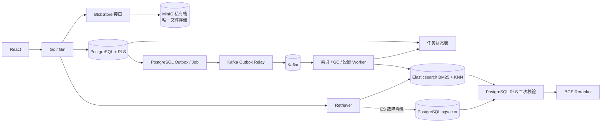

# Cortex RAG 与基础设施演进技术方案

> 状态：仓库与 Compose 已实现三个组件的第一版主路径；本文同时记录当前实现、尚未通过的生产门禁与后续收敛方案。
> 决策日期：2026-08-24。  
> 适用边界：覆盖 Markdown、PDF、DOC/DOCX 和图片 OCR 摄取，MinIO 大文件分片上传，Kafka 异步解析与向量化，Elasticsearch BM25 + KNN 检索，以及真实脱敏 bad case 和目标环境生产验收。PostgreSQL 继续是笔记正文、租户、权限、任务状态和索引版本的唯一业务权威，客户端不得直接选择租户或访问基础设施。

## 1. 决策摘要

| 组件 | 当前决策 | 在 Cortex 中的职责 | 上线完成标准 |
|---|---|---|---|
| MinIO | Compose 默认启用；生产门禁待目标环境验收 | 附件、知识原文件和解析派生文件的私有对象存储 | 完成历史对象 checksum 对账、回滚与联合恢复验收 |
| Kafka / Redpanda | Compose 默认启用；生产门禁待目标环境验收 | Transactional Outbox 的事件分发与知识索引、搜索投影、文件 GC 消费 | 完成幂等、DLQ、积压告警、重复/乱序与 broker 故障验收 |
| Elasticsearch | Compose 默认启用 BM25 + KNN；生产门禁待目标环境验收 | RAG 生产主 backend，承载关键词与向量混合检索 | 完成全量投影、PostgreSQL 二次校验、影子对比、灰度与 pgvector 降级验收 |

三个组件纳入同一个基础设施升级计划，但不得在同一次发布中同时切换文件、消息和检索主路径。固定实施顺序为：存储抽象与迁移框架 → MinIO → Kafka Outbox Relay → Elasticsearch 影子索引与灰度切流。每阶段验收完成后才能进入下一阶段，并且必须可独立回滚。

## 2. 不可改变的架构约束

1. PostgreSQL 保存业务最终事实、RLS 权限、有效文档版本、任务状态和引用来源；pgvector 保留为统一离线基线和 Elasticsearch 故障时的向量兜底，中文 2-gram RAG 检索在迁移观察窗口结束后删除。
2. MinIO 成为附件、知识原文件和解析派生文件的唯一持久化文件权威；不得保存或反向覆盖笔记权威正文。
3. 当前 Elasticsearch 投影同时执行 BM25 与 KNN，并保存 embedding；它仍是可重建投影，不能成为权限或文档有效性的最终判断方。
4. Kafka 是异步任务主干，只传递不含完整正文的事件；事件至少一次投递，消费者必须幂等，不宣称 Exactly Once。
5. MinIO、Kafka、Elasticsearch 均只暴露 Compose/集群内部网络，启用认证、TLS 和最小权限账号。
6. AI 不可用时的非 AI 主链路不依赖这三个组件；Elasticsearch 或 Kafka 故障不能阻止笔记、附件下载和导出。
7. 普通日志、消息和索引诊断不得包含密钥、邮箱、姓名、完整笔记、完整 query 或完整模型回答。
8. PostgreSQL 普通笔记关键词搜索继续保留。Elasticsearch 不可用时 RAG 显式降级到 pgvector 向量召回；降级链路继续执行 RLS、parent 聚合、BGE 精排、证据门控和引用核验，证据不足返回 `KNOWLEDGE_NO_EVIDENCE`，pgvector 同样不可用时返回 `KNOWLEDGE_RETRIEVAL_UNAVAILABLE`。

## 3. 目标架构



目标主路径为 MinIO 存储原文件和分片、Redis Bitmap 记录分片到达状态、Kafka/Redpanda 分发解析/分块/向量化/投影事件、Elasticsearch 同时执行 BM25 与 KNN 召回，再经 PostgreSQL RLS/活动版本二次校验、parent 聚合和 BGE 精排。PostgreSQL保存业务事实、事务 Outbox、任务状态和 pgvector 基线向量；ES 故障时只降级到 pgvector，不恢复中文 2-gram。

## 3.1 后端模块重构

```text
backend/internal/
├── blobstore/       # Local/MinIO 实现；最终生产只启用 MinIO
├── eventbus/        # Outbox Relay、Kafka producer、schema registry client
├── consumers/       # index、projection、file-gc、audit 消费者
├── searchindex/     # Elasticsearch mapping、bulk、alias、reconciliation
├── retrieval/       # ES BM25 + KNN 主路径、pgvector 基线/兜底、PG RLS validator、rerank 编排
├── store/           # PostgreSQL 业务事实、RLS、任务状态、Outbox
└── server/          # HTTP/SSE 契约，不直接调用 MinIO/Kafka/ES SDK
```

`backend/cmd/server/main.go` 是唯一部署后端入口。Outbox relay、知识索引、搜索投影与文件 GC 已迁入
`backend/internal/workers` 的受管 runner，由 server 按配置启动并共享取消与优雅退出边界；Compose 不再
构建或部署额外 worker 二进制。`cmd/migrate`、`cmd/blob-migrate` 和评测命令是显式运维工具，不是服务入口。

## 4. MinIO 引入方案

### 4.1 数据模型与接口

先引入与供应商无关的 `BlobStore`：

```go
type BlobStore interface {
    Put(ctx context.Context, key string, body io.Reader, size int64, sha256 string) (ObjectInfo, error)
    Open(ctx context.Context, key string) (io.ReadCloser, ObjectInfo, error)
    Stat(ctx context.Context, key string) (ObjectInfo, error)
    Delete(ctx context.Context, key string) error
}
```

新增版本化迁移，为附件和知识文档增加：

- `storage_backend`: `local|minio`；
- `object_key`: 服务端生成的不可猜测相对 key；
- `object_version` / `etag`；
- 保留现有 `stored_path` 作为本地后端兼容字段，迁移完成前不得删除。

对象 key 固定为服务端结构，例如：

```text
tenants/<tenant_uuid>/knowledge/<document_uuid>/<content_hash>/source
tenants/<tenant_uuid>/attachments/<attachment_uuid>/<content_hash>
```

原始文件名只存 PostgreSQL，不进入 key。桶保持私有，浏览器下载仍经认证后的 Go handler，不直接返回永久公开 URL。

### 4.2 写入与一致性

1. 创建受 RLS 保护的上传会话和 MinIO multipart upload ID，预占租户配额。
2. 客户端分片上传至后端，后端流式校验大小与 SHA-256 后写入 MinIO，并更新持久分片清单与 Redis Bitmap。
3. complete 请求校验全部分片、合并对象并计算完整摘要，在 PostgreSQL 事务中写入对象元数据、结算配额和 Outbox。
4. 数据库提交失败时产生受控清理任务；不得在请求线程中无限重试删除。
5. 上传完成后的解析、OCR、分块、Embedding 和 ES 投影全部由 Kafka 消费者异步执行。
6. 删除先软删除数据库记录并写 Outbox，再由 GC Worker 删除对象；下载始终先检查 PostgreSQL 权限和删除状态。

不采用无条件双写本地卷和 MinIO。迁移期使用“单对象单后端”，通过 `storage_backend` 决定读取位置，避免两个副本都被误认为权威。

### 4.3 历史迁移

1. 建立对象清单：数据库引用路径、大小、SHA-256。
2. 后台批量复制并 `Stat`/checksum 校验。
3. 单行事务切换该对象的 `storage_backend` 与 `object_key`。
4. 观察一个备份周期后再清理本地旧文件。
5. 迁移可暂停、幂等重跑；失败对象保持从本地读取。

### 4.4 部署与验收

- MinIO 不映射宿主机公共端口；backend 使用只允许指定桶操作的 Access Key。
- 开启服务端加密、对象版本或对象锁的选择必须与删除策略、成本和合规要求一起评审。
- 联合备份升级为 PostgreSQL dump + MinIO 版本化清单；恢复必须校验数据库到对象、对象到数据库双向一致。
- 验收覆盖：跨租户 404、路径不可控、重复上传、DB 提交失败补偿、对象丢失、MinIO 断网、并发配额和恢复演练。

### 4.5 回滚

迁移观察窗口内可按对象切回 `local`；已经迁移的对象继续按行读取 MinIO。只有完成反向复制和 checksum 校验后，才能把历史行切回本地，禁止直接修改全局开关导致对象不可读。MinIO 完成生产验收后，新上传不再提供本地持久化回退；本地磁盘只保留有大小和生命周期限制的临时文件。

## 5. Kafka 引入方案

### 5.1 为什么不能直接替换数据库队列

`knowledge_index_jobs` 和 `outbox_events` 已提供持久状态、`FOR UPDATE SKIP LOCKED`、有限租约、续租、fencing、重试与可观测积压。Kafka 不能替代数据库业务事务；直接在 handler 中“写数据库再发 Kafka”会产生双写不一致。

### 5.2 正确接入方式

采用 Transactional Outbox Relay，Kafka 不直接参与业务数据库事务：

1. 业务事务只写 PostgreSQL 业务表和 Outbox。
2. Relay 使用现有 lease/fencing claim Outbox，成功投递 Kafka 后才标记 `processed_at`。
3. Kafka 消息只包含 `event_id`、`event_type`、`aggregate_id`、服务端生成的 `tenant_ref`、版本和 trace ID；不包含正文、原文件或身份信息。
4. 消费者按 `event_id` 写入 `consumer_receipts` 或使用业务唯一键幂等。
5. 消费者仍需从 PostgreSQL 加载当前任务状态和有效索引版本；过期事件直接丢弃并记录稳定错误码。

建议 Topic：

| Topic | Key | 用途 |
|---|---|---|
| `cortex.document.uploaded.v1` | `document_id` | MinIO 合并完成后触发格式识别与解析 |
| `cortex.document.parsed.v1` | `document_id` | 解析完成后触发规范化、分块和向量化 |
| `cortex.knowledge.index.v1` | `document_id` | Embedding 与活动索引版本构建，同文档有序 |
| `cortex.search.projection.v1` | `document_id` | Elasticsearch 投影更新 |
| `cortex.document.dlq.v1` | `document_id` | 有限重试后保存脱敏失败事件 |
| `cortex.audit.export.v1` | `tenant_ref` | 可选的脱敏审计导出 |

默认 3 副本、`acks=all`、禁止自动创建 Topic；保留周期必须大于最长故障恢复窗口。Schema 使用明确版本的 JSON Schema 或 Protobuf，未知字段向前兼容。

### 5.3 失败语义

- 生产者：至少一次投递；Relay 重发是正常现象。
- 消费者：幂等、有限重试、指数退避；毒消息进入 DLQ，只保存事件标识和错误码。
- Kafka 不可用：Outbox 留在 PostgreSQL，业务写入成功；积压告警后恢复投递。
- 不使用 Kafka offset 作为业务完成状态，任务成功仍以 PostgreSQL 为准。

### 5.4 灰度与回滚

迁移窗口先让 Kafka 承担“唤醒通知”，PostgreSQL 任务表继续保存阶段、租约、重试和最终状态；验证重复、乱序、重平衡和宕机恢复后，Kafka 成为文档上传完成、解析、向量化和投影的唯一常态事件分发通道。Kafka 不可用时 Outbox 合法积压，恢复后继续处理，不在请求线程同步解析或向量化。

## 6. Elasticsearch 引入方案

### 6.1 索引边界

Elasticsearch 保存可重建的 child/parent 检索投影：

- `tenant_id`、`document_id`、`parent_id`、`index_version`、`chunk_id`；
- 标题、heading、规范化关键词、检索文本；
- 512 维 embedding（当前 Elasticsearch KNN 查询使用）；
- `knowledge_enabled`、文档状态、可选 collection 范围和投影版本。

不得把 ES 命中直接送给模型。所有候选必须在同一个 PostgreSQL RLS 事务中按 tenant、document、active index version、未删除状态再次批量校验；未通过的候选全部丢弃。这样即使 ES 投影延迟或过滤配置错误，也不能造成跨租户或旧版本内容泄露。

### 6.2 索引设计

- 使用版本化物理索引，例如 `cortex-knowledge-v1-000001`，读写别名分离；当前 ES 投影保存 embedding。
- `tenant_id` 作为 routing key，查询必须包含精确 tenant filter。
- 当前 ES 使用同一查询执行 BM25 与 512 维 cosine KNN；analyzer、候选数量和 `num_candidates` 必须继续通过冻结集校准。
- Elasticsearch 是生产 RAG 主 backend；PostgreSQL/pgvector 保留为统一评测基线和故障兜底，但不与 ES 结果做常态请求内拼接。中文 2-gram 不再保留。
- ES 候选必须经过 PostgreSQL 二次校验、parent 聚合、BGE rerank、证据门控和引用核验。

pgvector 兜底由服务端 circuit breaker 控制，仅在 ES 连接失败、超时、集群不可用或查询错误率超过阈值时启用，不因“ES 没有召回结果”而自动切换，避免掩盖索引或质量问题。降级事件必须记录稳定原因码、trace ID、持续时间和聚合指标；恢复后先通过探针和少量灰度请求验证 ES，再关闭降级。pgvector 只提供向量候选，因此沿用独立校准的降级证据阈值，不能假装具备 BM25 关键词召回能力。

### 6.3 投影一致性

1. PostgreSQL 成功激活新 `index_version` 后写 `search_projection.requested` Outbox。
2. Projection Worker 从 PostgreSQL 读取活动版本，批量 upsert ES。
3. 完成后记录 `projection_version`、文档数、chunk 数和 checksum。
4. 删除/权限变化优先写 tombstone，并在查询时由 PostgreSQL RLS 二次校验兜底。
5. 定时 reconciliation 对比 PostgreSQL 活动文档和 ES 投影，修复缺失、重复和旧版本。

### 6.4 上线步骤

1. **离线回放**：用冻结评测集记录旧 backend 基线，并验证 ES 的 Hit@K、MRR、Context Recall/Precision、P95 和成本。
2. **影子查询**：切换前线上仍返回旧结果，后台采样执行 ES，只记录脱敏排名差异和耗时。
3. **小比例灰度**：按后端生成的稳定 bucket 将主检索切到 ES BM25 + KNN；ES 失败时通过明确的降级指标和事件切到 pgvector，不做无观测的静默回退。
4. **扩大流量**：只有质量不回退、P95 达标、投影 lag 和资源成本可接受时扩大。
5. **收敛旧 backend**：跨过完整发布观察窗口且质量、容量和恢复验收通过后，删除 2-gram RAG 查询和索引；保留 pgvector 查询、向量索引、基线评测和降级开关。

### 6.5 验收门槛

- 164 条冻结集和真实脱敏 bad case 均无不可解释回退。
- Hit@10 不低于当前 1.0；Context Recall/Precision 不低于发布基线容差。
- 10,000 文档检索 P95 相比当前 329 ms 至少下降 30%，或在 50,000 文档规模仍低于 500 ms。
- 跨租户、软删除、权限变更、旧版本和索引延迟测试全部通过。
- ES 完全不可用时，RAG 返回稳定的 `KNOWLEDGE_RETRIEVAL_UNAVAILABLE`，笔记普通关键词搜索和其他非 AI 功能继续使用 PostgreSQL，不得绕过证据生成答案。

## 7. 大文件上传与多格式文档处理方案

### 7.1 API 契约

| 接口 | 用途 |
|---|---|
| `POST /api/v1/uploads` | 创建上传会话，返回 upload ID、part size 和过期时间 |
| `PUT /api/v1/uploads/{id}/parts/{number}` | 上传分片并校验长度和 SHA-256 |
| `GET /api/v1/uploads/{id}` | 查询已接收分片和会话状态 |
| `POST /api/v1/uploads/{id}/complete` | 校验完整摘要并幂等合并 |
| `DELETE /api/v1/uploads/{id}` | 取消会话并排队清理临时分片 |

客户端不得提交可信 `tenant_id` 或对象 key。服务端从 Principal 解析租户并生成安全相对 key；所有写操作支持 Idempotency-Key，重复 complete 返回第一次创建的资源。

### 7.2 状态与一致性

PostgreSQL 保存上传会话权威状态：`created/uploading/completing/completed/expired/failed`、期望大小、完整摘要、part size、过期时间和最终资源 ID。Redis Bitmap 记录已成功上传的分片序号，为秒级续传状态查询和缺片计算提供加速；它是可重建的协调状态，不是业务完成事实，丢失时从 PostgreSQL 分片清单或 MinIO ListParts 重建。

生产上传统一使用 MinIO Multipart Upload，分片 ETag 和 SHA-256 写入受 RLS 保护的数据库行。完成顺序为：锁定会话 → 校验 Redis Bitmap 与持久分片清单 → MinIO 合并对象 → 校验完整 SHA-256 → 创建文档记录和 Outbox 事件 → 标记上传完成。HTTP 请求到此返回，不在请求线程中解析、OCR、分块或向量化。

验收覆盖断网、刷新、重复和乱序分片、并发 complete、服务重启、会话过期、超配额、摘要错误、跨租户访问和孤儿分片对账。大文件只做流式 checksum，不把完整内容读入内存；未经确认不得批量物理删除孤儿文件。

### 7.3 支持格式与安全解析

知识库支持 Markdown/Markdown ZIP、PDF、DOC/DOCX 以及 PNG、JPEG、WebP 图片。文件必须同时校验扩展名、magic bytes、MIME、大小、页数、解压后大小和压缩比；加密、损坏、宏文档、超限或类型不一致的文件进入稳定失败状态，不执行宏、嵌入对象或外部链接。

- Markdown 继续使用现有安全 ZIP 展开、父子块切分和资源配额。
- PDF 与 DOC/DOCX 通过内部隔离解析服务提取标题、段落、表格和页码；建议使用 Apache Tika，但解析服务不得访问公网或持有数据库、MinIO、Kafka、Elasticsearch凭据。
- 扫描 PDF 和图片通过内部 OCR 服务识别文字，输出页码/图片序号、文本区域和置信度。低置信 OCR 文本不得单独满足强证据门控。
- 所有格式先转换为统一 Document IR，再进入同一套规范化、父子分块、Embedding 和 ES 投影流程。

Document IR 至少包含 `block_type`、`text`、`heading_path`、`page`、`table`、`image_index`、`source_span`、`parser_version` 和 `ocr_confidence`。引用结果必须能够定位 PDF 页码、Word 段落或图片区域。

### 7.4 Kafka 异步处理状态机

```text
uploaded
  → parsing
  → parsed
  → chunking
  → embedding
  → projecting
  → ready
```

MinIO 合并完成后写 `document.uploaded` Outbox，由 relay 投递 Kafka。消费者从 MinIO 流式读取原文件，完成格式识别、解析/OCR、规范化和分块；Embedding consumer 批量生成向量；projection consumer 将文本、metadata 和 embedding 批量写入 Elasticsearch，校验数量与 checksum 后才在 PostgreSQL 原子激活新 `index_version`。

各阶段状态、尝试次数、租约、fencing token、失败码和进度保存在 PostgreSQL。Kafka 采用至少一次投递，消费者以 `event_id + document_id + target_index_version` 幂等；同文档按 `document_id` 分区保证顺序，过期版本事件直接忽略。有限重试后进入 DLQ，人工重试重新发布新事件但不覆盖原审计记录。重建失败时保留上一活动版本可检索。

## 8. 真实脱敏 bad case 与分层评测

数据流固定为：用户负反馈 → 私有待审区 → 自动去直接标识 → 人工复核与授权 → 生成最小必要查询/证据/期望行为 → 晋升冻结集。未经用户确认的私人内容不得提交仓库或进入共享评测。

每条 case 记录稳定 ID、业务层、失败类型、允许来源、期望引用、应回答/应拒答、脱敏版本和审批时间。报告按来源、格式、查询类型、数据新旧、证据强弱和 bad-case 标签分层，至少输出 Hit@10、MRR、Context Recall、Context Precision、Faithfulness、引用通过率、拒答准确率、P50/P95、调用量和成本。

在线门控与离线评测复用相同的证据评分、阈值配置和引用校验函数。评测报告分别标明 pgvector 统一基线、Elasticsearch BM25 单通道、ES KNN 单通道、ES 融合结果和 pgvector 降级结果，并按 Markdown、PDF、Word、扫描 PDF、图片 OCR 分层；只有 ES 主路径与 pgvector 兜底均在冻结集和真实脱敏 bad case 上达到门槛时才能切流。

## 9. 目标环境生产验收

### 9.1 容量、成本与告警

按 1k、10k、50k 混合格式文档和目标峰值并发压测，定位 HTTP、认证、PostgreSQL/pgvector、Redis Bitmap、MinIO Multipart、解析/OCR、Embedding、Reranker、LiteLLM、Kafka 和 Elasticsearch 饱和点。ES 主路径和 pgvector 降级路径分别测量质量、P95/P99、容量上限和恢复时间；报告记录目标规格、错误率、队列 lag、降级行为及月度成本，本地结果不能替代目标环境 SLA。

Prometheus/Grafana 必须接入真实采集和 Alertmanager 通知，覆盖 API/SSE、数据库连接池和锁、pgvector 降级次数/持续时间/失败率、任务租约、Outbox、上传会话、孤儿分片、解析失败、Kafka lag/DLQ、MinIO 容量和对象差异、ES 集群/磁盘/投影 lag，以及 AI 调用错误率、Token 和成本。每条 P0/P1 告警必须有负责人、通知目标、阈值依据和 runbook。

### 9.2 联合备份恢复

恢复顺序为 PostgreSQL（含 pgvector 基线）→ MinIO 对象 → Kafka 配置/Topic → Elasticsearch 模板与可重建 BM25 + KNN 投影。Kafka offset 和 ES 索引不作为业务权威备份。隔离恢复必须验证迁移版本 41、63 张业务表（连同 `schema_migrations` 共 64 张 public 表）、RLS/FORCE RLS、登录、附件下载、对象双向清单、pgvector 降级问答、ES 全量投影重建、主路径恢复切回和任务幂等恢复，并记录目标与实测 RPO/RTO。Markdown、PDF、Word、扫描 PDF 与图片 OCR 都应纳入恢复验收；Excel 和演示文稿仍不在当前范围。

## 10. 已实施阶段记录与配置基线

以下 Phase 0～5 保留原始设计顺序，用于解释迁移 37～41 和当前 Compose 主路径的形成，不用于判断完成
状态。Phase 0～4 的本地第一版已经落地，Phase 5 仅完成本地验收；尚未完成的生产三节点、TLS、真实流量、
告警通知和扩展格式摄取统一记录在 `IMPLEMENTATION_GAPS.md`，避免在多份文档中重复维护状态。

### 10.1 数据库与配置演进

数据库变化必须使用连续版本化迁移，建议拆分为：

| 迁移 | 内容 | 回滚边界 |
|---|---|---|
| `000037_object_storage` | 增加对象 backend/key/version/etag、迁移状态和对象 GC 任务 | 不删除 `stored_path`，可回滚应用 |
| `000038_kafka_outbox` | 增加 Outbox schema version、publish 状态、consumer receipts、DLQ 审计 | Kafka 停止后可恢复 polling |
| `000039_search_projection` | 增加 ES projection version/status/checksum/lag 和 reconciliation 状态 | 可停用 ES 并继续旧检索 |
| `000040_external_infra_contract` | 三阶段验收后停止创建 2-gram RAG 投影，继续同步 pgvector 基线向量 | 观察窗口内只读保留 2-gram 索引 |
| `000041_kafka_knowledge_pipeline` | 把解析、Embedding、搜索投影拆为 Kafka 阶段并持久化阶段载荷 | 可切回 PostgreSQL task runner；最终状态仍以数据库为准 |
| 后续 contract migration | 回滚窗口结束后删除 2-gram `search_vector`、查询配置和废弃字段 | 保留 pgvector embedding；执行前必须有联合备份并完成不可逆评审 |

新增配置按职责分配：

```text
MINIO_ENDPOINT / MINIO_BUCKET / MINIO_ACCESS_KEY / MINIO_SECRET_KEY
KAFKA_BROKERS / KAFKA_CLIENT_ID / KAFKA_SASL_* / KAFKA_TLS_*
ELASTICSEARCH_URLS / ELASTICSEARCH_USERNAME / ELASTICSEARCH_PASSWORD / ELASTICSEARCH_CA_FILE
STORAGE_BACKEND=minio
EVENT_BUS=kafka
RAG_RETRIEVAL_BACKEND=elasticsearch
```

真实凭据只通过部署 Secret 注入，不写入 Compose 文件、镜像、数据库业务字段、日志或验收报告。启动时对必需配置 fail-fast；`/healthz` 仍只表示进程存活，API `/readyz` 只检查 PostgreSQL，其他可选依赖由 `/health/dependencies` 与 worker 指标独立报告。

### Phase 0：公共抽象与迁移框架

- 增加 `BlobStore` 接口、本地迁移实现与 MinIO 生产实现。
- 为 Elasticsearch 主 backend 与 pgvector 基线/兜底增加统一候选契约、shadow result schema、RLS 二次校验和降级指标。
- 为 Outbox 增加发布状态、Kafka Relay checkpoint、事件 schema version 和消费者幂等记录。
- 新增三套组件的配置校验、密钥边界、健康指标、Compose 服务和故障开关。
- 冻结当前 164 条评测、50,000 文档容量、跨租户与备份恢复基线。

### Phase 1：MinIO 大文件分片上传

- 新增上传会话、分片清单、Redis Bitmap 加速、流式 checksum 和幂等 complete。
- 生产统一使用 MinIO Multipart；完成断网、重启、并发、配额、跨租户和孤儿清理验收。
- 上传完成只提交文档元数据和 Outbox，不在同步请求内解析或向量化。

### Phase 2：MinIO

- 部署私有 MinIO，创建 `cortex-private` 桶、最小权限 backend 账号和独立管理账号。
- 增加 `storage_backend/object_key/object_version/etag` 字段，新上传默认写 MinIO。
- 按清单、checksum 和单行事务迁移历史对象；完成数据库 ↔ 对象双向对账。
- 更新备份、恢复、容量、配额、GC、对象丢失和 MinIO 断网验收。
- 完成标准：连续一个观察窗口无本地新文件，历史对象全部迁移或有明确失败清单。

### Phase 3：Kafka 事件总线

- 部署三节点 Kafka（本地开发可单节点），显式创建版本化 Topic、ACL、配额和保留策略。
- 上线 Outbox Relay；业务事务仍只写 PostgreSQL 和 Outbox。
- 接入 PDF/Word/图片解析与 OCR、分块、Embedding 和搜索投影消费者，按 `event_id + document_id + target_index_version` 幂等；毒消息进入 DLQ。
- 完成重复、乱序、重平衡、Broker 中断、解析器超时和积压恢复测试。
- 完成标准：Kafka 成为文档上传完成、解析、向量化和投影的唯一常态分发通道，任务最终状态仍以 PostgreSQL 为准。

### Phase 4：Elasticsearch BM25 + KNN 主路径

- 部署至少三节点 Elasticsearch，启用 TLS、账号权限、磁盘水位和快照仓库。
- Kafka 投影消费者构建版本化物理索引，并通过别名原子切换读写版本。
- 先离线回放，再执行线上影子查询；对排名差异、P95、投影 lag 和错误率做脱敏观测。
- 逐步按 1% → 10% → 50% → 100% 灰度，所有 ES 候选必须经 PostgreSQL RLS 和活动版本二次校验。
- 完成标准：ES BM25 + KNN 成为 RAG 生产主 backend；ES 故障时可观测地降级到 pgvector，冻结集与真实脱敏 bad case 无不可解释回退。

### Phase 5：收敛与生产验收

- 完成 MinIO、Kafka、Elasticsearch 与 PostgreSQL 的联合监控、告警路由、容量和成本报告。
- 演练 MinIO 对象丢失、Kafka 全部 Broker 不可用、ES 集群不可用以及三者组合故障。
- 完成联合备份恢复：PostgreSQL、MinIO 对象、Kafka 配置/Schema、ES 模板和可重建索引说明。
- 观察窗口结束后删除 2-gram RAG 索引和相关配置；保留 pgvector 统一基线、故障兜底及从 PostgreSQL 权威元数据与 MinIO 原文件重建 ES 的离线工具。

## 11. 上线前评审清单

- [ ] 有容量或故障证据证明组件解决了实际问题。
- [ ] 数据权威、重复投递、投影延迟和删除语义已经书面定义。
- [ ] 租户过滤在外部系统和 PostgreSQL RLS 二次校验中同时存在。
- [ ] 密钥、TLS、网络、备份、监控、告警和资源上限已经配置。
- [ ] 迁移可暂停、可重试、可核对，且有明确回滚路径。
- [ ] 非 AI 主链路和 PostgreSQL 权威边界没有被破坏。
- [ ] 冻结集、真实脱敏 bad case、跨租户、故障注入、容量和恢复验收全部通过。
- [ ] Markdown、PDF、DOC/DOCX、扫描 PDF 和图片 OCR 的解析、引用定位、资源限制与失败恢复均已验收。
- [ ] MinIO Multipart 与 Redis Bitmap 的断点续传、幂等、配额和孤儿清理均已验收。
- [x] 唯一后端入口约束已恢复，不再部署额外 worker `cmd/*` 二进制。

## 12. 明确不做与完成定义

- 当前个人知识库版本不引入组织、角色和组织标签 ACL；团队协作进入产品范围后另行设计。
- 第一阶段不支持 XLS/XLSX、PPT/PPTX 和旧版二进制 Office；新增格式仅包括 PDF、DOC/DOCX 与常见图片 OCR。
- 不用 WebSocket 替换现有 SSE；只有双向协同或高频服务端主动推送需求出现时再评审。
- 不把 PostgreSQL 正文同步成 Markdown 权威副本。
- 不把组件代码、Compose 服务或规则文件存在描述为生产验收完成。

只有代码、迁移、测试、API/运维文档、真实脱敏评测、目标环境容量成本、真实告警通知和隔离恢复全部通过，相关能力才能从“规划/部分实现”更新为“已实现”。未通过项继续保留在 `docs/IMPLEMENTATION_GAPS.md`，并附证据和复验日期。

## 13. 当前结论

当前 Compose 已完成公共抽象、MinIO、Kafka/Redpanda、Elasticsearch BM25 + KNN 和 server 内部 worker
收敛。PostgreSQL 继续保存业务权威、RLS、Outbox、任务状态、pgvector 基线向量和普通笔记搜索；
Elasticsearch 是默认 RAG 检索 backend，pgvector 保留为可观测降级路径。当前知识摄取开放 Markdown/ZIP、
PDF、DOC/DOCX 与 PNG/JPG/WebP，二进制格式由隔离解析/OCR 服务处理；Excel、演示文稿和断点续传仍未实现。
