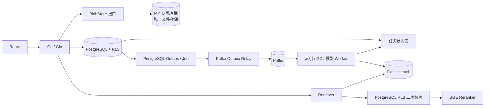

# MinIO、Kafka 与 Elasticsearch 引入技术方案

> 状态：已确定引入三个组件，本文定义实施顺序和上线门禁，不代表组件已经上线。  
> 决策日期：2026-08-24。  
> 适用边界：允许重构原有存储、任务和检索架构；PostgreSQL 继续是笔记正文、租户、权限、任务状态和索引版本的唯一业务权威，客户端不得直接选择租户或访问基础设施。

## 1. 决策摘要

| 组件 | 当前决策 | 在 Cortex 中的职责 | 上线完成标准 |
|---|---|---|---|
| MinIO | 确定引入，第一阶段上线 | 附件、知识原文件、解析派生文件和研究资产的唯一持久化对象存储 | 新文件只写 MinIO，历史文件完成校验迁移，本地数据卷退出持久化主路径 |
| Kafka | 确定引入，第二阶段上线 | 知识索引、搜索投影、文件 GC 和异步审计的主事件总线；PostgreSQL Outbox 只负责事务发布 | Relay、幂等消费者、DLQ、积压告警、重复与乱序测试通过，数据库任务表只保存状态而不承担常态扫描调度 |
| Elasticsearch | 确定引入，第三阶段上线 | RAG 的唯一在线 BM25 + KNN 召回引擎；BGE 继续最终精排 | 全量投影、RLS 二次校验、影子对比和灰度切流通过；pgvector RAG 索引退出主路径 |

三个组件纳入同一个基础设施升级计划，但不得在同一次发布中同时切换文件、消息和检索主路径。固定实施顺序为：存储抽象与迁移框架 → MinIO → Kafka Outbox Relay → Elasticsearch 影子索引与灰度切流。每阶段验收完成后才能进入下一阶段，并且必须可独立回滚。

## 2. 不可改变的架构约束

1. PostgreSQL 保存业务最终事实、RLS 权限、有效文档版本、任务状态和引用来源，但不再承担二进制文件、异步分发或 RAG 在线召回。
2. MinIO 成为附件、知识原文件和解析派生文件的唯一持久化文件权威；不得保存或反向覆盖笔记权威正文。
3. Elasticsearch 是 RAG 唯一在线召回引擎，但仍是可重建投影，不能成为权限或文档有效性的最终判断方。
4. Kafka 是异步任务主干，只传递不含完整正文的事件；事件至少一次投递，消费者必须幂等，不宣称 Exactly Once。
5. MinIO、Kafka、Elasticsearch 均只暴露 Compose/集群内部网络，启用认证、TLS 和最小权限账号。
6. AI 不可用时的非 AI 主链路不依赖这三个组件；Elasticsearch 或 Kafka 故障不能阻止笔记、附件下载和导出。
7. 普通日志、消息和索引诊断不得包含密钥、邮箱、姓名、完整笔记、完整 query 或完整模型回答。
8. PostgreSQL 普通笔记关键词搜索继续保留，确保 Elasticsearch 故障不影响笔记基本搜索；RAG 问答在 ES 不可用时返回稳定的检索不可用错误，不绕过来源约束生成。

## 3. 目标架构



上线后的正常主路径为 MinIO 存储原文件、Kafka 分发异步任务、Elasticsearch 执行混合召回；PostgreSQL 只保存业务事实、事务 Outbox、任务状态并承担 RLS 二次校验。原有本地文件存储、数据库任务轮询和 pgvector RAG 检索仅在迁移/回滚窗口保留，窗口结束后从主路径删除。

## 3.1 后端模块重构

```text
backend/internal/
├── blobstore/       # Local/MinIO 实现；最终生产只启用 MinIO
├── eventbus/        # Outbox Relay、Kafka producer、schema registry client
├── consumers/       # index、projection、file-gc、audit 消费者
├── searchindex/     # Elasticsearch mapping、bulk、alias、reconciliation
├── retrieval/       # ES hybrid retrieval、PG RLS validator、rerank 编排
├── store/           # PostgreSQL 业务事实、RLS、任务状态、Outbox
└── server/          # HTTP/SSE 契约，不直接调用 MinIO/Kafka/ES SDK
```

新增独立进程入口：

- `cmd/server`：HTTP API；
- `cmd/outbox-relay`：PostgreSQL → Kafka；
- `cmd/knowledge-consumer`：解析、Embedding、索引；
- `cmd/projection-consumer`：Elasticsearch 投影与删除；
- `cmd/file-gc-consumer`：MinIO 延迟删除；
- `cmd/reconcile`：MinIO/ES/PostgreSQL 对账。

这些二进制复用同一 Go module，但职责和连接权限分离。`server` 不持有 Kafka 管理、MinIO 管理或 Elasticsearch 集群管理权限。

## 4. MinIO 引入方案

### 4.1 数据模型与接口

先引入与供应商无关的 `BlobStore`：

```go
type BlobStore interface {
    Put(ctx context.Context, key string, body io.Reader, size int64, sha256 string) (ObjectInfo, error)
    Open(ctx context.Context, key string) (io.ReadCloser, ObjectInfo, error)
    Stat(ctx context.Context, key string) (ObjectInfo, error)
    Delete(ctx context.Context, key string) error
}
```

新增版本化迁移，为附件、知识文档和研究资产增加：

- `storage_backend`: `local|minio`；
- `object_key`: 服务端生成的不可猜测相对 key；
- `object_version` / `etag`；
- 保留现有 `stored_path` 作为本地后端兼容字段，迁移完成前不得删除。

对象 key 固定为服务端结构，例如：

```text
tenants/<tenant_uuid>/knowledge/<document_uuid>/<content_hash>/source
tenants/<tenant_uuid>/attachments/<attachment_uuid>/<content_hash>
```

原始文件名只存 PostgreSQL，不进入 key。桶保持私有，浏览器下载仍经认证后的 Go handler，不直接返回永久公开 URL。

### 4.2 写入与一致性

1. 上传先落到受控临时文件，同时计算大小、MIME 和 SHA-256。
2. 校验配额、压缩比和文件类型后，以确定性 key 写入 MinIO。
3. 在 PostgreSQL RLS 事务中写入对象元数据并完成配额占用。
4. 数据库提交失败时产生受控清理任务；不得在请求线程中无限重试删除。
5. 删除先软删除数据库记录并写 Outbox，再由 GC Worker 删除对象；下载始终先检查 PostgreSQL 权限和删除状态。

不采用无条件双写本地卷和 MinIO。迁移期使用“单对象单后端”，通过 `storage_backend` 决定读取位置，避免两个副本都被误认为权威。

### 4.3 历史迁移

1. 建立对象清单：数据库引用路径、大小、SHA-256。
2. 后台批量复制并 `Stat`/checksum 校验。
3. 单行事务切换该对象的 `storage_backend` 与 `object_key`。
4. 观察一个备份周期后再清理本地旧文件。
5. 迁移可暂停、幂等重跑；失败对象保持从本地读取。

### 4.4 部署与验收

- MinIO 不映射宿主机公共端口；backend 使用只允许指定桶操作的 Access Key。
- 开启服务端加密、对象版本或对象锁的选择必须与删除策略、成本和合规要求一起评审。
- 联合备份升级为 PostgreSQL dump + MinIO 版本化清单；恢复必须校验数据库到对象、对象到数据库双向一致。
- 验收覆盖：跨租户 404、路径不可控、重复上传、DB 提交失败补偿、对象丢失、MinIO 断网、并发配额和恢复演练。

### 4.5 回滚

迁移观察窗口内可按对象切回 `local`；已经迁移的对象继续按行读取 MinIO。只有完成反向复制和 checksum 校验后，才能把历史行切回本地，禁止直接修改全局开关导致对象不可读。MinIO 完成生产验收后，新上传不再提供本地持久化回退；本地磁盘只保留有大小和生命周期限制的临时文件。

## 5. Kafka 引入方案

### 5.1 为什么不能直接替换数据库队列

`knowledge_index_jobs` 和 `outbox_events` 已提供持久状态、`FOR UPDATE SKIP LOCKED`、有限租约、续租、fencing、重试与可观测积压。Kafka 不能替代数据库业务事务；直接在 handler 中“写数据库再发 Kafka”会产生双写不一致。

### 5.2 正确接入方式

采用 Transactional Outbox Relay，Kafka 不直接参与业务数据库事务：

1. 业务事务只写 PostgreSQL 业务表和 Outbox。
2. Relay 使用现有 lease/fencing claim Outbox，成功投递 Kafka 后才标记 `processed_at`。
3. Kafka 消息只包含 `event_id`、`event_type`、`aggregate_id`、服务端生成的 `tenant_ref`、版本和 trace ID；不包含正文、原文件或身份信息。
4. 消费者按 `event_id` 写入 `consumer_receipts` 或使用业务唯一键幂等。
5. 消费者仍需从 PostgreSQL 加载当前任务状态和有效索引版本；过期事件直接丢弃并记录稳定错误码。

建议 Topic：

| Topic | Key | 用途 |
|---|---|---|
| `cortex.knowledge.index.v1` | `document_id` | 索引任务唤醒，同文档有序 |
| `cortex.search.projection.v1` | `document_id` | Elasticsearch 投影更新 |
| `cortex.audit.export.v1` | `tenant_ref` | 可选的脱敏审计导出 |

默认 3 副本、`acks=all`、禁止自动创建 Topic；保留周期必须大于最长故障恢复窗口。Schema 使用明确版本的 JSON Schema 或 Protobuf，未知字段向前兼容。

### 5.3 失败语义

- 生产者：至少一次投递；Relay 重发是正常现象。
- 消费者：幂等、有限重试、指数退避；毒消息进入 DLQ，只保存事件标识和错误码。
- Kafka 不可用：Outbox 留在 PostgreSQL，业务写入成功；积压告警后恢复投递。
- 不使用 Kafka offset 作为业务完成状态，任务成功仍以 PostgreSQL 为准。

### 5.4 灰度与回滚

迁移窗口先让 Kafka 只做“唤醒通知”，原 PostgreSQL polling 临时兜底；验证重复、乱序、重平衡和宕机恢复后，将 Kafka 切为主调度并停止常态 polling。回滚窗口内可停止 Relay/消费者并恢复 polling；窗口结束后只保留人工恢复工具，不保留常驻数据库扫描器。

## 6. Elasticsearch 引入方案

### 6.1 索引边界

Elasticsearch 保存可重建的 child/parent 检索投影：

- `tenant_id`、`document_id`、`parent_id`、`index_version`、`chunk_id`；
- 标题、heading、规范化关键词、检索文本；
- 512 维 embedding；
- `knowledge_enabled`、文档状态、可选 collection 范围和投影版本。

不得把 ES 命中直接送给模型。所有候选必须在同一个 PostgreSQL RLS 事务中按 tenant、document、active index version、未删除状态再次批量校验；未通过的候选全部丢弃。这样即使 ES 投影延迟或过滤配置错误，也不能造成跨租户或旧版本内容泄露。

### 6.2 索引设计

- 使用版本化物理索引，例如 `cortex-knowledge-v1-000001`，读写别名分离。
- `tenant_id` 作为 routing key，查询必须包含精确 tenant filter。
- 中文关键词通道先验证 `standard`/`smartcn`/自定义 analyzer；不能因为图片项目使用 IK 就默认选择 IK。
- 向量通道使用 512 维 cosine HNSW；候选数量、`num_candidates` 和过滤条件必须通过冻结集校准。
- ES 返回 BM25 与 KNN 两路排名，继续使用现有 RRF、parent 聚合、BGE rerank、证据门控和引用核验。

### 6.3 投影一致性

1. PostgreSQL 成功激活新 `index_version` 后写 `search_projection.requested` Outbox。
2. Projection Worker 从 PostgreSQL 读取活动版本，批量 upsert ES。
3. 完成后记录 `projection_version`、文档数、chunk 数和 checksum。
4. 删除/权限变化优先写 tombstone，并在查询时由 PostgreSQL RLS 二次校验兜底。
5. 定时 reconciliation 对比 PostgreSQL 活动文档和 ES 投影，修复缺失、重复和旧版本。

### 6.4 上线步骤

1. **离线回放**：用冻结评测集对比 PostgreSQL 与 ES 的 Hit@K、MRR、Context Recall/Precision、P95 和成本。
2. **影子查询**：线上仍返回 PostgreSQL 结果，后台采样执行 ES，只记录脱敏排名差异和耗时。
3. **小比例灰度**：按后端生成的稳定 bucket 启用 ES，失败自动回退 PostgreSQL。
4. **扩大流量**：只有质量不回退、P95 达标、投影 lag 和资源成本可接受时扩大。
5. **保留回退**：至少跨过一个完整发布周期后，才考虑停止 PostgreSQL 主检索；PostgreSQL 索引数据仍保留到回滚窗口结束。

### 6.5 验收门槛

- 164 条冻结集和真实脱敏 bad case 均无不可解释回退。
- Hit@10 不低于当前 1.0；Context Recall/Precision 不低于发布基线容差。
- 10,000 文档检索 P95 相比当前 329 ms 至少下降 30%，或在 50,000 文档规模仍低于 500 ms。
- 跨租户、软删除、权限变更、旧版本和索引延迟测试全部通过。
- ES 完全不可用时，RAG 返回稳定的 `KNOWLEDGE_RETRIEVAL_UNAVAILABLE`，笔记普通关键词搜索和其他非 AI 功能继续使用 PostgreSQL，不得绕过证据生成答案。

## 7. 分阶段实施计划

### 7.1 数据库与配置演进

数据库变化必须使用连续版本化迁移，建议拆分为：

| 迁移 | 内容 | 回滚边界 |
|---|---|---|
| `000037_object_storage` | 增加对象 backend/key/version/etag、迁移状态和对象 GC 任务 | 不删除 `stored_path`，可回滚应用 |
| `000038_kafka_outbox` | 增加 Outbox schema version、publish 状态、consumer receipts、DLQ 审计 | Kafka 停止后可恢复 polling |
| `000039_search_projection` | 增加 ES projection version/status/checksum/lag 和 reconciliation 状态 | 可停用 ES 并继续旧检索 |
| `000040_external_infra_contract` | 三阶段验收后收紧非空约束，停止创建 pgvector RAG 数据 | 只允许向前修复，不自动删除历史向量 |
| 后续 contract migration | 回滚窗口结束后删除废弃 `stored_path`、RAG embedding/search_vector 和旧 polling 字段 | 执行前必须有联合备份并完成不可逆评审 |

新增配置按职责分配：

```text
MINIO_ENDPOINT / MINIO_BUCKET / MINIO_ACCESS_KEY / MINIO_SECRET_KEY
KAFKA_BROKERS / KAFKA_CLIENT_ID / KAFKA_SASL_* / KAFKA_TLS_*
ELASTICSEARCH_URLS / ELASTICSEARCH_USERNAME / ELASTICSEARCH_PASSWORD / ELASTICSEARCH_CA_FILE
STORAGE_BACKEND=minio
EVENT_BUS=kafka
RAG_RETRIEVAL_BACKEND=elasticsearch
```

真实凭据只通过部署 Secret 注入，不写入 Compose 文件、镜像、数据库业务字段、日志或验收报告。启动时对必需配置 fail-fast；`/healthz` 仍只表示进程存活，`/readyz` 在对应进程中检查其必需依赖，例如 API 检查 PostgreSQL 和 MinIO，消费者检查 PostgreSQL、Kafka、MinIO/ES。

### Phase 0：公共抽象与迁移框架

- 增加 `BlobStore` 接口、本地迁移实现与 MinIO 生产实现。
- 为检索器增加 PostgreSQL/Elasticsearch backend 与 shadow result schema。
- 为 Outbox 增加发布状态、Kafka Relay checkpoint、事件 schema version 和消费者幂等记录。
- 新增三套组件的配置校验、密钥边界、健康指标、Compose 服务和故障开关。
- 冻结当前 164 条评测、50,000 文档容量、跨租户与备份恢复基线。

### Phase 1：MinIO

- 部署私有 MinIO，创建 `cortex-private` 桶、最小权限 backend 账号和独立管理账号。
- 增加 `storage_backend/object_key/object_version/etag` 字段，新上传默认写 MinIO。
- 按清单、checksum 和单行事务迁移历史对象；完成数据库 ↔ 对象双向对账。
- 更新备份、恢复、容量、配额、GC、对象丢失和 MinIO 断网验收。
- 完成标准：连续一个观察窗口无本地新文件，历史对象全部迁移或有明确失败清单。

### Phase 2：Kafka 事件总线

- 部署三节点 Kafka（本地开发可单节点），显式创建版本化 Topic、ACL、配额和保留策略。
- 上线 Outbox Relay；业务事务仍只写 PostgreSQL 和 Outbox。
- 接入知识索引、搜索投影消费者，按 `event_id` 和业务唯一键幂等；毒消息进入 DLQ。
- 迁移期保留 PostgreSQL polling，Kafka 先做唤醒和分发；完成重复、乱序、重平衡、Broker 中断和积压恢复测试。
- 完成标准：Kafka 主动分发稳定运行并停止常态数据库 polling，任务最终状态仍以 PostgreSQL 为准。

### Phase 3：Elasticsearch 检索主路径

- 部署至少三节点 Elasticsearch，启用 TLS、账号权限、磁盘水位和快照仓库。
- Kafka 投影消费者构建版本化物理索引，并通过别名原子切换读写版本。
- 先离线回放，再执行线上影子查询；对排名差异、P95、投影 lag 和错误率做脱敏观测。
- 逐步按 1% → 10% → 50% → 100% 灰度，所有 ES 候选必须经 PostgreSQL RLS 和活动版本二次校验。
- 完成标准：ES 成为唯一 RAG 在线召回路径；ES 故障时稳定拒绝 RAG 生成，冻结集与真实脱敏 bad case 无不可解释回退。

### Phase 4：收敛与生产验收

- 完成 MinIO、Kafka、Elasticsearch 与 PostgreSQL 的联合监控、告警路由、容量和成本报告。
- 演练 MinIO 对象丢失、Kafka 全部 Broker 不可用、ES 集群不可用以及三者组合故障。
- 完成联合备份恢复：PostgreSQL、MinIO 对象、Kafka 配置/Schema、ES 模板和可重建索引说明。
- 观察窗口结束后删除 RAG 的 pgvector/FTS 查询、常态数据库 polling 和本地持久化写入；保留离线反向迁移与人工灾难恢复工具。

## 8. 上线前评审清单

- [ ] 有容量或故障证据证明组件解决了实际问题。
- [ ] 数据权威、重复投递、投影延迟和删除语义已经书面定义。
- [ ] 租户过滤在外部系统和 PostgreSQL RLS 二次校验中同时存在。
- [ ] 密钥、TLS、网络、备份、监控、告警和资源上限已经配置。
- [ ] 迁移可暂停、可重试、可核对，且有明确回滚路径。
- [ ] 非 AI 主链路和 PostgreSQL 权威边界没有被破坏。
- [ ] 冻结集、真实脱敏 bad case、跨租户、故障注入、容量和恢复验收全部通过。

## 9. 最终建议

批准重构原有架构并引入 MinIO、Kafka 和 Elasticsearch，按 Phase 0 → MinIO → Kafka → Elasticsearch → 生产验收的顺序实施。最终形态中，本地数据卷不再持久化业务文件，数据库 polling 不再承担常态任务调度，pgvector/FTS 不再承担 RAG 在线召回；PostgreSQL 只保留业务权威、RLS、Outbox、任务状态和普通笔记搜索。每阶段使用独立迁移、观察窗口和回滚点，不允许一个发布同时切换三条主路径。
