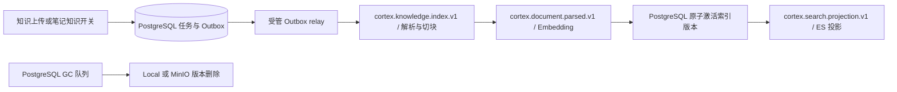

# Cortex 基础设施当前实现

> 校对日期：2026-09-07。本文描述已实现行为；后续设计见 [规划](plans/INFRASTRUCTURE_ROADMAP.md)，旧长篇方案见 [历史快照](archive/INFRASTRUCTURE_DESIGN_20260824.md)。

## 运行边界

| 组件 | 当前职责 | 权威来源 |
| --- | --- | --- |
| PostgreSQL 16 / pgvector | 租户、笔记、引用、配额、任务、Outbox、向量与活动索引版本 | 业务事实与权限 |
| MinIO / Local BlobStore | 私有附件和知识文件；按记录保存后端、key、version、etag | 文件内容 |
| Kafka / Redpanda | 知识解析、Embedding、搜索投影阶段事件 | 不保存业务完成事实 |
| Elasticsearch | BM25 + KNN 可重建投影 | 候选仍须回 PostgreSQL 校验 |
| Redis | 活动预扣、限流、缓存与模板排行 | PostgreSQL 保存最终事实 |
| LiteLLM、Embedding、Reranker、document-parser | 模型访问与隔离解析 | 不决定租户权限 |

`cmd/server` 托管 `internal/workers`、scheduler 和模板/AI 活动 worker。
`CORTEX_RUNTIME_ROLE=api` 只运行 HTTP，`worker` 运行后台任务，`all` 合并运行。
`cmd/migrate`、`cmd/blob-migrate` 和评测命令是显式运维工具。

## 文件上传与 GC

附件接口与知识上传接口均由后端接收文件并校验；当前没有对外分片上传会话 API。
知识上传将对象写入 BlobStore 后提交数据库与索引任务，返回 202；二进制格式由隔离解析器处理。
现有上传和 S3 Put 会读取受大小限制的文件内容，不承诺大文件恒定内存或断点续传。

`BlobStore` 提供 `Put/Open/Stat/Delete/Ready`；删除签名为
`Delete(ctx context.Context, key, version string) error`。S3 删除携带 `versionId`，本地实现忽略版本。
附件写入保存返回的版本，迁移工具亦保存版本；知识删除会把数据库已有版本带入 GC。
知识上传的常规入库路径目前未持久化每次 Put 返回的对象版本，此限制不能被“支持版本删除”掩盖。

附件删除事务先设置 `deleted_at` 并插入 `object_gc_jobs`：
1. worker 每秒检查队列，以管理连接和 `FOR UPDATE SKIP LOCKED` claim，设置唯一 owner 与两分钟租约。
2. 过期的 running 可被新 worker 接管；失败回 queued，30 秒后重试。
3. 按任务的 `storage_backend` 选择 local/MinIO；对应后端未配置时保留重试，不切换到另一存储。
4. 按 key/version 删除；完成更新仅接受当前 owner，成功后清理匹配的已软删附件行。
5. 上传配额只统计 `deleted_at IS NULL` 的附件，逻辑删除后即释放配额。

GC 不经过 Kafka。当前完成判断使用 owner fencing；不应宣称它实现了与 scheduler 相同的全部续租/期限校验。
迁移 42 为 GC 增加租约列和索引，并将历史无租约 running 恢复为 queued。
对象 key、bucket 和历史版本不可仅凭更改全局 `STORAGE_BACKEND` 迁移；`blob-migrate` 负责复制和 checksum 核对。

## 知识索引事件链



阶段消息只包含事件/文档标识和 schema 版本，任务载荷、lease、进度、receipt 和稳定失败码保存在 PostgreSQL。
已有活动版本在重建成功前持续服务。ES 投影在 PostgreSQL 激活之后执行，不能写成“ES 完成后才激活”。
`EVENT_BUS=postgres` 使用轮询索引 runner；`kafka` 使用阶段消费者。
模板 Outbox 有独立 worker，与知识 relay 的 claim 范围分离。

## 检索与故障

`RAG_RETRIEVAL_BACKEND=elasticsearch` 使用 ES BM25 + KNN；候选回 PostgreSQL 做租户、状态和活动版本校验。
`postgres` 使用 pgvector、中文 2-gram 与标题召回。配置可选择 backend，当前没有 ES 故障时自动切换 pgvector 的 circuit breaker。
ES 不可用返回 `KNOWLEDGE_RETRIEVAL_UNAVAILABLE`；普通笔记搜索仍可使用 PostgreSQL。完整流程见 [RAG](RAG.md)。

## 数据库与验证

初始化基线 materialize 到迁移 13，启动新库必须再执行全部待应用迁移；当前最终版本为 42、57 张 public 表。
已有迁移不改写，`cmd/migrate` 使用 advisory lock 管理版本化变更。

```powershell
# 仓库根目录；使用隔离 CI 数据库与真实外部依赖
./backend/scripts/local_integration_test.ps1
```

该入口覆盖 GC/RLS/租约/Redis/真实 MinIO 版本删除及全量 Go 测试。
发布、故障注入和备份恢复另见 [发布检查清单](RELEASE_CHECKLIST.md) 与 [运维说明](EXTERNAL_INFRA_OPERATIONS.md)。
