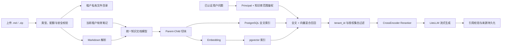

# Cortex 个人知识库技术方案

> 状态：待实现  
> 适用范围：用户上传 Markdown、Markdown ZIP、个人笔记入库与个人知识库问答  
> 最后更新：2026-08-04  
> 替代方向：移除面向固定 HowToCook 语料的产品能力，RAG 仅检索当前租户主动上传的资料和其本人笔记

## 1. 背景与目标

Cortex 当前的 RAG 链路面向仓库内固定版本的 HowToCook 语料。本方案将其调整为个人知识库：用户在前端上传 Markdown 文件或 ZIP 压缩包，后端将原始文件保存在 `CORTEX_DATA_DIR` 下的租户私有目录，对 Markdown 正文建立全文和向量索引，并将用户自己编写的有效笔记作为另一类知识来源共同参与问答。

目标如下：

1. 只解析 Markdown，不解析 PDF、Word、网页或其他正文格式；兼容 UTF-8 与 GBK/GB18030 文本，进入解析和索引链路前统一转换为 UTF-8 无 BOM；
2. 支持单个 `.md` 文件和包含 Markdown 的 `.zip` 压缩包；
3. ZIP 内允许携带 Markdown 引用的图片，图片与知识库原文件保存在同一文档目录树中，但不参与文本向量化；
4. 上传资料与个人笔记统一经过父子切块、全文索引、Embedding、混合召回和 Reranker；
5. 检索前必须校验登录身份、租户归属和知识库访问范围，任何查询都不能召回其他租户的数据；
6. 回答必须保存来源，未检索到当前租户的有效证据时不生成事实性答案；
7. 每个租户的个人知识库文件总容量不得超过 3 GiB（3,221,225,472 字节）；
8. Embedding、Reranker 或生成模型不可用时，笔记和文件管理仍保持可用。

非目标：团队共享知识库、公开知识库、知识库跨租户授权、外部对象存储、OCR、图片向量检索、压缩包在线预览，以及数据库与 Markdown 双向同步。

## 2. 总体架构



PostgreSQL 是知识元数据、索引状态、个人笔记正文和引用关系的权威来源；本地文件目录只保存用户上传的原始 Markdown 和图片。数据库不得保存宿主机绝对路径，只保存相对 `CORTEX_DATA_DIR` 的安全路径。

## 3. 上传格式与文件规则

### 3.1 支持范围

| 上传方式 | 允许内容 | 处理方式 |
|---|---|---|
| 单文件 | 一个 UTF-8 `.md` 文件 | 保存原文件并解析正文 |
| 压缩包 | `.zip`，至少包含一个 `.md` | 安全解压；每个 Markdown 建立独立知识文档 |
| ZIP 图片 | `.png`、`.jpg`、`.jpeg`、`.gif`、`.webp` | 原样保存，校验真实 MIME；不切块、不向量化 |

不接受独立图片上传。ZIP 中除 Markdown、支持的图片和可忽略的目录项外出现其他文件时，整个上传失败，避免用户误以为其他格式已经被索引。首期不支持嵌套 ZIP、加密 ZIP、符号链接、硬链接和可执行文件。

Markdown 支持 UTF-8、带 BOM 的 UTF-8 及 GBK/GB18030。后端不依赖不确定的通用编码猜测，而是按固定顺序解码：先识别 UTF-8 BOM，再尝试严格 UTF-8，失败后尝试 GB18030（覆盖常见 GBK 文本）；两种编码都无法解码时返回 `KNOWLEDGE_ENCODING_UNSUPPORTED`。进入正式目录、内容哈希、Markdown 解析和向量化前，正文统一转换为 UTF-8 无 BOM并规范换行符。单个空 Markdown 不创建索引任务。

转换过程应保留检测到的原始编码，例如 `utf-8`、`utf-8-bom` 或 `gb18030`，便于诊断；后续读取始终使用规范化后的 UTF-8 文件，不再重复猜测编码。不得使用系统默认代码页，因为服务部署环境变化会导致同一文件产生不同结果。

### 3.2 ZIP 安全

解压必须先扫描中央目录，再写入临时目录。至少实施以下限制：

- 拒绝绝对路径、盘符路径、UNC 路径、`..`、NUL 字节和规范化后逃离根目录的条目；
- 拒绝符号链接及其他特殊文件，禁止跟随任何链接；
- ZIP 条目名优先按照 UTF-8 标志解码；未标记 UTF-8 时仅回退 GB18030，解码失败则拒绝整个压缩包；路径安全校验必须在文件名成功解码和规范化后执行；
- 限制压缩包大小、解压总大小、单文件大小、文件数量、目录深度和压缩比，防止 Zip Slip 与 Zip Bomb；
- 文件扩展名、文件头和探测到的 MIME 必须一致；图片解码失败则拒绝；
- 上传流写入时同步计算 SHA-256，不将整个文件一次性读入内存；
- 先写 `CORTEX_DATA_DIR/tmp/<upload-id>`，全部校验成功后再原子移动到最终目录；失败时清理临时文件且不创建可见知识文档。

单个租户的个人知识库文件总容量上限固定为 3 GiB（`3221225472` 字节）。配额统计使用规范化后实际落盘的 Markdown 与图片字节数；ZIP 压缩包本身只用于传输，不重复计费，数据库中的 chunk、向量和索引空间不计入这 3 GiB 文件配额。上传完成后若租户已用容量加本次实际落盘容量超过上限，则整次上传失败并清理临时文件，不允许部分导入。

并发上传不能只执行“先查询、后写入”的非原子校验。建议在租户配额记录中维护 `used_bytes` 和 `reserved_bytes`，上传开始时按可验证的最大需求在数据库事务内锁定配额行并预占容量，完成安全解压和规范化后按实际字节结算；失败、取消或租约超时时释放预占。始终满足 `used_bytes + reserved_bytes <= 3221225472`。删除知识文档时只有在正式文件确认删除后才扣减 `used_bytes`，防止磁盘残留未计费。

单次上传大小、解压总大小、单文件大小、文件数量、目录深度和压缩比仍通过独立配置限制，例如 `KNOWLEDGE_MAX_UPLOAD_BYTES`、`KNOWLEDGE_MAX_EXTRACTED_BYTES`、`KNOWLEDGE_MAX_FILES`、`KNOWLEDGE_MAX_FILE_BYTES` 和 `KNOWLEDGE_MAX_COMPRESSION_RATIO`；这些限制不得高于租户剩余可用配额。

### 3.3 存储布局

建议目录结构：

```text
CORTEX_DATA_DIR/
└── knowledge/
    └── <tenant-uuid>/
        └── <upload-uuid>/
            └── source/
                ├── README.md
                ├── chapters/
                │   └── design.md
                └── images/
                    └── architecture.png
```

数据库仅保存类似 `knowledge/<tenant-uuid>/<upload-uuid>/source/README.md` 的相对路径。服务端在每次读写前使用 `filepath.Clean`、绝对路径解析和根目录包含校验，不能直接拼接客户端文件名。

ZIP 内的相对目录结构应保留，使 `./images/a.png` 等 Markdown 图片引用仍然有效。解析器只接受指向同一 `upload-uuid/source` 根目录内图片的相对引用；远程 URL 可保留为普通 Markdown 文本但不下载，`file:`、`data:`、绝对路径和越界引用不得映射为本地资源。

图片不通过公开静态目录暴露。前端展示本地图片时使用鉴权接口获取，后端校验 Principal、租户、文档归属和图片路径后返回内容，并设置安全的 `Content-Type`、`X-Content-Type-Options: nosniff` 和合适的缓存策略。

## 4. 数据模型

迁移 `000012_remove_personal_knowledge` 已删除旧版通用知识库表。实现本方案时必须新增后续版本化迁移（建议从 `000017_personal_knowledge_v2` 开始），不得修改旧迁移或在应用启动时临时建表。

建议的数据表如下：

| 表 | 作用 | 关键字段 |
|---|---|---|
| `knowledge_collections` | 用户管理的知识库/集合 | `tenant_id`、`name`、`deleted_at` |
| `knowledge_uploads` | 一次 `.md` 或 `.zip` 上传及配额统计 | `tenant_id`、`upload_id`、`stored_root`、`reserved_bytes`、`expanded_bytes`、`status` |
| `knowledge_documents` | 上传 Markdown 或笔记的统一文档记录 | `tenant_id`、`source_type`、`note_id`、`stored_path`、`source_encoding`、`content_hash`、`active_index_version`、`status` |
| `knowledge_assets` | ZIP 内图片 | `tenant_id`、`document_id`、`stored_path`、`mime_type`、`size`、`sha256` |
| `knowledge_parent_chunks` | 提供完整上下文的章节块 | `tenant_id`、`document_id`、`index_version`、`heading_path`、`content_hash` |
| `knowledge_child_chunks` | 用于召回和精排的小块 | `tenant_id`、`parent_id`、`search_vector`、`embedding`、`embedding_model` |
| `knowledge_index_jobs` | 异步解析和索引任务 | `tenant_id`、`document_id`、`target_index_version`、`lease_until`、`attempts` |
| `knowledge_message_sources` | 问答引用快照 | `tenant_id`、`message_id`、`source_type`、`document_id`、`note_id`、`snippet`、`rank` |

`knowledge_documents.source_type` 首期只允许：

- `upload`：正文权威来源为本地 Markdown 文件；
- `note`：正文权威来源为 PostgreSQL `notes` 表，不复制为本地 Markdown 文件。

当 `source_type='upload'` 时，`stored_path` 必填且 `note_id` 为空；当 `source_type='note'` 时，`note_id` 必填且 `stored_path` 为空。使用 `(tenant_id, note_id)` 外键关联笔记，避免通过全局 ID 引用其他租户笔记。

所有知识表都必须启用并强制 RLS，策略使用 transaction-local `app.current_tenant_id`；所有业务 SQL 同时保留显式 `tenant_id = $1` 条件。复合唯一键和外键均包含 `tenant_id`，从数据库结构上禁止跨租户关联。

## 5. Markdown 解析与索引

### 5.1 统一文档规范化

上传 Markdown 读取自受控文件路径，笔记正文读取自 `notes.content`。两类来源进入同一个规范化模型：标题、来源类型、集合、Markdown 正文、标题层级、内容哈希和可选资源引用。

解析只提取文本结构，不执行 Markdown 中的 HTML、脚本或内嵌代码。前端渲染仍需禁用原始 HTML或进行严格清洗。图片的 alt 文本可保留在检索文本中，图片二进制本身不进入 Embedding。

### 5.2 父子切块

- 优先按 Markdown 标题层级形成 parent，保留完整章节及标题路径；
- 超长章节按段落、列表和代码块边界拆为 child，避免截断 Markdown 结构；
- child 用于全文、向量召回和 Rerank，parent 用于最终生成上下文；
- `embedding_text` 至少包含文档标题、标题路径、来源类型和正文片段；
- chunk 的 `content_hash` 由解析器版本、切块版本、标题路径及规范化正文共同计算。

### 5.3 版本化和增量更新

每个文档维护 `active_index_version`。构建新版本时旧版本继续提供检索；只有目标版本的 parent、child 和 embedding 全部完整且模型一致时，才在事务中切换活动版本。构建失败不得删除当前活动版本。

用户修改笔记后，通过 outbox/索引任务提交新版本；正文哈希不变时跳过重复索引。笔记软删除、租户软删除或用户主动关闭“参与知识问答”时，文档立即退出可检索集合并异步清理向量。恢复笔记后重新校验内容并建立索引。

上传资料首期按不可原地编辑处理：重新上传生成新文档或新版本。删除知识文档时先标记 `deleting` 使其停止召回，再删除数据库索引与本地文件；文件删除失败应保留可重试任务，不把残留路径重新暴露给用户。

## 6. 查询鉴权与检索隔离

### 6.1 鉴权顺序

每次知识问答必须按以下顺序执行：

1. 认证中间件从 Token 解析可信 `Principal`，忽略客户端提交的 `tenant_id`；
2. 校验租户状态，已软删除租户返回 403；
3. 若请求指定 `collection_ids`，在设置租户上下文的同一事务中确认这些集合均属于当前租户且未删除；
4. 将服务端验证后的集合 ID 作为授权范围传给 Retriever；客户端 ID 不得直接拼入检索 SQL；
5. Retriever 的全文、向量、parent 展开和来源保存均在可信 Principal/RLS 下执行，并显式过滤 `tenant_id`；
6. 文档、笔记或集合不存在以及不属于当前租户时统一返回 404，不暴露资源是否存在。

即使用户不指定集合，默认范围也只能是当前租户的全部活动上传资料和设置为可参与问答的有效笔记，而不是全库数据。

### 6.2 Worker 边界

索引 worker 可以用管理连接 claim 到期任务，但 claim 结果只包含任务 ID、租户 ID和有限租约。处理某个任务时必须携带该任务记录中的租户 ID，在单独事务中设置 transaction-local RLS 上下文，并继续使用显式租户条件读取文档和写入 chunk；禁止用管理连接执行普通跨租户检索。

查询向量不得写入共享跨租户缓存。若未来增加缓存，缓存键必须包含租户 ID、授权集合、索引版本、Embedding 模型和 query 哈希，并设置短 TTL；默认关闭答案缓存。

### 6.3 混合检索与引用

检索链路采用：全文召回 + pgvector 向量召回 → RRF 融合 → CrossEncoder Rerank → parent 展开与去重。所有召回 SQL 必须同时满足：

```text
tenant_id = Principal.TenantID
document.status = 'ready'
document.deleted_at IS NULL
chunk.index_version = document.active_index_version
collection_id 属于服务端已验证范围（若指定）
笔记来源对应 note.deleted_at IS NULL 且允许参与问答
```

最终上下文中的每条证据携带不可伪造的服务端来源 ID。生成后校验引用是否属于本次候选集，再将来源标题、类型、片段、文档/笔记 ID、索引版本和排名保存到 `knowledge_message_sources`。来源后来被删除时保留最小引用快照并标记 `source_deleted`，不得保留或返回完整已删除正文。

没有当前租户证据时返回 `KNOWLEDGE_NO_EVIDENCE`，不能让模型依赖常识生成一个看似来自用户资料的回答。

## 7. API 草案

所有接口使用 `/api/v1` 和 `Authorization: Token <token>`。

| 方法 | 路径 | 说明 |
|---|---|---|
| `POST` | `/api/v1/knowledge/uploads` | `multipart/form-data` 上传一个 `.md` 或 `.zip`，支持幂等键 |
| `GET` | `/api/v1/knowledge/uploads/{id}` | 查询解析、索引状态及稳定错误码 |
| `GET` | `/api/v1/knowledge/documents` | 列出当前租户知识文档 |
| `GET` | `/api/v1/knowledge/documents/{id}` | 查看文档元数据和索引状态 |
| `DELETE` | `/api/v1/knowledge/documents/{id}` | 软删除并触发索引/文件清理 |
| `GET` | `/api/v1/knowledge/documents/{id}/assets/{assetId}` | 鉴权读取文档图片 |
| `POST` | `/api/v1/knowledge/documents/{id}/retry` | 重试失败的解析或索引任务 |
| `GET/POST/PATCH/DELETE` | `/api/v1/knowledge/collections...` | 管理当前租户集合 |
| `PATCH` | `/api/v1/notes/{id}/knowledge` | 设置笔记是否参与知识问答 |
| `POST` | `/api/v1/knowledge/chat/stream` | 对已验证范围执行 SSE 问答 |

上传接口在文件安全落盘和数据库记录创建后返回 `202 Accepted`；解析、Embedding 和索引异步执行。重复幂等键返回同一个上传结果。错误响应继续使用稳定的 `code`、`message` 和可选 `details`，不得返回宿主机路径、原始 SQL、上游响应正文或其他租户信息。

建议稳定错误码包括：`KNOWLEDGE_FILE_TYPE_UNSUPPORTED`、`KNOWLEDGE_ENCODING_UNSUPPORTED`、`KNOWLEDGE_MARKDOWN_INVALID`、`KNOWLEDGE_ARCHIVE_INVALID`、`KNOWLEDGE_ARCHIVE_UNSAFE`、`KNOWLEDGE_QUOTA_EXCEEDED`、`KNOWLEDGE_INDEX_PENDING`、`KNOWLEDGE_INDEX_FAILED`、`KNOWLEDGE_SCOPE_NOT_FOUND` 和 `KNOWLEDGE_NO_EVIDENCE`。

## 8. 前端方案

新增个人知识库页面，包含：

- 上传区：仅允许 `.md`、`.zip`，上传前显示格式、图片和配额说明；
- 文档列表：显示来源类型、所属集合、大小、更新时间和 `uploaded/parsing/indexing/ready/failed/deleting` 状态；
- 失败详情与重试：只展示稳定错误摘要，不展示服务器路径；
- 笔记设置：支持单篇或批量设置是否参与知识问答；
- 问答范围：默认“全部个人知识”，可选择一个或多个当前用户集合；
- 来源面板：区分“上传资料”和“个人笔记”，点击前再次通过鉴权接口读取。

前端的文件扩展名过滤仅用于用户体验，不能替代后端校验。SSE 断开后不得自动从头重放已输出内容；可使用 request ID 查询本次消息最终状态。

## 9. 配额、审计与隐私

- 每个租户的知识库文件容量上限为 3 GiB（3,221,225,472 字节），按 Markdown 和图片的实际落盘字节统计；通过数据库事务预占和结算容量，保证并发上传不能突破上限；
- 前端展示已用、预占及剩余容量，后端返回的容量判断始终为最终依据；向量和数据库空间可另设索引额度；
- 普通日志只记录租户的非直接身份标识、请求 ID、文档 ID、阶段、数量、耗时和错误码，不记录文件正文、问题、答案或绝对路径；
- AI 审计只保存必要元数据和来源 ID，发送给 LiteLLM 的观测元数据不得包含邮箱、姓名或完整正文；
- 完整备份可包含上传 Markdown、图片及其相对路径映射，但不得包含 Token、密钥或敏感审计；恢复只允许空租户并重映射文档、资源和引用 ID；
- 删除租户时立即禁止查询，随后异步清理其知识文件、向量、缓存和临时目录。

## 10. 故障与降级

| 故障 | 行为 |
|---|---|
| 文件或 ZIP 校验失败 | 不落入正式目录，不创建可检索文档 |
| Markdown 解析失败 | 文档标记失败，保留安全原文件供用户删除或重试 |
| Embedding 不可用 | 文档保持待索引/失败状态；笔记和文件管理可用 |
| Reranker 不可用 | 问答返回稳定错误，不把未经精排结果伪装为完整链路 |
| LiteLLM 不可用 | 知识管理和检索索引可用，生成问答不可用 |
| 新索引版本失败 | 继续使用旧活动版本；首次索引失败则文档不可检索 |
| 图片丢失 | 文本检索继续可用，资源接口返回 404并记录修复任务 |
| 文件删除失败 | 保持不可检索并进入清理重试，不恢复公开访问 |

## 11. 实施顺序

1. 新增个人知识库 v2 迁移、RLS、复合外键和配额字段；
2. 实现安全上传、ZIP 预扫描、原子落盘、图片鉴权读取与删除清理；
3. 实现 Markdown 解析、统一文档模型、父子切块和异步版本化索引；
4. 将笔记创建、更新、恢复和软删除事件接入索引任务；
5. 实现带 Principal 和授权集合的混合 Retriever，禁止复用无租户约束的菜谱检索 SQL；
6. 接入 Reranker、LiteLLM、SSE、引用校验和来源持久化；
7. 完成知识库前端页面、笔记入库设置和问答范围选择；
8. 移除 HowToCook 产品入口、固定语料同步、菜谱推荐及相关配置，并更新 README、API、备份和部署文档。

迁移期间不要让固定菜谱索引与个人知识索引共享表或默认检索范围。若需要短期并存，应使用独立路由和独立表，个人知识问答只能读取新知识表及当前租户笔记。

## 12. 测试与验收

### 12.1 必测安全场景

- 两个租户上传标题和内容完全相同的文档，互相不能列表、读取图片、删除或召回；
- 客户端伪造 `tenant_id`、文档 ID、集合 ID、asset ID 均不能扩大查询范围；
- ZIP 包含 `../`、绝对路径、盘符、符号链接、嵌套 ZIP、超高压缩比或不支持文件时被拒绝；
- UTF-8、UTF-8 BOM、GBK/GB18030 Markdown 均能转换为 UTF-8 无 BOM并正确索引；非法字节序列返回稳定编码错误，不能产生乱码文档；
- ZIP 条目名分别覆盖 UTF-8 标志、未标记 UTF-8 的 GB18030 文件名和无法解码的文件名，并在解码后重新验证目录穿越；
- 单租户已用容量达到或即将超过 3 GiB 时拒绝整次上传；多个并发上传经过预占后 `used_bytes + reserved_bytes` 始终不超过上限；
- 上传失败、取消和预占租约超时能够释放容量，文件删除失败时不得提前释放已用容量；
- 图片伪造扩展名、Markdown 引用越界路径和目录穿越下载被拒绝；
- worker claim 后写 chunk 时仍受任务租户上下文和显式租户条件约束；
- 删除/软删除文档或笔记后立即不再被召回，旧引用只返回最小删除快照。

### 12.2 功能与质量验收

- 单 Markdown 和多目录 ZIP 能正确保存、解析、索引，图片相对引用可通过鉴权接口展示；
- 修改笔记后只激活完整的新索引版本，旧版本在切换前持续可用；
- 同一问题能同时召回上传资料和个人笔记，并正确区分来源类型；
- 无证据时返回 `KNOWLEDGE_NO_EVIDENCE`；生成引用全部属于本次服务端候选集；
- 建立个人知识库离线评测集，统计 Hit@K、MRR、Context Recall、Context Precision、Faithfulness 和 Answer Relevancy；
- 验证 Embedding、Reranker 和 LiteLLM 分别不可用时的降级边界。

提交前至少运行仓库规定的后端、前端和 Compose 验证，并新增个人知识库验收脚本，覆盖上传、索引、跨租户隔离、混合问答、引用、删除与恢复流程。
