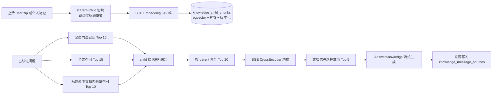
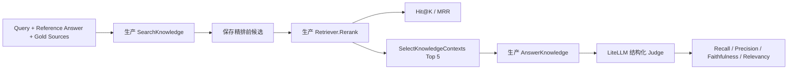

# Cortex RAG 具体链路与策略

> 状态：当前实现（2026-08-06）
> 适用范围：个人知识库问答（`POST /api/v1/knowledge/chat/stream`）与离线评测
> 最后验证：2026-08-06（164 条全量：90 菜谱 + 74 非菜谱，含分通道召回统计）
> 明确不包含：HyDE、Step-back Prompting、在线用户评价、外部向量数据库、跨租户共享 Prompt/响应缓存

> 历史沿革：本项目的 RAG 最初服务于旧项目名时代的内置 HowToCook 菜谱问答
> （`backend/internal/recipe`）。2026-08-05 菜谱功能整体移除（数据表由迁移
> `000018_drop_recipe_tables` 删除），菜谱语料一次性迁移到评测用户 `Diving` 的运行时
> 私有知识库；当前主线是 Cortex 个人知识库 v2/v3 检索，复用同一套 GTE Embedding
> 与 BGE CrossEncoder 精排。本文以当前实现为准，历史链路只在与当前对照时简要提及。

## 1. 目标与边界

Cortex 的 RAG 从当前租户启用的个人知识文档（上传的 `.md`/`.zip` 与开启知识索引的个人笔记）
中检索证据，并通过 LiteLLM 生成带来源约束的回答。设计重点是：

1. 用 child chunk 做细粒度召回，用 parent chunk 为生成保留完整章节；
2. 组合全局向量、正文全文、标题文档内向量三路召回，降低单一路径漏召；
3. 在 child 层使用 RRF 融合不同量纲的排序，再按 parent 聚合，最后用 BGE CrossEncoder 精排；
4. 索引重建期间保留旧版本，重建失败不中断线上检索；
5. 线上知识问答与离线评测复用同一个 `Store.SearchKnowledge` / `SelectKnowledgeContexts`，
   防止评测逻辑与生产逻辑漂移。

系统不提供在线评测 API、用户点评入口或评测后台。离线结果只写入本地
`artifacts/rag-eval/`，不进入业务数据库，也不含供应商密钥或完整正文之外的敏感信息。

## 2. 总体链路



## 3. 语料来源与索引构建

### 3.1 语料来源与文档状态

- 语料来自：单文件 `.md`、包含 Markdown 的 `.zip`（可携带 PNG/JPG/GIF/WebP 图片）、以及
  通过 `PATCH /api/v1/notes/{id}/knowledge` 开启参与问答的个人笔记；每租户容量上限 3 GiB。
- 文档状态机为 `uploaded → parsing → indexing → ready`，失败为 `failed`，删除为 `deleting`。
- 检索只覆盖 `status='ready'`、`deleted_at IS NULL`、`knowledge_enabled` 的文档，且
  `child.index_version = document.active_index_version`；`source_type='note'` 的文档还要保证
  对应笔记未被软删除。

### 3.2 Parent-Child 切分

`backend/internal/knowledge/chunker.go` 使用确定性规则切分，不调用 LLM，可重复构建：

- 按任意 Markdown 标题层级（`#`～`######`）维护 heading path，每个“有正文的章节”生成一个
  parent；
- **v3 起不再为只有 heading、没有有效正文的章节创建 parent**（如只有 `## 操作` 的空标题节）；
- child 硬上限为 500 个 Unicode 字符，超出时优先在换行处断行；
- `content` 保留原始片段，`embedding_text` 使用结构化增强文本：

```text
标题：<文档标题>
来源：<upload | note>
章节：<完整 heading path，以 / 分隔>
内容：<清洗后的 child 正文>
```

- `content_hash` 由 `parent-v1`/`child-v1` 版本前缀、heading path 与内容计算 SHA-256，
  相同输入可重复生成相同 hash。

### 3.3 版本化索引与重建

- 迁移 `000017_personal_knowledge_v2` 创建 `knowledge_*` 九张表并启用 RLS；
- 迁移 `000019_knowledge_retrieval_v3` 为全部启用且 ready 的文档排队下一索引版本；
- 后台 `RunKnowledgeIndexer`（`backend/internal/server/knowledge_worker.go`）轮询
  `knowledge_index_jobs`：claim 任务 → 读取正文 → `knowledge.Chunk` → embedding →
  `WriteKnowledgeChunks` 原子写入新版本并切换 `active_index_version`；
- 重建期间旧 `active_index_version` 继续服务；任一步失败则该文档保持旧版本，并记录稳定
  错误码（`KNOWLEDGE_MARKDOWN_INVALID`、`KNOWLEDGE_EMBEDDING_UNAVAILABLE`、
  `KNOWLEDGE_INDEX_FAILED` 等）；
- 检索 SQL 始终要求 `child.index_version = document.active_index_version`，不会混用同一文档
  的两个版本。

## 4. Query 处理策略

当前知识问答**不对 query 做 LLM 改写，也不做确定性意图扩展**：query 原样进入向量与全文召回
（菜谱时代保留的 `Featured Rewrite` / `ExpandRetrievalQueries` 已随 `internal/recipe` 移除）。

这意味着查询词本身的质量直接决定召回上限，也意味着“同义/领域词扩展、无监督改写”是后续
优化空间之一（见第 12 节），但不会引入 HyDE 或 Step-back。

## 5. 混合召回策略

`Store.SearchKnowledge` 在同一个 `pgx.Tx` 内设置 transaction-local RLS 上下文，并以
`tenant_id`、`collection_ids`（可选）、`knowledge_enabled`、`status='ready'`、
`index_version=active_index_version` 过滤后执行三路召回。

### 5.1 全局向量召回

query 经 `iic/nlp_gte_sentence-embedding_chinese-small`（512 维）生成向量，在所有 eligible
child 上按 cosine distance `<=>` 排序取 `RAG_VECTOR_TOP_K`（默认 15）。query embedding
失败时检索整体失败。

### 5.2 正文全文召回

对 `embedding_text` 建 `to_tsvector('simple', ...)`，用
`plainto_tsquery('simple', query)` 匹配，按 `ts_rank_cd` 排序取 `RAG_KEYWORD_TOP_K`
（默认 15）。

> 注意：`simple` 配置不做中文分词，匹配粒度是整段结构化文本；这解释了为何标题/章节字段
> 被拼进 `embedding_text` 对全文召回同样重要。

### 5.3 标题文档内向量召回

先找“标题包含 query 或 query 包含标题”的文档（去空格、去 `.md`、去“的做法”后缀，最多
5 篇），再在这批文档内按 query 向量召回 `RAG_TITLE_TOP_K`（默认 10）。该通道用于把
“明确点名某篇资料”的问题锁定到目标文档，避免被全局相似文档淹没。

### 5.4 child 层 RRF 与 parent 聚合

- 三路候选以 `child_chunk_id` 为键，在 child 层按

```text
RRF score = Σ 1 / (60 + route_rank)
```

  累加；多路命中的 child 分数更高，并保留 route provenance；
- 随后按 `parent_id` 聚合，每个 parent 取其中 child 的最高分，按分数取
  `RAG_FUSION_TOP_K`（默认 20）个 parent 作为粗排候选；
- 同分时排序结果可重复。

### 5.5 默认召回参数

| 配置 | 默认值 |
|---|---:|
| `RAG_VECTOR_TOP_K` | 15 |
| `RAG_TITLE_TOP_K` | 10 |
| `RAG_KEYWORD_TOP_K` | 15 |
| `RAG_FUSION_TOP_K` | 20 |
| `RAG_CONTEXT_PARENT_TOP_K` | 5 |

## 6. Rerank 与生成上下文

### 6.1 Rerank

粗排 Top 20 parent 交给 `BAAI/bge-reranker-v2-m3`（Compose 内部 `reranker-service:8080`）。
线上知识问答与离线评测共用相同的精排输入：

```text
标题：<document title>
来源：<source type>
章节：<heading path>
内容：<parent content>
```

reranker 返回的 index 必须完整、唯一且在候选范围内；缺失、重复或越界会使本次问答失败，
不静默采用不完整结果。

### 6.2 文档优先的上下文选择

精排后由 `SelectKnowledgeContexts`（`backend/internal/store/knowledge_retrieval.go`）选择
最终上下文：

1. 先确定文档：**明确标题命中时只从第一名文档选择**（`query` 归一化后包含第一名标题），
   否则最多保留三个高分文档；
2. 在选中文档内按其最高分 parent 依次填充，再用剩余预算补充这些文档的其他相关章节；
3. 总预算 `RAG_CONTEXT_PARENT_TOP_K`（默认 5），相同 parent 去重。

该策略把“召回哪个文档”和“取文档哪一章”解耦，是本轮 Context Recall 与 Context Precision
同时提升的关键（见第 9 节）。

### 6.3 生成与来源保存

最终 parent 转为 `KnowledgeEvidence`（引用 `K1`…`Kn`），由
`AIWorkflow.AnswerKnowledge`（`backend/internal/ai/workflow.go`）经 LiteLLM 逻辑模型
`diary-default`（Compose 中映射 DeepSeek，Kimi/OpenAI 兜底）流式生成。业务层继续负责来源
约束、引用校验、配额与审计；供应商真实密钥不会进入前端、日志、评测集或报告配置。

SSE 事件序列为 `retrieval → delta* → sources → done`；回答与来源写入
`knowledge_message_sources`（含 `document_id`、`note_id`、标题、摘要、`index_version` 与
`rank`）。保存时若来源文档已失效，返回 `KNOWLEDGE_SOURCE_INVALID`。

页面与实现细节见 [个人知识库页](page/KNOWLEDGE_PAGE_ARCHITECTURE.md)。

## 7. 故障与降级策略

| 故障 | 当前行为 |
|---|---|
| query embedding 未配置或失败 | 返回 `KNOWLEDGE_EMBEDDING_UNAVAILABLE`，检索不继续 |
| 没有候选 | 返回 `KNOWLEDGE_NO_EVIDENCE`，不生成无来源答案 |
| reranker 未配置、调用失败或返回不完整 | 返回 `KNOWLEDGE_RERANK_UNAVAILABLE`，不静默用粗排结果 |
| 上下文选择后为空 | 同“没有候选”，返回无依据语义 |
| 来源在保存时失效 | 返回 `KNOWLEDGE_SOURCE_INVALID`，提示重新提问 |
| 索引构建失败 | 未完成文档继续使用旧活动版本 |
| LiteLLM 不可用 | AI 问答不可用；笔记、搜索、附件、导出和备份保持可用 |
| 个人笔记被软删除 | 对应 `source_type='note'` 文档退出检索 |

普通日志只应记录错误码、候选数、耗时和 request/trace ID，不记录完整 query、正文、上下文
或答案。

## 8. 离线评测链路

### 8.1 数据集与评测范围

- 主数据集 `backend/testdata/rag/knowledge_eval_v2.jsonl` 包含 45 条非菜谱查询（v2），另有 `recipe_eval_v1.jsonl` 包含 90 条菜谱查询（v1 回归用）、完整参考答案、gold
  source path 和标签；文件名保留历史命名（语料来自已迁移的 HowToCook 菜谱），配套清单见
  `backend/testdata/rag/recipe_eval_v1_manifest.json`。
- gold 按迁移前的文件名与数据库文档标题或 `stored_path` 匹配，不依赖知识集合唯一性。
- 评测入口固定按用户名解析 `Diving` 的 Principal，在其全部启用且 ready 的知识文档上复用
  生产检索链路；不接收 `tenant_id`，也不限定知识集合。

### 8.2 单条评测流程



每条失败只记录本条 error，其余 query 继续运行。Judge 输出使用严格 JSON 校验，同时兼容模型
偶发返回的外层 `json` Markdown code fence；未知字段、非法 rank、缺失数组和越界分数仍会被
拒绝。

### 8.3 指标定义

| 指标 | 定义 |
|---|---|
| Hit@K | Top-K 中是否出现 gold source/chunk，取全体均值 |
| MRR | 第一个 gold 命中的倒数排名均值；分别统计 rerank 前后 |
| **Route Hit@10** | 按召回通道（向量/全文/标题）独立统计 Top-10 命中率 |
| **Route Incremental** | 各通道独有命中比例（仅该通道命中、多通道协同） |
| Context Recall | 最终 context 支持的 reference facts / 全部 reference facts |
| Context Precision | Judge 标记的相关 context 按排名计算 Average Precision |
| Faithfulness | 生成答案中有 context 支持的原子 claims / 全部 claims |
| Answer Relevancy | 答案对 query 意图的覆盖和聚焦程度 |

> 通道来源追踪自 2026-08-06 通过 `child_score` CTE 中 `route_mask` bit flags 实现：
> `1 = vector, 2 = fulltext, 4 = title`。`ComputeRouteMetrics` 在 rerank 前的候选集上
> 统计各通道的独立命中与协同关系，帮助定位召回短板。

Judge 仍通过 LiteLLM，不直连模型供应商。完整结果包含每条候选、生成答案、Judge 判断和阶段
耗时，便于区分粗召回、rerank、上下文选择与生成问题。

### 8.4 运行与产物

```powershell
.\backend\scripts\rag_eval.ps1 -Workers 1
# 可用 -CaseIDs "recipe-001,recipe-002" 做小样本检查
```

> 全量评测默认使用单 worker：多 worker 会触发 LiteLLM 限流（见第 12.5 节）。

一次运行在 `artifacts/rag-eval/<timestamp>/` 生成：

- `config.json`：数据集、模型和运行参数快照；
- `cases.jsonl`：逐 query trace、答案、评分和错误；
- `summary.json`：聚合指标与 p50/p95 延迟；
- `report.md`：可读报告。

> **运行环境注意（2026-08-06 实测）**：
> - `PATCH /api/v1/notes/{id}/knowledge` 使用 `digest(...,'sha256')`（pgcrypto）计算
>   `content_hash`，但 `backend/db/schema.sql` 基线尚未创建 `pgcrypto` 扩展。新库初始化后
>   首次为笔记启用知识索引会报 `function digest(bytea, unknown) does not exist
>   (SQLSTATE 42883)`；**应在 `schema.sql` 基线补充 `CREATE EXTENSION IF NOT EXISTS
>   pgcrypto;`**，已部署库手动执行一次即可。
> - 评测固定按用户名解析 `Diving`；需要上传评测 fixture 时，口令仅通过
>   `CORTEX_EVAL_DIVING_PASSWORD` 或脚本参数注入。其租户下必须已上传并
>   索引评测集引用的全部文档，含 `backend/testdata/rag/non_recipe_notes/` 的 10 篇非菜谱笔记。

完整流水线（上传非菜谱笔记 → 等待索引完成 → 运行 164 条合并集 → 与基线对比并输出分通道报告）：

```powershell
# 首次（自动上传非菜谱笔记并启用索引）
.\backend\scripts\run_full_eval.ps1 -Workers 2
# 已入库后跳过上传
.\backend\scripts\run_full_eval.ps1 -Workers 2 -SkipUpload
```

## 9. 评测结果对照分析（2026-08-05 / 2026-08-06）

评测环境：用户 `Diving`，数据集 90 条，`search_limit=20`、`context_top_k=5`，Embedding
`iic/nlp_gte_sentence-embedding_chinese-small`，Reranker `BAAI/bge-reranker-v2-m3`，生成与
Judge 均走 LiteLLM。以下按运行目录演进对照。

### 9.1 演进阶段

| 运行目录 | 阶段 | 说明 |
|---|---|---|
| `20260805-081806` | 升级前基线 | reranker 只接收 parent 正文；Judge 未收到 context 正文，质量指标不可信 |
| `20260805-084256` | 升级后 | 修复 Judge context 缺失；reranker 补齐标题/来源/章节 |
| `20260805-091638` | 无效运行 | 4 workers 触发 LiteLLM 限流，46/90 失败；**已删除，不计入对比** |
| `20260805-092823` | 文档优先（固定 3 文档）中间态 | Context Recall 提升但 Context Precision 下降，用于定位上下文策略 |
| `20260805-094202` | RAG v3 最终 | 标题确定性门控 + 文档优先 + 章节预算，当前基线 |

### 9.2 指标对照

| 指标 | 081806 升级前 | 084256 升级后 | 092823 文档优先中间态 | 094202 RAG v3 最终 |
|---|---:|---:|---:|---:|
| Hit@1 | 0.8111 | 0.9222 | 0.9889 | 0.9889 |
| Hit@3 | 0.9111 | 0.9889 | 1.0000 | 1.0000 |
| Hit@5 | 0.9333 | 0.9889 | 1.0000 | 1.0000 |
| Hit@10 | 0.9667 | 0.9889 | 1.0000 | 1.0000 |
| MRR（rerank 前） | 0.8877 | 0.8877 | 0.9568 | 0.9568 |
| MRR（rerank 后） | 0.8670 | 0.9537 | 0.9926 | 0.9926 |
| Context Recall | 0.5245* | 0.5429 | 0.8807 | **0.8998** |
| Context Precision | 0.8433* | 0.8878 | 0.7662 | **0.9335** |
| Faithfulness | 0.8812* | 0.9262 | 0.9611 | **0.9743** |
| Answer Relevancy | 0.6877 | 0.7554 | 0.9267 | **0.9331** |
| 总耗时 p50（ms） | 7,093 | 7,590 | 7,363 | 7,041 |
| 总耗时 p95（ms） | 10,417 | 12,747 | 10,433 | 10,323 |

`*` 升级前 Judge 没有收到 context 正文，这三项只能作为故障运行记录，不能作为可信质量基线。

### 9.3 排序与失败对照

| 项目 | 081806 | 084256 | 094202 |
|---|---:|---:|---:|
| 成功案例 | 90/90 | 90/90 | 90/90 |
| rerank 后 Top-1 命中 | 73/90 | 83/90 | 89/90 |
| rerank 排名回退案例 | 12 | 4 | 0 |
| Hit@5 miss | 6 | 1 | 0 |

### 9.4 关键结论

1. **Judge 必须携带 context**：081806 的 Context Recall/Precision/Faithfulness 因 Judge
   缺上下文而失真；修复后 084256 三项才成为可信基线。
2. **标题与 heading 对 CrossEncoder 至关重要**：084256 相比 081806，Hit@1 提升 11.11
   个百分点、rerank 后 MRR 提升 8.67 个百分点，rerank 回退从 12 条降到 4 条；
   鱼香肉丝案例从粗排 Top-1 被 rerank 移出 Top-10 恢复为 Top-1。
3. **正确文档命中 ≠ 正确章节命中**：084256 阶段正确文档大多已命中，但 Context Recall 仍
   只有 0.5429——命中“只有 `## 操作` 标题的空 parent”，而详细步骤在“处理原料”“炒熟各种
   材料”等更深章节。
4. **RAG v3 三项修复同时生效**：跳过 heading-only parent、标题通道 + child 层 RRF +
   parent 聚合去重、以及“先选文档再选章节”的上下文策略，使 Context Recall 从 0.5429 提升
   到 0.8998，Faithfulness 到 0.9743，Answer Relevancy 到 0.9331。
5. **上下文策略存在精度/召回权衡**：092823 固定保留前三个文档虽然 Context Recall 达到
   0.8807，但 Context Precision 降至 0.7662；最终改为“明确标题命中只选目标文档，否则最多
   三篇”，使 Context Recall 提升到 0.8998 的同时 Context Precision 恢复到 0.9335。
6. **排序已饱和，剩余差距在上下文覆盖与生成**：Hit@5/10 均达到 1.0、rerank 回退归零；
   当前主要剩余问题从“gold 文档找不到”转向“最终 Top-5 上下文对参考事实的覆盖仍差约 10%”
   以及低分案例的章节选择。

### 9.5 分通道召回评测（2026-08-06，164 条合并集）

评测环境：用户 `Diving`，`knowledge_eval_merged.jsonl` = 90 条菜谱（v1）+ 74 条非菜谱（v2 45 条
+ extra 29 条），`search_limit=20`、`context_top_k=5`，Embedding/Reranker/生成/Judge 与 9.2
一致。运行目录 `20260806-132544`（`rag_eval.ps1` 直跑）与 `20260806-134152`
（`run_full_eval.ps1` 全流程，含基线对比报告）。

| 指标 | 20260806-134152 |
|---|---:|
| Hit@1 | 0.9939 |
| Hit@3 / Hit@5 / Hit@10 | 1.0000 |
| MRR（rerank 前 / 后） | 0.9407 / 0.9959 |
| Context Recall | 0.8538 |
| Context Precision | 0.9032 |
| Faithfulness | 0.9479 |
| Answer Relevancy | 0.9275 |
| 总耗时 p50 / p95（ms） | 7,485 / 10,863 |

分通道 Hit@10（rerank 前）：

| 通道 | Hit@10 | 说明 |
|---|---:|---|
| 向量召回（Vector） | 1.0000 | 唯一能独立覆盖全部 gold 的通道 |
| 全文召回（Fulltext） | 0.0000 | 对中文查询**零命中**，增量与协同均为 0 |
| 标题召回（Title） | 0.4756 | 命中必然同时被向量命中，无独立增量 |

> **关键结论（通道来源追踪的首次量化结果）**：164 条用例的 rerank 前候选中没有任何一条带
> `route=2`（全文）标记。根因是 `to_tsvector('simple')` / `plainto_tsquery('simple')` 对
> 无空格中文整句不做分词：查询词被整体视为单个 token，与 chunk 文本中的整句 token 无法命中。
> 全文通道当前是**零贡献通道**，向量 + 标题两路已覆盖全部 gold（Hit@10 = 1.0）。建议结合
> 第 12.2 节在 `simple` 之外引入中文分词（如 `zhparser`）或 2-gram 确定性切词后再评估是否保留
> 该通道；在引入中文分词前该通道不参与命中，但也不影响召回上限（由向量/标题兜底）。
>
> 两次运行（132544 / 134152）的检索类指标完全一致（Hit@K、MRR、分通道统计），生成类指标
> （Context Recall / Precision / Faithfulness / Answer Relevancy）因 LLM 非确定性存在
> ±1～2 个百分点抖动，对比时应使用同一次运行内的口径。

## 10. 代码定位

| 职责 | 文件 |
|---|---|
| Parent-Child 切分与 embedding text | `backend/internal/knowledge/chunker.go` |
| 上传/归档校验 | `backend/internal/knowledge/archive.go` |
| 混合召回、RRF、parent 聚合 SQL | `backend/internal/store/knowledge_retrieval.go` |
| 文档优先上下文选择 | `backend/internal/store/knowledge_retrieval.go`（`SelectKnowledgeContexts`） |
| 索引任务与租户数据 | `backend/internal/store/knowledge.go`、`knowledge_jobs.go` |
| 在线问答 handler | `backend/internal/server/knowledge.go`（`knowledgeChat`） |
| 异步索引 worker | `backend/internal/server/knowledge_worker.go` |
| 生成 Prompt 与 SSE | `backend/internal/ai/workflow.go`（`AnswerKnowledge`） |
| 离线评测入口 | `backend/cmd/rag-eval/main.go` |
| 指标、Judge 与报告 | `backend/internal/rageval/evaluation.go` |
| v2/v3 数据库迁移 | `backend/internal/migrations/sql/000017_personal_knowledge_v2.up.sql`、`000019_knowledge_retrieval_v3.up.sql` |
| 评测脚本与数据集 | `backend/scripts/rag_eval.ps1`、`backend/testdata/rag/recipe_eval_v1.jsonl` |

历史菜谱链路（`backend/internal/recipe`、`store/recipes.go`、迁移 `000016_recipe_retrieval_v2`
等）已于 2026-08-05 随菜谱功能删除，不再作为当前实现。

## 11. 验证命令

```powershell
Set-Location backend
go vet ./...
go test ./...
go build ./cmd/server

Set-Location ..
docker compose config --quiet
.\backend\scripts\non_ai_smoke.ps1
.\backend\scripts\ai_acceptance.ps1
```

索引验收还应确认：所有活动文档均使用目标版本、目标版本 child 数与 embedding 非空数一致、
没有 queued/running/failed 的索引任务。RAG 回归按需复跑：

```powershell
.\backend\scripts\rag_eval.ps1 -Workers 1
```

## 12. 下一步优化策略

以下按“预期收益 / 改动成本”排序，均在现有边界内（不引入 HyDE、Step-back、外部向量库或
在线评测），每条都建议先用离线评测验证再上线。

### 12.1 评测集分层与覆盖扩展（高优先）✅ 已实现

- **现状**：90 条全部来自已迁移的菜谱语料，标签只有 `ingredients/steps/tips` 和难度，无法
  反映上传 PDF/长文档、个人笔记、日常记录等真实知识问答形态。
- **2026-08-06 实现**：
  1. 新增 `knowledge_eval_v2.jsonl`（45 条非菜谱用例），覆盖技术笔记、工作总结、读书笔记、
     个人日记、部署手册、分析文章等 10 篇多类型文档；
  2. 数据集重命名为 `knowledge_eval_v2`，默认路径从 `testdata/rag/recipe_eval_v1.jsonl`
     改为 `testdata/rag/knowledge_eval_v2.jsonl`；
  3. 为 `SearchKnowledge` SQL 引入通道来源追踪（route provenance bit flags：1=vector,
     2=fulltext, 4=title），`CandidateTrace` 新增 `route_provenance` 字段；
  4. 新增 `ComputeRouteMetrics` 实现分通道命中率统计：向量/全文/标题独立 Hit@10、增量覆盖
     （各通道独有命中率）、协同覆盖（多通道同时命中比例）；
  5. 评测报告 `report.md` 增加「分通道召回命中率」与「通道增量与协同」两张表格。
- **建议**：
  1. 将数据集重命名为 `knowledge_eval_v1`（同步 manifest、`cmd/rag-eval` 默认路径与
     `scripts/rag_eval.ps1`），消除“recipe”历史命名；
  2. 补充非菜谱样例：长文档（含多级标题）、表格、代码块、个人笔记（`source_type=note`）、
     跨集合问题；
  3. 增加按 route（向量/全文/标题通道）的独立命中率、增量命中和 rerank regression 汇总，
     定位是哪一路在漏召；
  4. 为低分 query 建立“命中 child → 最终 parent”的逐案例人工核查样本。

### 12.2 中文检索能力（高优先，2026-08-06 已量化）

- **现状**：全文召回使用 `to_tsvector('simple')`，对中文不做分词，长 query 匹配粒度粗。
  **2026-08-06 分通道评测量化**：164 条用例中全文通道 Hit@10 = 0、独立增量 = 0、协同命中 = 0，
  rerank 前候选中无任何 `route=2` 候选；根因是 `simple` 分词把无空格中文整句当作单个 token，
  与 `plainto_tsquery('simple', query)` 无法命中。向量通道单独已覆盖 100% gold，标题通道
  47.56%（无独立增量）。向量召回对“精确数字/配料用量”类问题不够敏感（历史案例：蛋炒饭材料
  与用量）。
- **建议**：优先解决中文分词——在 `embedding_text` 上引入 `zhparser`/`pg_jieba` 扩展，或应用层
  确定性 2-gram 切词后走 FTS，用 9.5 的分通道指标复测：目标是把 Fulltext Hit@10 从 0% 提升到
  出现实际增量（Fulltext Incremental > 0），再决定保留或下线该通道；同时可实验 `pg_trgm` 相似度
  作为补充通道，并控制索引体积与查询延迟。

### 12.3 上下文选择策略调优（中优先）

- **现状**：`RAG_CONTEXT_PARENT_TOP_K=5`、文档上限 3、标题命中门控 1，均为单一配置点。
- **建议**：
  1. 对比 Top 5 与 Top 6/8 对 Context Recall 的提升，观察 Context Precision 回退幅度；
  2. 把“标题门控”从只判断第一名扩展到前 N 名文档的标题重合度，验证多文档场景；
  3. 对同一文档内章节预算做上限约束（如单文档最多 3 个 parent），避免一个长文档独占上下文。

### 12.4 Query 确定性增强（中优先）

- **现状**：query 原样召回，没有领域词扩展，也没有针对否定/数字/单位等条件的保护。
- **建议**：参考已移除的菜谱链路，实现**确定性**意图扩展（仅追加领域词、不删除原始条件、
  不调用 LLM），先覆盖“材料/用量/步骤/技巧/原因”等高频意图，用评测集对比增量命中；禁止
  使用 HyDE 或 Step-back。

### 12.5 评测与生成稳定性（中优先）

- **现状**：多 worker 会触发 LiteLLM 限流；Judge 全部依赖单一模型；生成对
  “context 中没有的替代建议”仍可能夹带。
- **建议**：
  1. 评测运行增加指数退避重试，或对 LiteLLM 限流做队列化，使 4 workers 也可安全跑全量；
  2. 收紧 `AnswerKnowledge` prompt，明确“只回答 context 中出现的内容，不补充替代做法”，
     用 Faithfulness 与 Answer Relevancy 验证；
  3. 增加 Judge 一致性抽样：人工复核低分与临界案例，防止指标被单一 Judge 模型偏差主导。

### 12.6 延迟与容量（低优先）

- **现状**：rerank p50 约 745 ms、检索 p50 约 137 ms，全量评测单 worker 在分钟级完成（90 条 × 总耗时 p50≈7 s，含限流重试约 10～30 分钟）。
- **建议**：
  1. 评估 reranker batch size 与 `RERANK_MAX_DOCUMENTS` 对 p95 的影响；
  2. 索引 embedding 维持 1～2 worker，避免底层 OpenMP 线程资源不足；
  3. 语料规模扩大后，监控 pgvector 索引膨胀与 `RAG_FUSION_TOP_K` 的扫描成本。

总体原则：**不通过无上限增加上下文来掩盖召回问题**；任何改动都必须先在
`artifacts/rag-eval` 上跑出不低于当前基线的对照结果再合入。菜谱 90 条基线（2026-08-05）：
Hit@5/10 = 1.0、Context Recall ≥ 0.8998、Context Precision ≥ 0.9335；合并集 164 条基线
（2026-08-06，`20260806-134152`）：Hit@5/10 = 1.0、Context Recall ≥ 0.8538、Context
Precision ≥ 0.9032，**同一数据集内对比**。
