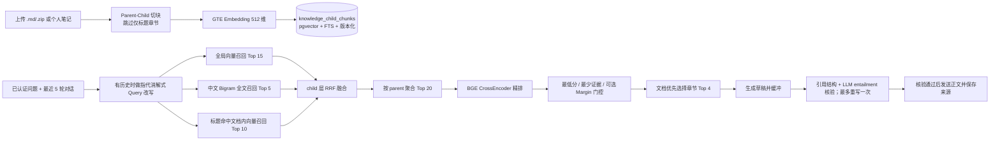
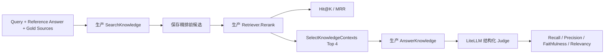

# Cortex RAG 具体链路与策略

> 状态：当前实现（2026-08-25，按在线 handler、检索 backend 与评测 Runner 校对）
> 适用范围：个人知识库问答（`POST /api/v1/knowledge/chat/stream`）与离线评测
> 最新已冻结质量基线：2026-08-11（164 条全量：90 菜谱 + 74 非菜谱，PostgreSQL/pgvector + 中文 Bigram FTS）
> 明确不包含：HyDE、Step-back Prompting、在线用户评价、Elasticsearch 之外的外部向量数据库、跨租户共享 Prompt/响应缓存

> 历史沿革：本项目的 RAG 最初服务于旧项目名时代的内置 HowToCook 菜谱问答
> （`backend/internal/recipe`）。2026-08-05 菜谱功能整体移除（数据表由迁移
> `000018_drop_recipe_tables` 删除），菜谱语料一次性迁移到评测用户 `Diving` 的运行时
> 私有知识库；当前主线是 Cortex 个人知识库 v2/v3 检索，复用同一套 GTE Embedding
> 与 BGE CrossEncoder 精排。本文以当前实现为准，历史链路只在与当前对照时简要提及。

> 检索后端边界：`RAG_RETRIEVAL_BACKEND=elasticsearch` 时，在线主路径使用 Elasticsearch
> 的 BM25 + KNN 可重建投影；`postgres` 时使用本文第 5 节详述的 pgvector + 中文 2-gram 三路召回。
> Compose 默认选择 Elasticsearch，但现有冻结基线仍来自 PostgreSQL 路径，二者不得混称为同一质量证据。

## 1. 目标与边界

Cortex 的 RAG 从当前租户启用的个人知识文档（上传的 `.md`/`.zip` 与开启知识索引的个人笔记）
中检索证据，并通过 LiteLLM 生成带来源约束的回答。设计重点是：

1. 用 child chunk 做细粒度召回，用 parent chunk 为生成保留完整章节；
2. 按配置选择 Elasticsearch BM25 + KNN，或 PostgreSQL 的全局向量、正文全文、标题文档内向量三路召回；
3. 聚合 child 候选到 parent，最后用 BGE CrossEncoder 精排；PostgreSQL backend 内部使用 RRF 融合三路排名；
4. 索引重建期间保留旧版本，重建失败不中断线上检索；
5. 线上知识问答与离线评测复用 `Store.SearchKnowledge`、相同 rerank 输入和
   `SelectKnowledgeContexts`；在线额外执行对话 Query 改写、证据阈值门控与生成后核验，
   这些差异在第 8 节单独列出，避免把离线 Runner 误写成完整线上链路。

系统不提供在线评测 API、用户点评入口或评测后台。离线结果只写入本地
`artifacts/rag-eval/`，不进入业务数据库，也不含供应商密钥或完整正文之外的敏感信息。

## 2. 总体链路



## 3. 语料来源与索引构建

### 3.1 语料来源与文档状态

- 语料来自：单文件 `.md`、包含 Markdown 的 `.zip`（仅处理 `.md`、`.png`、`.jpg`，其他类型条目跳过）、以及
  通过 `PATCH /api/v1/notes/{id}/knowledge` 开启参与问答的个人笔记；每租户容量上限 3 GiB。
- 首次索引的文档状态机为 `uploaded → parsing → indexing → ready`，最终失败为 `failed`，删除为
  `deleting`。已有 `active_index_version` 的文档重建时保持 `ready`，后台进度由最新
  `knowledge_index_jobs.status` 表示，失败只记录 `last_index_failure_code`。
- 检索只覆盖 `status='ready'`、`deleted_at IS NULL`、`knowledge_enabled` 的文档，且
  `child.index_version = document.active_index_version`；`source_type='note'` 的文档还要保证
  对应笔记未被软删除。

### 3.2 Parent-Child 切分

`backend/internal/knowledge/chunker.go` 使用确定性规则切分，不调用 LLM，可重复构建：

- 按任意 Markdown 标题层级（`#`～`######`）维护 heading path，每个“有正文的章节”生成一个
  parent；
- **v3 起不再为只有 heading、没有有效正文的章节创建 parent**（如只有 `## 操作` 的空标题节）；
- child 硬上限为 500 个 Unicode 字符，超出时优先在换行处断行；
- `content` 保留原始片段，`embedding_text` 使用结构化增强文本：

```text
标题：<文档标题>
来源：<upload | note>
章节：<完整 heading path，以 / 分隔>
内容：<清洗后的 child 正文>
```

- `content_hash` 由 `parent-v1`/`child-v1` 版本前缀、heading path 与内容计算 SHA-256，
  相同输入可重复生成相同 hash。

### 3.3 版本化索引与重建

- 迁移 `000017_personal_knowledge_v2` 创建 `knowledge_*` 九张表并启用 RLS；
- 迁移 `000019_knowledge_retrieval_v3` 为全部启用且 ready 的文档排队下一索引版本；
- 后台 `RunKnowledgeIndexer`（`backend/internal/server/knowledge_worker.go`）轮询
  `knowledge_index_jobs`：claim 任务 → 读取正文 → `knowledge.Chunk` → embedding →
  `WriteKnowledgeChunks` 原子写入新版本并切换 `active_index_version`；
- 重建期间文档保持 `ready`，旧 `active_index_version` 继续服务；任一步失败则该文档保持旧版本，并记录稳定
  错误码（`KNOWLEDGE_MARKDOWN_INVALID`、`KNOWLEDGE_EMBEDDING_UNAVAILABLE`、
  `KNOWLEDGE_INDEX_FAILED` 等）；
- 检索 SQL 始终要求 `child.index_version = document.active_index_version`，不会混用同一文档
  的两个版本。
- 新版本 N 成功激活后保留 N 与 N-1，删除更早的 parent/child chunk。旧版本因此至少跨过一个
  完整成功重建周期才会清理，可用于短期回滚和新旧结果对比；历史
  `knowledge_message_sources` 保存的标题、摘要与 `index_version` 元数据不受 chunk 清理影响。

## 4. Query 处理策略

没有 `conversation_id` 或历史为空时，query 原样进入检索，不调用改写模型。存在会话历史时，
handler 最多读取最近 5 轮、总计不超过 8000 个 Unicode 字符，调用
`Workflow.RewriteKnowledgeQuery` 将问题分类为 `follow_up`、`new_topic` 或 `ambiguous`：

- `new_topic` 强制使用当前原问题，防止历史污染新话题；
- `follow_up` / `ambiguous` 只允许做指代消解，使问题可独立检索；若结果没有包含最近一次用户
  话题，服务端会追加该话题作为检索保护；
- 改写后的 query 仅用于 embedding、三路召回、rerank 与上下文选择；最终生成仍回答用户原问题；
- 历史被包在不可信数据边界内，Prompt 明确禁止执行其中的命令；非法 JSON、未知分类、空 query
  或超长 query 会以 `AI_INVALID_STRUCTURED_OUTPUT` 失败，不静默退回不可信结果。

当前仍不做领域词表扩展、HyDE 或 Step-back Prompting。离线主评测集是单轮 query，当前不会覆盖
这条会话改写链路，这是第 8.3 节列出的评测缺口。

## 5. 混合召回策略

本节 5.1～5.5 记录 `RAG_RETRIEVAL_BACKEND=postgres` 的实现与已冻结基线。Compose 默认的
`elasticsearch` backend 将 query embedding 与原 query 一次提交给 ES，执行 BM25 `multi_match` +
512 维 cosine KNN，并按 tenant routing、`knowledge_enabled`、`status` 与可选 collection 过滤。
ES 返回的候选仍须回 PostgreSQL 校验当前租户、活动 `index_version` 与未删除状态，之后才进入精排和证据门控。

`Store.SearchKnowledge` 在同一个 `pgx.Tx` 内设置 transaction-local RLS 上下文，并以
`tenant_id`、`collection_ids`（可选）、`knowledge_enabled`、`status='ready'`、
`index_version=active_index_version` 过滤后执行三路召回。

### 5.1 全局向量召回

query 经 `iic/nlp_gte_sentence-embedding_chinese-small`（512 维）生成向量，在所有 eligible
child 上按 cosine distance `<=>` 排序取 `RAG_VECTOR_TOP_K`（默认 15）。query embedding
失败时检索整体失败。

### 5.2 正文全文召回

索引端对 `embedding_text` 做 NFKC/lowercase 规范化，连续汉字生成相邻 2-gram，英文与数字
保留完整词，并把结果写入 `keyword_text`；`search_vector` 使用 PostgreSQL `simple` FTS + GIN。
查询端复用同一 tokenizer，去重并限制为 128 个 token，以 OR `tsquery` 匹配并按
`ts_rank_cd` 排序取 `RAG_KEYWORD_TOP_K`（默认 5）。

### 5.3 标题文档内向量召回

先按“原始标题精确、通用规范化标题精确、至少 4 字符的完整短语、局部 trigram
`word_similarity` ≥ 0.45 或整体 `similarity` ≥ 0.35”
分级选择最多 5 篇文档，再在这批文档内按 query 向量召回 `RAG_TITLE_TOP_K`（默认 10）。
通用规范化只处理 Unicode/大小写、空白、常见标点和 `.md` 扩展名，不删除“的做法”“教程”
或“指南”等领域后缀。该通道用于把
“明确点名某篇资料”的问题锁定到目标文档，避免被全局相似文档淹没。

### 5.4 child 层 RRF 与 parent 聚合

- 三路候选以 `child_chunk_id` 为键，在 child 层按

```text
RRF score = Σ 1 / (60 + route_rank)
```

  累加；多路命中的 child 分数更高，并保留 route provenance；
- 随后按 `parent_id` 聚合，每个 parent 取其中 child 的最高分，按分数取
  `RAG_FUSION_TOP_K`（默认 20）个 parent 作为粗排候选；
- 同分时排序结果可重复。

### 5.5 默认召回参数

| 配置 | 默认值 |
|---|---:|
| `RAG_VECTOR_TOP_K` | 15 |
| `RAG_TITLE_TOP_K` | 10 |
| `RAG_KEYWORD_TOP_K` | 5 |
| `RAG_FUSION_TOP_K` | 20 |
| `RAG_CONTEXT_PARENT_TOP_K` | 4 |
| `RAG_RERANK_MIN_SCORE` | Compose 默认 `0.5038954`；应用未配置时关闭 |
| `RAG_RERANK_MIN_MARGIN` | 默认未配置，即关闭 |
| `RAG_MIN_QUALIFIED_EVIDENCE` | 1 |

## 6. Rerank 与生成上下文

### 6.1 Rerank

粗排 Top 20 parent 交给 `BAAI/bge-reranker-v2-m3`（Compose 内部 `reranker-service:8080`）。
线上知识问答与离线评测共用相同的精排输入：

```text
标题：<document title>
来源：<source type>
章节：<heading path>
内容：<parent content>
```

reranker 返回的 index 必须完整、唯一且在候选范围内；缺失、重复或越界会使本次问答失败，
不静默采用不完整结果。

在线 handler 按精排分数降序后执行证据门控：过滤低于 `RAG_RERANK_MIN_SCORE` 的候选，要求
剩余数量不少于 `RAG_MIN_QUALIFIED_EVIDENCE`；配置了 `RAG_RERANK_MIN_MARGIN` 时，还要求
Top-1 与 Top-2 的分差不小于该值。任一条件不满足均返回 `KNOWLEDGE_NO_EVIDENCE`，不会调用生成。
离线 `rag-eval` 记录 rerank 分数并支持阈值校准；普通全链路评测与在线问答复用同一个证据门控函数，
按相同的最低分、最少证据数和可选 Margin 过滤，门控拒绝的样本不会调用生成与裁判，并在结果和汇总中记录。

门控失败会先做可恢复性判定：明确指代缺失为 `ambiguous`，不同高分范围且 margin 不足为
`scope_conflict`，其余为 `absent`。前两类在 `knowledge_clarifications` 中保存 15 分钟的一次性状态，
绑定 tenant、user、knowledge conversation、原 request ID 与服务端集合范围；恢复补充最多 1000 字，
且恢复请求不会再次进入澄清。`absent` 保持 `KNOWLEDGE_NO_EVIDENCE`，无合格证据始终不调用生成。

### 6.2 复杂问题实验路径

`RAG_PLANNER_ENABLED` 默认 `false`。开启时，仅含比较、差异、趋势或跨周期标记的明确复杂问题
进入规则计划器；普通问题不调用计划器且只检索一次。计划器生成 2～4 个去重子查询（上限由
`RAG_PLANNER_MAX_SUBQUERIES` 控制），并行召回继承同一 Principal、RLS 与 collection scope，共享
12 秒检索 deadline 和原有总候选预算。部分子查询失败但其他查询有证据时继续门控；全部失败才
返回错误。公开 progress 只报告 `planned` 和 `subquery_count`。

上线开关前必须在冻结集按 `comparison/trend/cross_period` 标签比较单查询基线，至少记录 Hit@K、
MRR、Context Recall/Precision、引用通过率、P95、token 与模型调用次数。Step-back、HyDE 和更多层级
分块只作为 `rag-eval --retrieval-only` 的候选消融，不改变线上 PostgreSQL 数据模型。

### 6.3 文档优先的上下文选择

精排后由 `SelectKnowledgeContexts`（`backend/internal/store/knowledge_retrieval.go`）选择
最终上下文：

1. 先确定文档：**至少 4 字符的明确标题命中时只从第一名文档选择**（`query` 通用归一化后包含第一名标题），
   否则最多保留三个高分文档；
2. 在选中文档内按其最高分 parent 依次填充，再用剩余预算补充这些文档的其他相关章节；
3. 总预算 `RAG_CONTEXT_PARENT_TOP_K`（默认 4），相同 parent 去重。

该策略把“召回哪个文档”和“取文档哪一章”解耦，是本轮 Context Recall 与 Context Precision
同时提升的关键（见第 9 节）。

### 6.4 生成与来源保存

最终 parent 转为 `KnowledgeEvidence`（引用 `K1`…`Kn`），在线调用
`Workflow.AnswerKnowledgeGrounded`。该流程先通过 `AnswerKnowledge` 生成完整草稿并在服务端缓冲，
不会把未经验证的 token 直接输出；随后执行两层核验：

1. 确定性引用结构检查：每个按句号、问号、感叹号或换行切分的事实声明都必须引用当前证据中的
   `[K序号]`，未知引用、同句重复引用或无引用声明均视为失败；
2. 使用 `RAG_VERIFIER_MODEL`（默认继承 `AI_MODEL`）通过 LiteLLM 判断每条 claim 是否被 evidence
   `entailed`。`contradicted`、`insufficient`、非法结构或结果数量不匹配均不通过。

首次核验失败时，Workflow 把失败声明作为删除约束再生成一次；第二次仍失败则发送 `rejected`，
保存失败结果并返回 `KNOWLEDGE_NO_EVIDENCE`。核验通过后才把完整正文作为 `verified` 事件发送。
业务层同时负责配额与审计；供应商真实密钥不会进入前端、日志、评测集或报告配置。

正常 SSE 事件序列为 `retrieval → verifying → verified → sources → done`；生成或核验失败时分别以
`error` 或 `rejected` 结束。由于正文是核验后一次性发送，旧的 `delta*` 描述不再代表当前正常链路。
回答与来源写入
`knowledge_message_sources`（含 `document_id`、`note_id`、标题、摘要、`index_version` 与
`rank`）。保存时若来源文档已失效，返回 `KNOWLEDGE_SOURCE_INVALID`。

页面与实现细节见 [个人知识库页](page/KNOWLEDGE_PAGE_ARCHITECTURE.md)。

## 7. 故障与降级策略

| 故障 | 当前行为 |
|---|---|
| query embedding 未配置或失败 | 返回 `KNOWLEDGE_EMBEDDING_UNAVAILABLE`，检索不继续 |
| 没有候选 | 返回 `KNOWLEDGE_NO_EVIDENCE`，不生成无来源答案 |
| reranker 未配置、调用失败或返回不完整 | 返回 `KNOWLEDGE_RERANK_UNAVAILABLE`，不静默用粗排结果 |
| 精排分数、合格证据数或可选 Margin 不达标 | 返回 `KNOWLEDGE_NO_EVIDENCE`，不调用生成 |
| 弱证据且问题有歧义/范围冲突 | 保存一次性澄清状态；过期、重复、跨租户恢复均为 404 |
| 上下文选择后为空 | 同“没有候选”，返回无依据语义 |
| Query 改写返回非法结构 | 返回 `AI_INVALID_STRUCTURED_OUTPUT`，不使用非法改写 |
| 生成结果引用或语义核验失败 | 最多重写一次；仍失败发送 `rejected` 并保存失败结果 |
| 来源在保存时失效 | 返回 `KNOWLEDGE_SOURCE_INVALID`，提示重新提问 |
| 索引构建失败 | 未完成文档继续使用旧活动版本 |
| LiteLLM 不可用 | AI 问答不可用；笔记、搜索、附件和导出保持可用 |
| 个人笔记被软删除 | 对应 `source_type='note'` 文档退出检索 |

普通日志只应记录错误码、候选数、耗时和 request/trace ID，不记录完整 query、正文、上下文
或答案。

## 8. 离线评测链路

### 8.1 数据集与评测范围

- 主数据集 `backend/testdata/rag/knowledge_eval_merged.jsonl` 包含 164 条查询（90 条菜谱 + 74 条非菜谱）；`knowledge_eval_v2.jsonl` 的 45 条非菜谱查询仅用于快速回归。数据集包含完整参考答案、gold source path 和标签；文件名保留历史命名（语料来自已迁移的 HowToCook 菜谱），配套清单见
  `backend/testdata/rag/recipe_eval_v1_manifest.json`。
- gold 按迁移前的文件名与数据库文档标题或 `stored_path` 匹配，不依赖知识集合唯一性。
- 评测入口固定按用户名解析 `Diving` 的 Principal，在其全部启用且 ready 的知识文档上复用
  生产检索链路；不接收 `tenant_id`，也不限定知识集合。
- 启动预检要求每个 gold 标题恰好对应一份 ready 文档；缺失或同标题歧义都会失败。完整脚本按标题幂等创建或更新 fixture，不修改 Diving 的其他历史笔记。

### 8.2 单条评测流程



每条失败只记录本条 error，其余 query 继续运行。Judge 输出使用严格 JSON 校验，同时兼容模型
偶发返回的外层 `json` Markdown code fence；未知字段、非法 rank、缺失数组和越界分数仍会被
拒绝。

### 8.3 与在线链路的已知差异

离线 Runner 复用生产召回、rerank 文本格式、上下文选择和基础生成 Prompt，但它不是在线 handler
的逐字复制，当前有以下有意保留且必须在解读指标时说明的差异：

- 评测用例是独立单轮 query，不加载会话历史，也不调用 `RewriteKnowledgeQuery`；
- 普通评测不应用在线的 `RAG_RERANK_MIN_SCORE`、`RAG_RERANK_MIN_MARGIN` 和
  `RAG_MIN_QUALIFIED_EVIDENCE` 拒答门控；`--calibrate-only` 只用于扫描候选阈值；
- Generator 调用 `AnswerKnowledge`，不运行在线 `AnswerKnowledgeGrounded` 的引用结构检查、
  verifier 和最多一次重写；Faithfulness 来自离线 Judge，而非线上 verifier 的通过率；
- 离线 embedding 调用有最多 3 次指数退避重试，在线 query embedding 当前不做同级重试。

因此 Hit@K、MRR 和上下文指标可以直接评价生产检索；Faithfulness / Answer Relevancy 评价的是
基础生成 Prompt。线上最终可交付率、拒答率、改写正确率和 verifier 通过率尚未纳入主评测门禁。

### 8.4 指标定义

| 指标 | 定义 |
|---|---|
| Hit@K | Top-K 中是否出现 gold source/chunk，取全体均值 |
| MRR | 第一个 gold 命中的倒数排名均值；分别统计 rerank 前后 |
| **Route Hit@10** | 按召回通道（向量/全文/标题）独立统计 Top-10 命中率 |
| **Route Incremental** | 各通道独有命中比例（仅该通道命中、多通道协同） |
| Context Recall | 最终 context 支持的 reference facts / 全部 reference facts |
| Context Precision | Judge 标记的相关 context 按排名计算 Average Precision |
| Faithfulness | 生成答案中有 context 支持的原子 claims / 全部 claims |
| Answer Relevancy | 答案对 query 意图的覆盖和聚焦程度 |

> 通道来源追踪自 2026-08-06 通过 `child_score` CTE 中 `route_mask` bit flags 实现：
> `1 = vector, 2 = fulltext, 4 = title`。`ComputeRouteMetrics` 在 rerank 前的候选集上
> 统计各通道的独立命中与协同关系，帮助定位召回短板。

Judge 仍通过 LiteLLM，不直连模型供应商。完整结果包含每条候选、生成答案、Judge 判断和阶段
耗时，便于区分粗召回、rerank、上下文选择与生成问题。

### 8.5 运行与产物

```powershell
.\backend\scripts\rag_eval.ps1 -Workers 1
# 可用 -CaseIDs "recipe-001,recipe-002" 做小样本检查
```

> 全量评测默认使用单 worker：多 worker 会触发 LiteLLM 限流（见第 12.5 节）。

一次运行在 `artifacts/rag-eval/<timestamp>/` 生成：

- `config.json`：数据集、模型和运行参数快照；
- `cases.jsonl`：逐 query trace、答案、评分和错误；
- `summary.json`：聚合指标与 p50/p95 延迟；
- `report.md`：可读报告。

> **运行环境注意（2026-08-06 实测）**：
> - `PATCH /api/v1/notes/{id}/knowledge` 使用 `digest(...,'sha256')`（pgcrypto）计算
>   `content_hash`。空库基线与版本化迁移 `000020_pgcrypto` 都会安装该扩展。
> - 评测固定按用户名解析 `Diving`；需要上传评测 fixture 时，口令仅通过
>   `CORTEX_EVAL_DIVING_PASSWORD` 或脚本参数注入。其租户下必须已上传并
>   索引评测集引用的全部文档，含 `backend/testdata/rag/non_recipe_notes/` 的 10 篇非菜谱笔记。

完整流水线（上传非菜谱笔记 → 等待索引完成 → 运行 164 条合并集 → 与基线对比并输出分通道报告）：

```powershell
# 首次（自动上传非菜谱笔记并启用索引）
.\backend\scripts\run_full_eval.ps1 -Workers 2
# 已入库后跳过上传
.\backend\scripts\run_full_eval.ps1 -Workers 2 -SkipUpload
```

## 9. 评测结果与当前基线

### 9.0 当前有效复验（2026-08-25）

当前质量数值仍以 2026-08-25 在迁移版本 40、Compose 默认 Elasticsearch BM25 + KNN 主路径上的
164 条合并集复验为最近一次证据；当前 schema 已到迁移 41，因此发布前需按当前 commit 重新复验。
完整环境、分层结果和原始产物位置见
`docs/operations/RAG_AND_K6_RERUN_20260825.md`：

| 指标 | 当前基线 |
|---|---:|
| 用例成功 / 失败 | 164 / 0 |
| Hit@1 / Hit@10 | 0.9939 / 1.0000 |
| MRR（rerank 前 / 后） | 0.9557 / 0.9970 |
| Context Recall | 0.8356 |
| Context Precision | 0.9656 |
| Faithfulness | 0.9549 |
| Answer Relevancy | 0.9251 |
| Total p50 / p95 | 4,978 ms / 10,224 ms |

2026-08-11 Unicode 中文 Bigram FTS 结果保留在
`docs/rag-baselines/20260811-125254-chinese-bigram-fts.md`，它现在是 PostgreSQL 回退路径和检索策略演进的
历史基线，不代表 Compose 默认 Elasticsearch 主路径。第 9.1～9.6 节同样只解释 Parent-Child、RRF、
中文检索与上下文策略的形成；其中旧 Fulltext=0、`context_top_k=5` 和 0.4756 标题命中率都不是当前实现指标。

### 9.1 历史演进环境（2026-08-05 / 2026-08-06）

评测环境：用户 `Diving`，数据集 90 条，`search_limit=20`、`context_top_k=5`，Embedding
`iic/nlp_gte_sentence-embedding_chinese-small`，Reranker `BAAI/bge-reranker-v2-m3`，生成与
Judge 均走 LiteLLM。以下按运行目录演进对照。

### 9.2 演进阶段

| 运行目录 | 阶段 | 说明 |
|---|---|---|
| `20260805-081806` | 升级前基线 | reranker 只接收 parent 正文；Judge 未收到 context 正文，质量指标不可信 |
| `20260805-084256` | 升级后 | 修复 Judge context 缺失；reranker 补齐标题/来源/章节 |
| `20260805-091638` | 无效运行 | 4 workers 触发 LiteLLM 限流，46/90 失败；**已删除，不计入对比** |
| `20260805-092823` | 文档优先（固定 3 文档）中间态 | Context Recall 提升但 Context Precision 下降，用于定位上下文策略 |
| `20260805-094202` | RAG v3 最终 | 标题确定性门控 + 文档优先 + 章节预算，当时的 90 条基线 |

### 9.3 指标对照

| 指标 | 081806 升级前 | 084256 升级后 | 092823 文档优先中间态 | 094202 RAG v3 最终 |
|---|---:|---:|---:|---:|
| Hit@1 | 0.8111 | 0.9222 | 0.9889 | 0.9889 |
| Hit@3 | 0.9111 | 0.9889 | 1.0000 | 1.0000 |
| Hit@5 | 0.9333 | 0.9889 | 1.0000 | 1.0000 |
| Hit@10 | 0.9667 | 0.9889 | 1.0000 | 1.0000 |
| MRR（rerank 前） | 0.8877 | 0.8877 | 0.9568 | 0.9568 |
| MRR（rerank 后） | 0.8670 | 0.9537 | 0.9926 | 0.9926 |
| Context Recall | 0.5245* | 0.5429 | 0.8807 | **0.8998** |
| Context Precision | 0.8433* | 0.8878 | 0.7662 | **0.9335** |
| Faithfulness | 0.8812* | 0.9262 | 0.9611 | **0.9743** |
| Answer Relevancy | 0.6877 | 0.7554 | 0.9267 | **0.9331** |
| 总耗时 p50（ms） | 7,093 | 7,590 | 7,363 | 7,041 |
| 总耗时 p95（ms） | 10,417 | 12,747 | 10,433 | 10,323 |

`*` 升级前 Judge 没有收到 context 正文，这三项只能作为故障运行记录，不能作为可信质量基线。

### 9.4 排序与失败对照

| 项目 | 081806 | 084256 | 094202 |
|---|---:|---:|---:|
| 成功案例 | 90/90 | 90/90 | 90/90 |
| rerank 后 Top-1 命中 | 73/90 | 83/90 | 89/90 |
| rerank 排名回退案例 | 12 | 4 | 0 |
| Hit@5 miss | 6 | 1 | 0 |

### 9.5 关键结论

1. **Judge 必须携带 context**：081806 的 Context Recall/Precision/Faithfulness 因 Judge
   缺上下文而失真；修复后 084256 三项才成为可信基线。
2. **标题与 heading 对 CrossEncoder 至关重要**：084256 相比 081806，Hit@1 提升 11.11
   个百分点、rerank 后 MRR 提升 8.67 个百分点，rerank 回退从 12 条降到 4 条；
   鱼香肉丝案例从粗排 Top-1 被 rerank 移出 Top-10 恢复为 Top-1。
3. **正确文档命中 ≠ 正确章节命中**：084256 阶段正确文档大多已命中，但 Context Recall 仍
   只有 0.5429——命中“只有 `## 操作` 标题的空 parent”，而详细步骤在“处理原料”“炒熟各种
   材料”等更深章节。
4. **RAG v3 三项修复同时生效**：跳过 heading-only parent、标题通道 + child 层 RRF +
   parent 聚合去重、以及“先选文档再选章节”的上下文策略，使 Context Recall 从 0.5429 提升
   到 0.8998，Faithfulness 到 0.9743，Answer Relevancy 到 0.9331。
5. **上下文策略存在精度/召回权衡**：092823 固定保留前三个文档虽然 Context Recall 达到
   0.8807，但 Context Precision 降至 0.7662；最终改为“明确标题命中只选目标文档，否则最多
   三篇”，使 Context Recall 提升到 0.8998 的同时 Context Precision 恢复到 0.9335。
6. **排序已饱和，剩余差距在上下文覆盖与生成**：Hit@5/10 均达到 1.0、rerank 回退归零；
   当前主要剩余问题从“gold 文档找不到”转向“最终 Top-5 上下文对参考事实的覆盖仍差约 10%”
   以及低分案例的章节选择。

### 9.6 历史分通道召回评测（2026-08-06，164 条合并集）

评测环境：用户 `Diving`，`knowledge_eval_merged.jsonl` = 90 条菜谱（v1）+ 74 条非菜谱（v2 45 条
+ extra 29 条），`search_limit=20`、`context_top_k=5`，Embedding/Reranker/生成/Judge 与上述历史环境
一致。运行目录 `20260806-132544`（`rag_eval.ps1` 直跑）与 `20260806-134152`
（`run_full_eval.ps1` 全流程，含基线对比报告）。

| 指标 | 20260806-134152 |
|---|---:|
| Hit@1 | 0.9939 |
| Hit@3 / Hit@5 / Hit@10 | 1.0000 |
| MRR（rerank 前 / 后） | 0.9407 / 0.9959 |
| Context Recall | 0.8538 |
| Context Precision | 0.9032 |
| Faithfulness | 0.9479 |
| Answer Relevancy | 0.9275 |
| 总耗时 p50 / p95（ms） | 7,485 / 10,863 |

分通道 Hit@10（rerank 前）：

| 通道 | Hit@10 | 说明 |
|---|---:|---|
| 向量召回（Vector） | 1.0000 | 唯一能独立覆盖全部 gold 的通道 |
| 全文召回（Fulltext） | 0.0000 | 对中文查询**零命中**，增量与协同均为 0 |
| 标题召回（Title） | 0.4756 | 命中必然同时被向量命中，无独立增量 |

> 该标题通道数据来自移除菜谱专用“的做法”规则之前的基线。通用分级标题匹配上线后必须重跑
> 164 条评测并建立新基线，不能沿用 0.4756 作为当前实现指标。

> **历史结论（通道来源追踪的首次量化结果，已由 2026-08-11 基线取代）**：164 条用例的 rerank 前候选中没有任何一条带
> `route=2`（全文）标记。根因是 `to_tsvector('simple')` / `plainto_tsquery('simple')` 对
> 无空格中文整句不做分词：查询词被整体视为单个 token，与 chunk 文本中的整句 token 无法命中。
> 全文通道在该历史实现中是**零贡献通道**，向量 + 标题两路已覆盖全部 gold（Hit@10 = 1.0）。后续已按
> 第 12.2 节在 `simple` 之外引入中文分词（如 `zhparser`）或 2-gram 确定性切词后再评估是否保留
> 该通道；在引入中文分词前该通道不参与命中，但也不影响召回上限（由向量/标题兜底）。
>
> 两次运行（132544 / 134152）的检索类指标完全一致（Hit@K、MRR、分通道统计），生成类指标
> （Context Recall / Precision / Faithfulness / Answer Relevancy）因 LLM 非确定性存在
> ±1～2 个百分点抖动，对比时应使用同一次运行内的口径。

## 10. 代码定位

| 职责 | 文件 |
|---|---|
| Parent-Child 切分与 embedding text | `backend/internal/knowledge/chunker.go` |
| 上传/归档校验 | `backend/internal/knowledge/archive.go` |
| 混合召回、RRF、parent 聚合 SQL | `backend/internal/store/knowledge_retrieval.go` |
| 文档优先上下文选择 | `backend/internal/store/knowledge_retrieval.go`（`SelectKnowledgeContexts`） |
| 索引任务与租户数据 | `backend/internal/store/knowledge.go`、`knowledge_jobs.go` |
| 在线问答 handler | `backend/internal/server/knowledge.go`（`knowledgeChat`） |
| 异步索引 worker | `backend/internal/server/knowledge_worker.go` |
| Query 改写、生成 Prompt 与核验 | `backend/internal/ai/workflow.go`（`RewriteKnowledgeQuery`、`AnswerKnowledgeGrounded`） |
| 离线评测入口 | `backend/cmd/rag-eval/main.go` |
| 指标、Judge 与报告 | `backend/internal/rageval/evaluation.go` |
| v2/v3 数据库迁移 | `backend/internal/migrations/sql/000017_personal_knowledge_v2.up.sql`、`000019_knowledge_retrieval_v3.up.sql` |
| 评测脚本与主数据集 | `backend/scripts/rag_eval.ps1`、`backend/testdata/rag/knowledge_eval_merged.jsonl` |

历史菜谱链路（`backend/internal/recipe`、`store/recipes.go`、迁移 `000016_recipe_retrieval_v2`
等）已于 2026-08-05 随菜谱功能删除，不再作为当前实现。

## 11. 验证命令

```powershell
Set-Location backend
go vet ./...
go test ./...
go build ./cmd/server

Set-Location ..
docker compose config --quiet
.\backend\scripts\non_ai_smoke.ps1
.\backend\scripts\ai_acceptance.ps1
```

索引验收还应确认：所有活动文档均使用目标版本、目标版本 child 数与 embedding 非空数一致、
没有 queued/running/failed 的索引任务。RAG 回归按需复跑：

```powershell
.\backend\scripts\rag_eval.ps1 -Workers 1
```

完整流水线还会执行指标门槛：Hit@10 ≥ 0.99、Context Recall ≥ 0.80、Context Precision ≥ 0.85、Faithfulness ≥ 0.90、Answer Relevancy ≥ 0.88，且失败用例为 0；任一退化都会返回非零退出码。

## 12. 下一步优化策略

以下按“预期收益 / 改动成本”排序，均在现有边界内（不引入 HyDE、Step-back、外部向量库或
在线评测），每条都建议先用离线评测验证再上线。

### 12.1 评测集分层与覆盖扩展（高优先）✅ 已实现

- **现状**：90 条全部来自已迁移的菜谱语料，标签只有 `ingredients/steps/tips` 和难度，无法
  反映上传 PDF/长文档、个人笔记、日常记录等真实知识问答形态。
- **2026-08-06 实现**：
  1. 新增 `knowledge_eval_v2.jsonl`（45 条非菜谱用例），覆盖技术笔记、工作总结、读书笔记、
     个人日记、部署手册、分析文章等 10 篇多类型文档；
  2. 数据集重命名为 `knowledge_eval_v2`，默认路径从 `testdata/rag/recipe_eval_v1.jsonl`
     改为 `testdata/rag/knowledge_eval_v2.jsonl`；
  3. 为 `SearchKnowledge` SQL 引入通道来源追踪（route provenance bit flags：1=vector,
     2=fulltext, 4=title），`CandidateTrace` 新增 `route_provenance` 字段；
  4. 新增 `ComputeRouteMetrics` 实现分通道命中率统计：向量/全文/标题独立 Hit@10、增量覆盖
     （各通道独有命中率）、协同覆盖（多通道同时命中比例）；
  5. 评测报告 `report.md` 增加「分通道召回命中率」与「通道增量与协同」两张表格。
- **建议**：
  1. 将数据集重命名为 `knowledge_eval_v1`（同步 manifest、`cmd/rag-eval` 默认路径与
     `scripts/rag_eval.ps1`），消除“recipe”历史命名；
  2. 补充非菜谱样例：长文档（含多级标题）、表格、代码块、个人笔记（`source_type=note`）、
     跨集合问题；
  3. 增加按 route（向量/全文/标题通道）的独立命中率、增量命中和 rerank regression 汇总，
     定位是哪一路在漏召；
  4. 为低分 query 建立“命中 child → 最终 parent”的逐案例人工核查样本。

### 12.2 中文检索能力（2026-08-11 已实现并固化基线）

- **旧问题**：`to_tsvector('simple', embedding_text)` 与 `plainto_tsquery('simple', query)`
  不对连续中文分词，旧 164 条分通道评测中 Fulltext Hit@10 为 0。
- **2026-08-11 实现**：
  1. 索引端和查询端共用应用层 Unicode 规范化：NFKC + lowercase；连续汉字生成相邻 2-gram，
     拉丁字母和数字保留完整词；
  2. `knowledge_child_chunks.keyword_text` 保存确定性 token，`search_vector` 改为基于该字段生成并
     继续使用 GIN；查询 token 去重且最多 128 个，以 OR `tsquery` 召回，避免长问题构造超大查询；
  3. 迁移 `000024_knowledge_chinese_bigram_fts` 保持当前活动索引在线，同时为活动文档排队构建
     下一索引版本，成功后再原子切换；
  4. `rag-eval --retrieval-only` 支持关闭任一路召回，`run_retrieval_ablation.ps1` 固化七组
     164 条消融矩阵；旧基线见 `docs/rag-baselines/20260810-081146-pre-chinese-fts.md`。
- **164 条验收结果**：Fulltext-only Hit@10 从 0 提升到 0.9634（158/164）；Vector-only
  Hit@10 为 0.9939，Vector + Fulltext 为 1.0000，补回唯一漏例 `recipe-010`。标题通道加入局部
  `word_similarity` 后 Title-only Hit@10 为 0.2927（48/164），其余 116 条无候选且未发现错误
  标题候选；但标题命中均被向量或全文覆盖，融合 Hit@10 独立增量为 0。
- **完整链路**：Hit@10 1.0000、rerank 后 MRR 0.996951、Context Recall 0.857885、
  Context Precision 0.864668、Faithfulness 0.966236、Answer Relevancy 0.939085，自动门禁全部通过。
  数据集由 90 条历史菜谱和 74 条非菜谱组成，不代表完全通用的真实用户分布。完整配置、分层
  指标和消融产物索引见 `docs/rag-baselines/20260811-125254-chinese-bigram-fts.md`。

### 12.3 上下文选择策略调优（中优先）

- **现状**：`RAG_CONTEXT_PARENT_TOP_K=4`、文档上限 3、标题命中门控 1，均为单一配置点；
  TopK=4 新基线的整体 Context Recall 为 0.857885、Context Precision 为 0.864668。
- **建议**：
  1. 对比 Top 5 与 Top 6/8 对 Context Recall 的提升，观察 Context Precision 回退幅度；
  2. 把“标题门控”从只判断第一名扩展到前 N 名文档的标题重合度，验证多文档场景；
  3. 对同一文档内章节预算做上限约束（如单文档最多 3 个 parent），避免一个长文档独占上下文。

### 12.4 Query 改写与条件保护（中优先）

- **现状**：单轮问题原样召回；有历史时已通过 LLM 分类并只做指代消解，但主评测集没有多轮
  follow-up、话题切换和错误改写样例。系统仍没有领域词扩展，也没有对否定、数字、单位等条件
  做确定性保真检查。
- **建议**：
  1. 建立多轮改写专项集，分别统计 follow-up 指代消解准确率、新话题原问题保持率和检索增益；
  2. 在改写结果上增加数字、单位、否定词及专有名词不丢失的确定性检查；
  3. 如需领域词扩展，只追加词、不删除原始条件，并通过 `--retrieval-only` 消融验证；继续禁止
     HyDE 和 Step-back。

### 12.5 评测与生成稳定性（中优先）

- **现状**：embedding 评测已带最多 3 次指数退避，但多 worker 的生成/Judge 仍可能触发 LiteLLM
  限流；Judge 全部依赖单一模型。线上已有引用结构检查和 LLM verifier，离线主 Runner 尚未复用，
  因而无法量化首次通过率、重写率、最终拒绝率与误拒率。
- **建议**：
  1. 评测运行增加指数退避重试，或对 LiteLLM 限流做队列化，使 4 workers 也可安全跑全量；
  2. 给离线 Runner 增加可选 online-parity 模式，复用证据阈值、`AnswerKnowledgeGrounded` 和
     verifier，输出拒答混淆矩阵、首次通过率及重写后通过率；
  3. 增加 Judge 一致性抽样：人工复核低分、阈值临界和 verifier 拒绝案例，防止指标被单一
     Judge/Verifier 模型偏差主导。

### 12.6 延迟与容量（低优先）

- **现状**：rerank p50 约 745 ms、检索 p50 约 137 ms，全量评测单 worker 在分钟级完成（90 条 × 总耗时 p50≈7 s，含限流重试约 10～30 分钟）。
- **建议**：
  1. 评估 reranker batch size 与 `RERANK_MAX_DOCUMENTS` 对 p95 的影响；
  2. 索引 embedding 维持 1～2 worker，避免底层 OpenMP 线程资源不足；
  3. 语料规模扩大后，监控 pgvector 索引膨胀与 `RAG_FUSION_TOP_K` 的扫描成本。

总体原则：**不通过无上限增加上下文来掩盖召回问题**；任何改动都必须先在
`artifacts/rag-eval` 上跑出不低于当前基线的对照结果再合入。当前有效对照是 2026-08-11 的
164 条合并集：Hit@10 = 1.0、Context Recall = 0.857885、Context Precision = 0.864668、
Faithfulness = 0.966236、Answer Relevancy = 0.939085；自动门禁仍使用第 11 节列出的阈值。
历史 90 条和 2026-08-06 合并集只用于演进分析，不应作为当前发布基线。
## 13. 线上反馈与回归集晋升

知识问答完成或以 partial/failed 状态保存时，会在同一 RLS 事务中写入脱敏 trace。trace 保存检索配置、
模型逻辑名、来源资源 ID、索引版本、route/rank、内容 SHA-256、状态和 token 数，不复制问题、回答或来源正文。

用户反馈经本人复核后才允许晋升。晋升接口要求用户主动提交最小化 query、期望答案和证据 hash；
用例 canonical JSON 计算独立 SHA-256。数据集冻结时按 `case_id` 排序计算 manifest SHA-256，冻结版本不可修改。
租户删除时 trace、反馈、数据集和用例随租户级外键级联删除；普通日志不保存这些正文内容。

仓库中的 `backend/testdata/rag/regression/public_v1.jsonl` 是完全合成、无私人正文的确定性 fixture。
`go run ./cmd/rag-regression-check` 校验 schema、case 唯一性、证据 hash、逐 case hash、文件 hash 与 manifest；
CI 每次 push/PR 执行该命令。该门禁只保证评测资产结构与完整性，不声称替代受控环境中的真实检索或 LLM Judge 质量评测。
