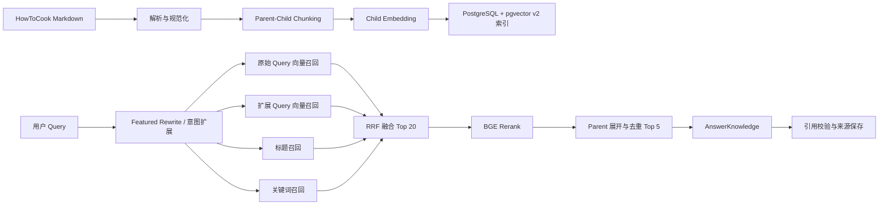
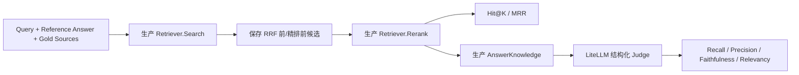
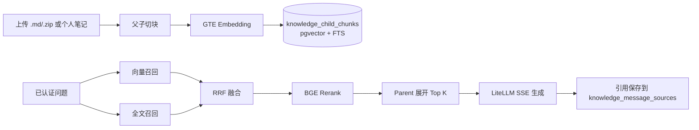

# Diary Listener RAG 具体链路与策略

> 状态：已移除的历史实现记录（2026-08-05）  
> 适用范围：HowToCook 菜谱问答与离线评测（已随菜谱功能移除）  
> 最后验证：2026-08-02  
> 明确不包含：HyDE、Step-back Prompting、在线用户评价、外部向量数据库

> 菜谱检索链路（`internal/recipe`、`cmd/rag-eval`、`testdata/rag`、`scripts/rag_eval.ps1`）
> 已随菜谱功能于 2026-08-05 移除，菜谱数据表由迁移 `000018_drop_recipe_tables` 删除；
> 本文保留为历史记录。个人知识库 v2 复用同一套 GTE Embedding 与 BGE 精排，见文末第 12 节。

## 1. 目标与边界

本文记录的 RAG 曾用于从仓库内置的 HowToCook 菜谱语料中检索证据，并通过 LiteLLM 生成带来源约束的回答。设计重点是：

1. 用 child chunk 做细粒度召回，用 parent chunk 为生成保留完整章节；
2. 组合向量、标题、关键词三路召回，降低单一路径漏召；
3. 使用 RRF 融合不同量纲的排序，再使用 BGE Cross-Encoder 精排；
4. 索引重建期间保留旧版本，避免重建失败导致线上检索中断；
5. 线上与离线评测复用同一个 `recipe.Retriever`，防止评测逻辑与生产逻辑漂移。

系统不提供在线评测 API、用户点评入口或评测后台。离线结果只写入本地 `artifacts/rag-eval/`，不进入业务数据库。

## 2. 总体链路



## 3. 语料同步与索引构建

### 3.1 权威语料

语料唯一来源曾是 `backend/resources/howtocook`。后端启动时由 `recipe.SyncCorpus` 扫描 dishes 和 tips 下的 Markdown，解析标题、分类、简介、食材、饮食标签、正文及内容 SHA-256。

> 2026-08-05 起仓库不再包含 `resources/howtocook`，相关代码与评测工具也已删除：语料一次性
> 迁移到用户 `Diving` 的运行时私有知识库。以下链路描述仅作为历史记录保留。

Markdown 是系统语料的交换来源，索引数据写入：

- `recipe_documents`：文档元数据和完整 Markdown；
- `recipe_parent_chunks`：可交给生成模型的完整章节；
- `recipe_child_chunks`：用于召回和 rerank 的小粒度片段；
- `recipe_index_jobs`：异步 embedding 任务。

### 3.2 Parent-Child 切分

`backend/internal/recipe/chunker.go` 使用确定性规则切分：

- 按 Markdown `##` 二级标题建立 parent；标题前内容归入“简介与基础信息”；
- parent 保留完整章节 Markdown；
- 章节超过限制时继续拆成 child，child 硬上限为 500 个 Unicode 字符；
- 图片行和固定 Issue/Pull request 尾注不进入检索文本；
- `content` 保留原始片段，`embedding_text` 使用结构化增强文本；
- `content_hash` 由索引版本、heading 和内容计算，相同输入可重复生成相同 hash。

结构化 `embedding_text` 由以下内容组成：

```text
标题：菜谱标题
分类：菜谱分类
章节：当前 heading
检索意图：章节对应的领域词
食材：文档食材列表
内容：清洗后的 child 正文
```

章节增强词采用固定映射：

| 章节类型 | 增强词 |
|---|---|
| 原料、食材、计算 | 食材、原料、配料、用量、配方 |
| 操作、做法、制作 | 步骤、做法、流程、烹饪 |
| 附加、注意、技巧 | 技巧、注意、避坑、口感、保存 |
| 简介及其他 | 特点、风味、难度、热量 |

切分和检索文本构建不调用 LLM，因此索引可重复构建，生成模型不可用时也不会影响语料同步。

### 3.3 双版本索引

迁移 `000016_recipe_retrieval_v2` 为文档和 parent 增加索引版本，并将 pgvector 索引操作类统一为 `vector_cosine_ops`。

重建流程为：

1. 当前 `active_index_version` 继续服务；
2. 按目标版本写入新的 parent 和 child，不删除活动版本；
3. indexer 为目标版本全部 child 生成 512 维 embedding；
4. 激活前校验目标版本至少有一个 child，并且 embedding 非空、模型完全一致；
5. 单篇文档校验通过后切换其 `active_index_version`；
6. 任一步失败则该文档继续使用旧版本。

检索 SQL 始终要求 `child.index_version = document.active_index_version`，不会混用同一文档的两个版本。

## 4. Query 处理策略

### 4.1 Featured 菜谱改写

当请求携带 featured recipe 时，`RewriteQuery` 将菜谱标题加入问题，并识别食材、步骤或技巧意图。需要严格从 featured 菜谱回答的意图会保留 `FeaturedOnly` 约束，避免相似菜谱替代指定菜谱。

### 4.2 确定性意图扩展

`ExpandRetrievalQueries` 永远保留原始 query，并最多增加一个扩展 query。扩展只追加领域词，不删除菜名、数字、否定或忌口条件，也不调用 LLM。

| 意图 | 典型触发词 | 追加词 |
|---|---|---|
| ingredients | 食材、材料、用量、比例、配方 | 食材 原料 配料 用量 配方 |
| steps | 怎么做、步骤、制作、流程 | 完整制作步骤 做法 流程 烹饪 |
| tips | 为什么、避免、保持、失败、火候 | 烹饪技巧 注意事项 避坑 口感 保存 |
| time_temperature | 多久、几分钟、多少度、功率 | 时间 温度 火候 分钟 功率 |

扩展 query 是额外召回路径，不替换原始 query。

## 5. 混合召回策略

### 5.1 向量召回

原始 query 和扩展 query 分别请求 embedding，并各自从当前活动版本的 child 中召回 Top 15。查询要求 embedding model 严格匹配，并使用 cosine distance `<=>` 排序。

原始 query embedding 失败时检索整体失败。当前 embedding 服务的并发能力有限，索引构建建议使用 1～2 个 worker；过高并发可能触发底层 OpenMP 线程资源不足。

### 5.2 标题召回

标题路由处理 query 明确包含规范菜名的情况：query 包含标题或标题包含 query 时返回对应文档的活动 child。标题精确包含获得较高的路由内分数，章节与当前意图匹配时额外加权。

当前首期只使用规范标题，没有独立别名表。

### 5.3 关键词召回

关键词路由从 query 中按中文标点和空白提取长度不少于两个字符的字段，在 child 的结构化 `embedding_text` 中做匹配。标题精确包含、heading 意图匹配及正文 token 命中共同决定该路由内部排序。

关键词分数只在关键词路由内部使用，不与向量距离直接相加。

### 5.4 RRF 融合

各路候选以 `child_chunk_id` 为键去重，默认采用：

```text
RRF score = Σ 1 / (60 + route_rank)
```

同一路重复 child 只计一次；多路命中的 child 累加贡献，并保留 `vector_original`、`vector_<intent>`、`title`、`keyword` 等 route provenance。融合后按 RRF 分数取 Top 20；同分时按 chunk ID 排序，保证结果可重复。

默认召回参数：

| 配置 | 默认值 |
|---|---:|
| `RAG_VECTOR_TOP_K` | 15 |
| `RAG_TITLE_TOP_K` | 10 |
| `RAG_KEYWORD_TOP_K` | 15 |
| `RAG_FUSION_TOP_K` | 20 |
| `RAG_CONTEXT_PARENT_TOP_K` | 5 |

## 6. Rerank 与生成上下文

RRF Top 20 child 交给 `BAAI/bge-reranker-v2-m3`。reranker 返回的 index 必须完整、唯一且在候选范围内；缺失、重复或越界会使本次 rerank 失败，不使用不完整结果静默降级。

精排后按顺序展开 parent：

- 相同 `parent_id` 只保留一次；
- 同一 document 最多保留两个 parent；
- 默认最终选择 Top 5 parent；
- parent 查询失败时返回错误，不把不完整 child 冒充生成上下文；
- trace 保留 child、parent、document、hash、heading、融合分和 rerank 分。

最终 parent 转为 `KnowledgeEvidence`，由现有 `AIWorkflow.AnswerKnowledge` 通过 LiteLLM 逻辑模型 `diary-default` 生成答案。业务层继续负责来源约束、引用校验、配额和审计；供应商真实密钥不会进入前端、日志、评测集或报告配置。

## 7. 故障与降级策略

| 故障 | 当前行为 |
|---|---|
| 标题或关键词路由失败 | 忽略该辅助路由，保留其他路由 |
| query embedding 未配置或失败 | 检索失败，返回稳定业务错误 |
| embedding 维度不是 512 | 拒绝响应，不写入或检索错误维度向量 |
| reranker 未配置、调用失败或返回不完整 | 问答失败，不静默采用粗排结果 |
| parent 展开失败 | 问答失败，不以 child 碎片替代完整上下文 |
| 没有候选或没有证据 | 返回无依据语义，不生成无来源答案 |
| v2 构建失败 | 未完成文档继续使用旧活动版本 |
| LiteLLM 不可用 | AI 问答不可用；笔记、搜索、附件、导出和备份保持可用 |

普通日志只应记录错误码、候选数、耗时和 request/trace ID，不记录完整 query、正文、上下文或答案。

## 8. 离线评测链路

离线入口为 `backend/cmd/rag-eval`，它不是常驻服务，不注册 HTTP 路由。数据集 `backend/testdata/rag/recipe_eval_v1.jsonl` 包含 90 条基于真实资源整理的 query、完整参考答案、gold source path 和标签。

单条评测执行：



每条失败只记录本条 error，其余 query 继续运行。Judge 输出使用严格 JSON 校验，同时兼容模型偶发返回的外层 `json` Markdown code fence；未知字段、非法 rank、缺失数组和越界分数仍会被拒绝。

### 8.1 指标定义

| 指标 | 定义 |
|---|---|
| Hit@K | Top-K 中是否出现 gold source/chunk，取全体均值 |
| MRR | 第一个 gold 命中的倒数排名均值；分别统计 rerank 前后 |
| Context Recall | 最终 context 支持的 reference facts / 全部 reference facts |
| Context Precision | Judge 标记的相关 context 按排名计算 Average Precision |
| Faithfulness | 生成答案中有 context 支持的原子 claims / 全部 claims |
| Answer Relevancy | 答案对 query 意图的覆盖和聚焦程度 |

Judge 仍通过 LiteLLM，不直连模型供应商。完整结果包含每条候选、生成答案、Judge 判断和阶段耗时，便于区分粗召回、rerank、上下文选择与生成问题。

### 8.2 运行与产物

```powershell
# 已随菜谱功能移除：rag_eval.ps1 / cmd/rag-eval / testdata/rag
# .\backend\scripts\rag_eval.ps1 -Workers 4
```

一次运行在 `artifacts/rag-eval/<timestamp>/` 生成：

- `config.json`：数据集、模型和运行参数快照；
- `cases.jsonl`：逐 query trace、答案、评分和错误；
- `summary.json`：聚合指标与 p50/p95 延迟；
- `report.md`：可读报告和最低分样本。

## 9. 已验证效果

基线使用完整文档单路向量召回；最终结果使用 v2 Parent-Child 与混合检索。最终报告为 `artifacts/rag-eval/20260802-150458/report.md`，90 条全部成功。

| 指标 | 基线 | 当前实现 | 第一轮目标 | 状态 |
|---|---:|---:|---:|---|
| Hit@1 | 0.7111 | 0.8889 | ≥ 0.80 | 通过 |
| Hit@5 | 0.7333 | 0.9333 | ≥ 0.88 | 通过 |
| MRR（rerank 后） | 0.7204 | 0.9111 | ≥ 0.80 | 通过 |
| Context Recall | 0.7448 | 0.8118 | ≥ 0.82 | 差 0.0082 |
| Context Precision | 0.8673 | 0.9107 | ≥ 0.85 | 通过 |
| Faithfulness | 0.9700 | 0.9374 | ≥ 0.95 | 差 0.0126 |
| Answer Relevancy | 0.8012 | 0.8733 | ≥ 0.85 | 通过 |

Top-10 miss 从 24 条降至 6 条，修复 18 条。结果说明 Parent-Child、标题/关键词补召和 RRF 显著改善了召回与排序；当前主要剩余问题已经从“gold 文档找不到”转向“最终五个 parent 对参考事实覆盖不足”和“生成答案夹带低价值扩展事实”。

后续优化应优先：

1. 针对低分 query 分析命中的 child 与最终 parent，改善步骤、火候、酱汁等章节选择；
2. 在不明显降低 Context Precision 的前提下比较 parent Top 5 与 Top 8；
3. 收紧生成 prompt，禁止引入 context 中与问题无关的替代建议；
4. 增加按 route 的独立命中、增量命中和 rerank regression 汇总；
5. 语料规模扩大后再评估 `pg_trgm` 或中文分词索引。

不应通过无上限增加上下文来掩盖召回问题，也不引入 HyDE 或 Step-back。

## 10. 代码定位

> 下列文件已随菜谱功能删除（2026-08-05），保留此表仅用于追溯；个人知识库对应代码见第 12 节。

| 职责 | 文件 |
|---|---|
| Markdown 解析 | `backend/internal/recipe/parser.go` |
| Parent-Child 切分与 embedding text | `backend/internal/recipe/chunker.go` |
| 语料同步 | `backend/internal/recipe/sync.go` |
| 异步 embedding 与版本激活 | `backend/internal/recipe/indexer.go` |
| Query 改写与扩展 | `backend/internal/recipe/query_rewrite.go` |
| 混合召回、RRF、rerank、parent 展开编排 | `backend/internal/recipe/retriever.go` |
| SQL 检索与版本化 chunk 存储 | `backend/internal/store/recipes.go` |
| 在线问答编排 | `backend/internal/server/server.go`、`backend/internal/ai/workflow.go` |
| 离线评测入口 | `backend/cmd/rag-eval/main.go` |
| 指标、Judge 和报告 | `backend/internal/recipe/evaluation.go` |
| v2 数据库迁移 | `backend/internal/migrations/sql/000016_recipe_retrieval_v2.up.sql` |

个人知识库 v2 复用同一 Embedding/精排与父子切块思路，代码位于
`backend/internal/knowledge`（chunker/archive）、`backend/internal/server/knowledge.go`
（handlers）、`backend/internal/server/knowledge_worker.go`（索引 worker）、
`backend/internal/store/knowledge*.go`（SQL 与检索），迁移为
`backend/internal/migrations/sql/000017_personal_knowledge_v2.up.sql`。

## 11. 验证命令

```powershell
Set-Location backend
go vet ./...
go test ./...
go build ./cmd/server

Set-Location ..
docker compose config --quiet
.\backend\scripts\non_ai_smoke.ps1
.\backend\scripts\ai_acceptance.ps1
```

索引验收还应确认：所有活动文档均使用目标版本、目标版本 child 数与 embedding 非空数一致、没有 queued/running/failed 的索引任务。

> 注意：`rag_eval.ps1` 与 `recipe_eval_v1` 数据集针对旧菜谱检索链路；个人知识库 v2 尚无对应
> 离线评测集，验收以 `KNOWLEDGE_*` 错误码、跨租户隔离、来源保存与 3 GiB 配额检查为准。

## 12. 个人知识库 RAG（当前主线）

个人知识库 v2 复用同一套 GTE Embedding（512 维）与 BGE CrossEncoder 精排，检索只针对当前租户：



- 检索入口 `POST /api/v1/knowledge/chat/stream`；`SearchKnowledge` 在同一个 `pgx.Tx` 内设置
  RLS 上下文，并以 `tenant_id`、`collection_ids`、`knowledge_enabled`、`status='ready'`、
  `index_version=active_index_version` 过滤。
- 无当前租户证据返回 `KNOWLEDGE_NO_EVIDENCE`；Embedding / Reranker 不可用分别返回
  `KNOWLEDGE_EMBEDDING_UNAVAILABLE` / `KNOWLEDGE_RERANK_UNAVAILABLE`。
- 页面与实现细节见 [个人知识库页](page/KNOWLEDGE_PAGE_ARCHITECTURE.md)。
