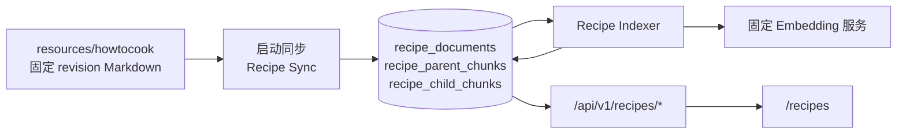

# Cortex 软件设计说明书

## 1. 产品边界

Cortex 是个人记录与回顾工作台，提供笔记、日报/周报/月报、标签、附件、历史版本、
中文搜索、Dashboard、AI 整理、报告、回忆、研究和今日菜谱。

知识库是只读的系统级 HowToCook 语料：

- 唯一来源为 `backend/resources/howtocook`。
- 用户不能上传、编辑、删除或创建知识集合。
- 研究结果、日报、周报、月报和个人笔记都不会写入知识库。
- 不提供 `/knowledge` 页面或 `/api/v1/knowledge/*` API。
- 迁移 `000012_remove_personal_knowledge` 永久删除旧个人知识表、历史数据和研究关联字段。

## 2. 技术架构

- 前端：React 18、TypeScript、Webpack 5、Ant Design。
- 后端：Go、Gin、pgx/v5，唯一入口为 `backend/cmd/server/main.go`。
- 数据库：PostgreSQL 16、RLS、pgvector。
- AI：后端仅通过 LiteLLM 的 OpenAI 兼容接口访问逻辑模型。

PostgreSQL 是个人笔记正文的唯一权威来源。Markdown 只用于笔记交换、导出和仓库内固定
HowToCook 语料，不与数据库做双向同步。

## 3. 租户与数据安全

- 每个账号对应一个服务端解析的个人租户，客户端 `tenant_id` 不可信。
- 租户查询在 `Store.WithTx` 中设置 transaction-local RLS 上下文，并保留显式
  `tenant_id` 条件。
- 跨租户资源访问统一表现为 404。
- 密码使用 PBKDF2-SHA256；登录 Token 只保存 SHA-256 摘要。
- 笔记更新使用乐观锁，正文更新和 AI 覆盖前创建 revision，删除默认软删除。
- 附件和知识文件只保存 `CORTEX_DATA_DIR` 下的安全相对路径，不作为公开静态目录暴露；`DIARY_DATA_DIR` 仅为兼容别名。

## 4. 静态 HowToCook 知识库



服务启动时读取 `resources/howtocook/SOURCE.json` 的 revision，幂等同步菜谱与技巧 Markdown，
并为变更内容排队生成向量。生产构建不得读取仓库外的 HowToCook 路径。

菜谱问答只检索 `recipe_documents` 和 `recipe_child_chunks`。无可靠来源时拒绝生成；
保存的引用必须仍指向当前静态语料。个人笔记、周期报告、附件和研究内容不参与此检索。

公开接口：

| 方法 | 路径 | 说明 |
| --- | --- | --- |
| `GET` | `/api/v1/recipes/today` | 返回确定性的今日菜谱和三个建议问题 |
| `POST` | `/api/v1/recipes/chat` | 基于 HowToCook 来源进行 SSE 问答 |
| `GET` | `/api/v1/recipes/messages/{id}/sources` | 返回系统菜谱引用 |
| `GET` / `PUT` | `/api/v1/settings/preferences` | 读取或更新忌口及时区 |

## 5. 笔记、报告和回忆

笔记、日报、周报和月报保存在租户业务表中，不进入静态知识库。报告必须先生成草稿，
确认后写入，并保存当前租户的来源笔记。回忆问答只能使用可信 Principal 下检索到的个人笔记，
与 HowToCook 菜谱检索相互隔离。

## 6. 研究

研究任务和来源受个人租户 RLS 隔离，可生成可编辑草稿、忽略或删除。研究内容不会保存到
HowToCook 知识库，也不提供目标知识集合参数。图片资产保存在独立的 `research` 安全目录。

## 7. AI 与降级

AI 未配置或不可用时，认证、笔记、搜索、附件、导出、备份和静态菜谱浏览仍可用。
后端只持有 LiteLLM 虚拟密钥；供应商真实 Key 不进入前端、业务数据库、日志或备份。
流式响应已经输出内容后不得从头重试。

## 8. 部署与验证

Compose 下数据库、LiteLLM、Embedding 和 Reranker 服务不暴露宿主机端口。
`/healthz` 只反映进程存活，`/readyz` 只验证数据库可用。

```powershell
Set-Location backend
go vet ./...
go test ./...
go build ./cmd/server

Set-Location ..\frontend
npm run format:check
npm test
npm run build

Set-Location ..
docker compose config --quiet
.\backend\scripts\recipe_sync_acceptance.ps1
```

## 9. 模板广场与限量 AI 活动

私有模板受租户 RLS 保护，作者明确上架时生成不含租户标识的公开快照；作者下架或删除租户时
立即使快照不可见。完整备份只包含私有模板和个人收藏。

每日活动配置保存在 PostgreSQL，Redis Lua 负责库存和重复领取预扣，数据库唯一约束、点数
账本与 claim/job 状态机保存最终事实。Worker 使用有限租约领取任务，成功后自动写入带来源的
月报；最终失败释放冻结点数但不返普通名额。Redis 不可用时只关闭领取，不影响核心笔记功能。

活动参数集中保存在 `ai_flash_event_settings`。scheduler 使用 PostgreSQL 剩余名额和既有领取记录
预热带时间窗的 Redis Key；领取请求先由 Redis `TIME` 裁决开放时间和库存，只有预扣成功的少量
请求进入 PostgreSQL。模板排行由 outbox 幂等投影到 ZSet/HLL，Redis 清空后从公开统计重建。
