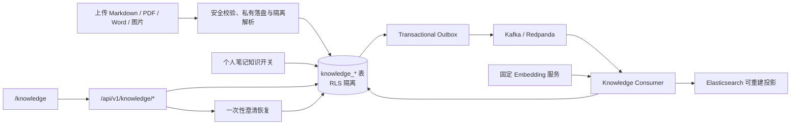

# Cortex 软件设计说明书

## 1. 产品边界

Cortex 是个人记录与回顾工作台，提供笔记、日报/周报/月报、标签、附件、历史版本、
中文搜索、Dashboard、AI 整理、报告、回忆、研究、模板广场、限量 AI 活动和
个人知识库。

知识库以个人知识库 v2 为当前主线：

- 用户上传 `.md`、Markdown `.zip`、PDF、DOC/DOCX 或 PNG/JPG/WebP，经过安全解析/OCR 后可创建知识集合、开启个人笔记入库，并进行
  带来源保存的混合问答；每租户容量上限 3 GiB。
- 数据由迁移 `000017_personal_knowledge_v2` 的 `knowledge_*` 表承载，并启用 RLS。
- `/knowledge` 是知识库入口；`/recipes` 与 `/assistant` 已重定向到 `/knowledge`。
- HowToCook 固定语料已从仓库移除并一次性迁移到用户 `Diving` 的运行时私有知识库；
  菜谱接口（`/api/v1/recipes/*`）与忌口、时区偏好已一并移除，前端 `/recipes`、
  `/assistant` 重定向到 `/knowledge`。
- 研究结果、日报、周报、月报和个人笔记不会写入个人知识库；研究内容与知识库检索相互隔离。

## 2. 技术架构

- 前端：React 18、TypeScript、Webpack 5、Ant Design。
- 后端：Go、Gin、pgx/v5；唯一部署入口为 `backend/cmd/server/main.go`，基础设施 worker 由内部 runner 托管。
- 数据库：PostgreSQL 16、RLS、pgvector；同时保存对象定位、Transactional Outbox、任务状态和引用事实。
- AI：后端仅通过 LiteLLM 的 OpenAI 兼容接口访问逻辑模型。
- Compose 当前默认使用 MinIO 保存业务文件、Redpanda 提供 Kafka 接口分发 Outbox 事件、
  Elasticsearch 保存可重建的 BM25 + KNN 检索投影。三者均不是租户权限或业务完成状态的权威来源。

PostgreSQL 是个人笔记正文的唯一权威来源。Markdown 只用于笔记交换、导出以及个人知识库
上传语料，不与数据库做双向同步。

后端业务代码按增量方式收敛为 `server → application → domain/ports → infrastructure/store`：
`server` 只处理 HTTP 契约和 Principal 传递，`application` 负责用例校验与编排，端口由用例侧定义，
`store` 保留 SQL、事务和 transaction-local RLS，Redis、对象存储、Kafka 与 Elasticsearch 等适配器
放在基础设施边界。现有领域在修改时逐条迁移，不为目录整齐而一次性改写稳定业务。

## 3. 租户与数据安全

- 每个账号对应一个服务端解析的个人租户，客户端 `tenant_id` 不可信。
- 租户查询在 `Store.WithTx` 中设置 transaction-local RLS 上下文，并保留显式
  `tenant_id` 条件。
- 跨租户资源访问统一表现为 404。
- 密码使用 PBKDF2-SHA256；登录 Token 只保存 SHA-256 摘要。
- 笔记更新使用乐观锁，正文更新和 AI 覆盖前创建 revision，删除默认软删除。
- 附件、知识文件和研究资产只保存服务端生成的安全对象定位，不作为公开静态目录暴露。Compose 默认
  使用 MinIO；`CORTEX_DATA_DIR` 的本地实现用于迁移或明确回退，`DIARY_DATA_DIR` 仅为兼容别名。

## 4. 个人知识库



- 上传经 `internal/knowledge` 校验类型、配额与 ZIP 路径安全后，由 `BlobStore` 写入服务端生成的对象 key；
  Compose 默认后端为 MinIO，本地路径仅是迁移/回退实现。
- Kafka 模式下由 server 受管的 Outbox relay 串联三个独立阶段：`cortex.knowledge.index.v1`
  驱动解析/OCR与父子切块，`cortex.document.parsed.v1` 驱动批量 Embedding 和 PostgreSQL 原子激活，
  `cortex.search.projection.v1` 驱动 Elasticsearch 投影。阶段消息只携带事件与文档标识，解析中间结果、
  任务进度、重试和 fencing 均由 PostgreSQL 持久化。PostgreSQL 回退模式仍由原 runner 轮询任务。
  两条路径都使用 Compose 内部 `embedding-service`
  （`iic/nlp_gte_sentence-embedding_chinese-small`，512 维）生成向量。
- 问答只检索当前租户 `knowledge_documents`（含开启知识问答的个人笔记）。Compose 默认通过
  Elasticsearch 的 BM25 + KNN 投影召回，PostgreSQL/pgvector + 中文 2-gram 保留为配置化回退；候选必须
  回 PostgreSQL 按当前租户、活动索引版本和有效状态二次校验，再经 `reranker-service`
  （`BAAI/bge-reranker-v2-m3`）精排后取前 `RAG_CONTEXT_PARENT_TOP_K` 个
  parent；来源写入 `knowledge_message_sources`。无当前租户证据时返回 `KNOWLEDGE_NO_EVIDENCE`。
- 公开 SSE 使用 `schema_version=1` 的 `retrieval_progress` DTO 展示改写、Embedding、召回、精排与
  证据门控统计，不暴露 prompt、正文块、身份、内部地址或上游响应。
- 弱证据分为 `ambiguous`、`scope_conflict` 和 `absent`。前两类持久化到
  `knowledge_clarifications`，绑定服务端 Principal、knowledge conversation、原 request ID 和集合
  范围，15 分钟内只允许补充一次；`absent` 与恢复后仍不足均直接拒答。
- `knowledge_index_jobs` 持久化稳定阶段与块进度，更新受 owner lease fencing 保护；已有活动版本的
  文档在重建期间保持可查询。
- 默认关闭的规则计划器仅识别明确比较、趋势和跨周期问题，最多并行召回 4 个子查询；所有子查询
  继承同一 RLS Principal、集合范围、候选预算与总 deadline。

主要接口：

| 方法 | 路径 | 说明 |
| --- | --- | --- |
| `POST` | `/api/v1/knowledge/uploads` | 上传 Markdown/ZIP、PDF、DOC/DOCX 或图片，安全落盘后返回 202 |
| `GET` | `/api/v1/knowledge/uploads/{id}` | 查询上传与索引状态 |
| `GET` | `/api/v1/knowledge/documents` | 列出当前租户文档与 3 GiB 配额 |
| `DELETE` | `/api/v1/knowledge/documents/{id}` | 删除文档并使其退出检索 |
| `GET` | `/api/v1/knowledge/documents/{id}/assets/{asset_id}` | 鉴权读取解析生成的文档资产 |
| `POST` | `/api/v1/knowledge/documents/{id}/retry` | 重试失败的解析或索引任务 |
| `GET` / `POST` | `/api/v1/knowledge/collections` | 查询或创建知识集合 |
| `POST` | `/api/v1/knowledge/chat/stream` | 混合检索、精排并 SSE 回答 |
| `PATCH` | `/api/v1/notes/{id}/knowledge` | 开启或关闭笔记知识索引 |

## 5. 笔记、报告和回忆

笔记、日报、周报和月报保存在租户业务表中。报告必须先生成草稿，确认后写入，并保存当前
租户的来源笔记。回忆问答只能使用可信 Principal 下检索到的个人笔记。用户可通过
`PATCH /api/v1/notes/{id}/knowledge` 开启个人笔记参与个人知识库问答；知识库检索与回忆
问答相互隔离。

## 6. 研究

研究任务和来源受个人租户 RLS 隔离，可生成可编辑草稿、忽略或删除。研究内容不会保存到
个人知识库，也不提供目标知识集合参数。图片资产保存在独立的 `research` 安全目录。

## 7. AI 与降级

AI 未配置或不可用时，认证、笔记、搜索、附件、导出和知识库文件管理仍可用。
个人知识库上传、删除不依赖 Embedding；Embedding 或 Reranker 不可用时，索引任务失败或
问答返回稳定错误（`KNOWLEDGE_EMBEDDING_UNAVAILABLE` / `KNOWLEDGE_RERANK_UNAVAILABLE`）。
后端只持有 LiteLLM 虚拟密钥；供应商真实 Key 不进入前端、业务数据库或日志。
流式响应已经输出内容后不得从头重试。
Excel 与演示文稿不属于当前知识库摄取范围；新增格式必须同时具备隔离解析、资源限制、来源定位、
版本化任务和失败回滚，不能只放开扩展名。

## 8. 部署与验证

Compose 下数据库、Redis、MinIO、Kafka/Redpanda、Elasticsearch、LiteLLM、Embedding 和 Reranker
服务不暴露宿主机公共端口。`/healthz` 只反映 API 进程存活，`/readyz` 只验证 PostgreSQL；`/health/dependencies` 独立报告对象存储、Redis、搜索和 AI 能力，避免可选依赖故障摘除核心笔记流量。`CORTEX_RUNTIME_ROLE` 支持 `all`、`api`、`worker`，其中 API 角色不建立 migrator 管理连接。新实例由 `backend/db/schema.sql`
基线加版本化迁移初始化（当前迁移版本 41，共 63 张业务表；连同 `schema_migrations` 为 64 张 public 表）。

```powershell
Set-Location backend
go vet ./...
go test ./...
go build ./cmd/server

Set-Location ..\frontend
npm run format:check
npm test
npm run build

Set-Location ..
docker compose config --quiet
.\backend\scripts\non_ai_smoke.ps1
.\backend\scripts\ai_acceptance.ps1
.\backend\scripts\research_acceptance.ps1
.\backend\scripts\template_ai_event_acceptance.ps1
```

知识库验收覆盖上传、索引、混合问答、跨租户隔离与 3 GiB 配额。

`backend/cmd/server/main.go` 是唯一部署后端入口；Compose 使用同一 server 镜像的 `api` 与 `worker`
运行角色，外部基础设施 worker 由 `backend/internal/workers` 受管运行。`cmd/migrate`、数据迁移和评测
命令仅用于显式运维或离线验证，不是长期服务入口。

## 9. 模板广场与限量 AI 活动

私有模板受租户 RLS 保护，作者明确上架时生成不含租户标识的公开快照；作者下架或删除租户时
立即使快照不可见。

每日活动配置保存在 PostgreSQL，Redis Lua 负责库存和重复领取预扣，数据库唯一约束、库存槽位和点数账本保存
最终事实。每个名额对应一条启用 RLS 的库存槽位，领取事务通过 `FOR UPDATE SKIP LOCKED` 并行绑定 Claim，
`claimed_slots` 由后台按秒汇总，避免所有成功事务串行更新同一活动行。Token 认证使用独立数据库连接池，
摘要缓存未命中时不会挤占普通业务和领取事务连接。当前活动是免费点数领取：成功后点数即时到账。Redis 不可用时通过带独立并发舱壁、短超时
和熔断的 PostgreSQL fallback 完整校验资格并原子写入；核心笔记功能不受影响。

活动参数集中保存在 `ai_flash_event_settings`。scheduler 使用 PostgreSQL 剩余名额和既有领取记录
分批构建版本化 Redis 投影并原子切换 active pointer；领取请求先由 Redis `TIME` 裁决开放时间和库存，
只有预扣成功的少量请求进入 PostgreSQL。模板公开内容采用私有原稿与版本化公开快照分离；排行由
Outbox 幂等投影到 ZSet/HLL，Redis 清空后可从公开统计重建，公开读取仍回 PostgreSQL 校验发布状态。
Marketplace worker 只领取模板 aggregate，处理期间续租，数据库完成更新要求 owner 与未过期租约匹配。
`new` / `trending` 排行使用候选版本键离线分批构建和 active pointer CAS 原子切换；daily ZSet 与匿名
UV HLL 保留 8 天，UV 由统计接口通过 `PFCOUNT` 读取。Redis 客户端使用最大 64 条连接的有界复用池。
trending 采用 7 天半衰期衰减；公开模板包含匹配由迁移 000025 的 trigram GIN 索引支持。模板举报
功能不属于产品范围，迁移 000026 已删除对应表、API、服务端逻辑和前端入口。
