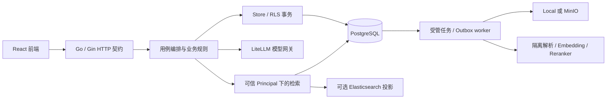

# Cortex 系统设计

校对日期：2026-10-05。本文维护产品边界、模块职责和数据一致性规则；执行规范以 [AGENTS.md](../AGENTS.md) 为准。
接口字段见 [API](api.md)，页面行为见 [使用流程](page/README.md)，运行命令见 [开发指南](guides/LOCAL_DEVELOPMENT.md)。

## 产品范围

Cortex 面向个人记录与回顾，支持普通笔记、日报/周报/月报、标签、附件、正文历史、中文搜索、
工作台、AI 整理与报告、个人知识问答、Markdown 模板广场、每日限量免费点数活动和 Markdown ZIP 导出。

- 知识库支持 Markdown/ZIP、PDF、DOC/DOCX、PNG/JPG/WebP；每租户容量上限为 3 GiB。
- 个人笔记须显式开启知识开关才参与知识问答；周期报告不自动入库。
- 旧 `/recipes`、`/assistant` 页面重定向到 `/knowledge`；没有独立的菜谱 API、内置全局语料或回忆问答页面。
- 活动领取成功即发放免费点数，不代表已生成深度月报。
- 团队协作、计费、桌面组件、云盘同步、数据库与 Markdown 双向同步、小红书研究不在当前产品范围。
- Excel/演示文稿摄取、分片续传、结构化 PDF 坐标引用等候选能力见 [实现缺口](IMPLEMENTATION_GAPS.md)。

## 架构与部署

前端固定为 React 18、TypeScript、Webpack 5、Ant Design；后端为 Go、Gin、pgx/v5；数据库为 PostgreSQL 16。
PostgreSQL 是笔记正文、租户权限、任务与引用事实的唯一权威来源，Markdown 用于内容交换和导出。

```mermaid
flowchart LR
    UI[React 前端] --> HTTP[Go / Gin HTTP 契约]
    HTTP --> APP[用例编排与业务规则]
    APP --> STORE[Store / RLS 事务]
    STORE --> PG[(PostgreSQL)]
    APP --> AI[LiteLLM 模型网关]
    APP --> RET[可信 Principal 下的检索]
    RET --> PG
    RET --> ES[可选 Elasticsearch 投影]
    PG --> WORK[受管任务 / Outbox worker]
    WORK --> BLOB[Local 或 MinIO]
    WORK --> MODEL[隔离解析 / Embedding / Reranker]
```

`backend/cmd/server/main.go` 是唯一长期服务入口；`CORTEX_RUNTIME_ROLE` 支持 `all`、`api`、`worker`。
当前完整 Compose 的 backend 默认运行 `all`，没有默认拆成两个独立的 API/worker 服务。
`api` 角色不建立 migrator 管理连接；`cmd/migrate`、`cmd/blob-migrate` 和评测命令属于显式运维工具。

| 部署 | 文件与消息 | 知识检索 | 适用说明 |
| --- | --- | --- | --- |
| 完整 Compose | MinIO、Redpanda/Kafka、Redis | Elasticsearch 投影 | 模型、解析和监控服务随完整栈配置 |
| 个人轻量 Compose | Local BlobStore、PostgreSQL 任务 | PostgreSQL/pgvector | 默认只启用 db/backend/frontend；AI 与知识模型服务按 profile 启用 |

两种部署使用独立卷，切换配置不会自动迁移数据。具体步骤见 [个人部署](guides/PERSONAL_DEPLOYMENT.md)。

## 模块职责

业务代码逐步收敛为 `server → application → domain/ports → infrastructure/store`：

| 边界 | 职责 |
| --- | --- |
| server | HTTP 解析、响应、Principal 传递；不承载 SQL 和事务 |
| application | 用例校验、配额、确认、审计和业务编排 |
| domain / ports | 领域类型及用例侧依赖接口 |
| store | SQL、事务、显式 tenant 条件和 transaction-local RLS |
| AIClient / Retriever / AIWorkflow | 分别负责模型流、可信范围检索和编排；不能取代业务层的来源/权限校验 |
| workers / scheduler | 租约、幂等事件、索引、投影、GC 与定时报告任务 |

现有领域在修改时逐步迁移，不为目录整齐重写稳定业务。对象、事件和索引细节见 [基础设施](INFRASTRUCTURE_EVOLUTION.md)。

## 租户、认证与内容保护

每个账号关联一个由服务端解析的个人租户；客户端提交的 tenant_id 不参与租户选择。
租户业务查询通过 Store 事务设置用户/租户 RLS 上下文，并保留显式 tenant_id 条件。跨租户资源统一返回 404。
应用连接使用低权限 `cortex_app`，迁移和后台 claim 使用 `cortex_migrator`；软删除租户不能登录或继续使用 Token。
密码使用 PBKDF2-SHA256，Token 只持久化 SHA-256 摘要，支持过期、撤销和最后使用时间。

正文更新使用乐观冲突保护；修改及 AI 覆盖前创建 revision，删除默认软删除。
revision 保存正文，不保存完整的标题、日期和历史报告来源；恢复正文前保留当前正文。
新版恢复客户端提交 expected_updated_at，旧空请求体仍兼容，详见 API。

浏览器 sessionStorage 草稿按账号隔离，最长保留七天；其恢复、冲突比较及报告五份成功草稿历史均不改变服务器权威性。
它们不跨设备同步，也不替代备份。完整知识回答保存为普通笔记时，服务器按 message ID 读取回答、
复核来源、配额和所属账号，在租户事务锁下通过审计引用去重，不接受客户端替换正文或来源。

附件与知识文件使用服务端生成的私有对象定位，鉴权下载，不作为公开静态目录暴露。
Local 后端使用 CORTEX_DATA_DIR，DIARY_DATA_DIR 仅为旧配置别名；对象版本持久化限制见基础设施说明。

## 知识检索与 AI

知识摄取包括安全上传、隔离解析/OCR、父子切块、Embedding 和索引激活。已有活动索引在重建成功前持续服务。
Kafka 模式先在 PostgreSQL 原子激活，再构建 Elasticsearch 投影；PostgreSQL 模式由 runner 轮询任务。
候选回 PostgreSQL 复核租户、有效状态、活动索引和原笔记，再精排、证据门控、生成、引用核验并保存来源。

无依据时拒答；歧义和范围冲突可进入有期限、一次性的澄清恢复。检索技术进度不包含正文或直接身份信息。
计划器默认关闭；阈值、模型、召回路径与评测说明集中在 [RAG](RAG.md) 和 [质量回归](guides/QUALITY_EVALUATION.md)。

生成只经 LiteLLM 的逻辑模型 `cortex-default`，backend 仅持有虚拟密钥；供应商 Key 只注入网关。
整理和手动报告先返回草稿，经确认接口写入；报告携带本次实际来源，确认时继续复核租户和周期。
流式响应已经输出内容后不得从头重试；失败尝试不能覆盖完整草稿。缓存、元数据与估算用量规则见 [网关规范](LLM_GATEWAY.md)。

AI、Embedding、Reranker 或解析服务不可用时，认证、笔记、搜索、附件和导出仍可用；依赖它们的索引或问答返回稳定错误。
当前没有 Elasticsearch 故障自动切换 pgvector 的实现，普通笔记搜索仍使用 PostgreSQL。

## 模板、活动与定时任务

模板私有原稿受 RLS 保护；作者自主上架生成公开快照，下架或删除租户时快照不可见。
公开列表仍要求登录；“公开”指内容可跨租户查看，不代表匿名接口。模板使用通过幂等键创建个人笔记。
排行、收藏和匿名 UV 可使用 Redis 投影，公开读取仍回 PostgreSQL 校验发布状态。

限量活动由数据库配置开放时段、资格、库存和奖励。Redis Lua 预扣，PostgreSQL 库存槽位、唯一约束、
领取记录和点数账本保存最终事实；不可用时执行受限的数据库 fallback。活动与知识事件使用独立 worker 范围。
具体接口、默认参数和失败行为统一见 API，不在设计文档重复维护。

scheduler 使用管理连接和有限租约 claim 到期任务；创建 run、续租、写报告和完成均校验当前 owner。
状态持久化为 running/success/failed，手动重试异步返回 queued，正在执行时返回 busy。
任务按 IANA 时区计算，数据库保存 UTC；周/月周期分别归一到周一/月初。

## 验证与运行边界

新库由 schema 基线和版本化迁移初始化，当前迁移 42、57 张 public 表；已有结构变更必须新增迁移并使用 advisory lock。
`/healthz` 表示进程存活，`/readyz` 验证 PostgreSQL；可选依赖由 `/health/dependencies` 独立报告。
完整 Compose 的数据库、缓存、对象、消息、搜索和模型服务不暴露宿主机公共端口。

验证命令统一见 [开发指南](guides/LOCAL_DEVELOPMENT.md)，发布门禁见 [发布清单](RELEASE_CHECKLIST.md)，
故障处理见 [运维手册](runbooks/OPERATIONS.md)。[日期化验收报告](operations/README.md)只证明其记录的环境和范围。
