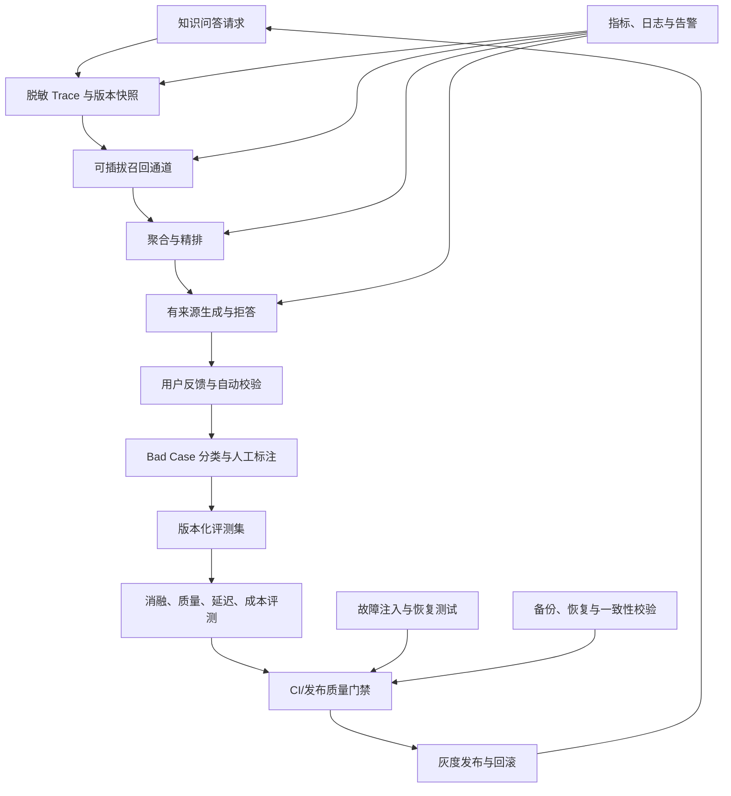

# Cortex 面向 SSP 级工程能力的优化升级方案

> 状态：规划中  
> 编写日期：2026-08-12  
> 适用范围：个人知识库 RAG、AI 网关、后台任务、可观测性、灾备与发布质量  
> 约束：本文描述的是后续建设计划；除“当前基线”明确列出的能力外，不代表功能已经实现。

## 1. 背景与目标

Cortex 已经具备个人笔记、附件、历史版本、周期报告、模板广场、AI 工作流、个人知识库、
多租户 RLS、版本化迁移、Docker Compose 和 CI 等完整产品骨架。个人知识库已经形成如下链路：

```text
Markdown 上传/笔记入库
→ Parent-Child 切块与版本化索引
→ 向量/全文/标题候选召回
→ child 级 RRF 与 parent 聚合
→ CrossEncoder 精排
→ 上下文选择与有来源生成
→ SSE 返回并保存回答及来源
```

当前项目的主要差距不再是功能数量，而是缺少持续证明以下能力的工程闭环：

1. 每个检索组件的实际贡献可被消融实验量化，无效复杂度能够被识别和移除。
2. 线上 bad case 能回流到版本化评测集，并通过 CI 阻止质量退化。
3. 索引、流式生成、调度和跨服务任务在进程崩溃与依赖故障下可恢复、可重入。
4. 质量、延迟、成本和容量能够联合评估，而不是只优化单一离线指标。
5. PostgreSQL 与应用数据卷能够按明确 RPO/RTO 完成恢复演练和一致性校验。

本方案以“可度量、可定位、可恢复、可回归”为目标，不引入团队协作、计费、云盘同步、
桌面组件或数据库与 Markdown 双向同步。

## 2. 当前基线与已知问题

### 2.1 已有能力

- 租户业务查询在 `Store.WithTx` 中设置 transaction-local RLS 上下文，并保留显式
  `tenant_id` 条件。
- 知识文档以状态机异步索引；重建成功后原子切换 `active_index_version`，失败时旧版本继续服务。
- 知识问答无证据时返回 `KNOWLEDGE_NO_EVIDENCE`，来源失效时拒绝保存无效引用。
- RAG 离线评测覆盖 Hit@K、MRR、Context Recall、Context Precision、Faithfulness、
  Answer Relevancy、分通道命中率和阶段耗时。
- AI 不可用时，认证、笔记、搜索、附件和导出保持可用；流式输出开始后不从头重试。
- scheduler 使用 `FOR UPDATE SKIP LOCKED` 竞争到期任务，并持久化运行状态。
- CI 已执行后端 vet/test/build、前端格式检查/test/build 和 Compose 配置检查。
- 已提供 `/healthz`、`/readyz`、request ID 和一组 Prometheus 文本指标。

### 2.2 已知问题

| 编号 | 问题 | 影响 | 当前证据 |
| --- | --- | --- | --- |
| G1 | PostgreSQL `simple` FTS 对中文语料缺少有效分词，当前全文通道离线 Hit@10 和独立增量为 0 | “混合检索”增加复杂度但没有可证明收益 | `docs/RAG.md` 分通道评测 |
| G2 | 离线评测存在，但没有标准化的线上反馈、脱敏 trace、标注和回归集晋升流程 | 同类错误可能重复发生 | 当前无反馈闭环接口和数据模型 |
| G3 | Embedding、Reranker、LiteLLM、索引切换和 scheduler 的崩溃窗口缺少系统故障注入 | 正确性主要由静态设计推断 | 单元测试与验收脚本覆盖不完整 |
| G4 | `/metrics` 主要覆盖局部业务计数，缺少 HTTP、DB、RAG、队列和依赖的统一指标 | 故障定位依赖人工翻日志 | `internal/server/metrics.go` |
| G5 | 有数据库与数据卷灾备说明，但缺少独立环境恢复演练、自动校验及 RPO/RTO 记录 | “完整备份恢复”不能作为已完成能力 | `README.md` 当前灾备边界 |
| G6 | RAG 评测多 worker 会触发 LiteLLM 限流 | 无法稳定提升评测吞吐 | 历史评测失败记录 |
| G7 | 缺少质量、延迟、token 成本和容量的联合决策 | Top-K 与模型选择难以形成工程取舍 | 当前报告以质量指标为主 |

## 3. 总体升级架构



建设顺序必须遵循：先补测量，再做优化；先验证故障边界，再声明可靠性；先完成恢复演练，
再声明灾备能力。

## 4. 工作流一：RAG 消融实验与中文检索改造

### 4.1 目标

- 量化向量、标题、全文、RRF、Parent-Child、Reranker 和上下文选择的独立贡献。
- 解决或移除中文 FTS 零贡献通道。
- 形成质量、延迟和成本三维的参数决策记录。

### 4.2 统一实验协议

每次实验必须固定并保存以下信息：

- 数据集版本、case ID 集合和内容 SHA-256。
- Embedding、Reranker、生成模型和 Judge 模型的逻辑名与版本。
- Prompt 版本、chunker 版本、索引版本和全部 Top-K 参数。
- PostgreSQL、Embedding、Reranker、LiteLLM 的运行配置。
- 随机性参数、worker 数、开始时间、Git commit 和工作树状态。
- 逐 case 候选、route provenance、重排前后排名、最终上下文、回答、引用和阶段耗时。

禁止把不同数据集、不同 Judge 或不完整失败运行直接作为前后效果对比。

### 4.3 消融矩阵

| 实验组 | 变量 | 主要问题 | 必须观察的指标 |
| --- | --- | --- | --- |
| A0 | 仅向量 child 召回 | 基础语义检索能力如何 | Hit@K、MRR、延迟 |
| A1 | 向量 + 标题 | 标题通道的独立增量是多少 | Route Incremental、MRR |
| A2 | 向量 + 当前 FTS | 当前全文通道是否有贡献 | FTS Hit@10、独立增量 |
| A3 | 向量 + 新中文关键词通道 | 中文精确词、数字、编号是否改善 | 分类型 Hit@K、增量命中 |
| A4 | 三路候选但不使用 RRF | RRF 是否优于简单拼接/最高分 | MRR、重复候选率 |
| A5 | 去掉 Reranker | 精排收益与延迟成本是多少 | MRR、Context 指标、p95 |
| A6 | child 直接生成 | Parent-Child 是否改善完整上下文 | Context Recall/Precision |
| A7 | 固定 parent Top-K | 文档优先策略是否有效 | Context 指标、token 数 |
| A8 | Top-K 5/6/8 | 上下文预算的 Pareto 边界 | 质量、延迟、token 成本 |

### 4.4 中文关键词检索候选方案

按最小侵入原则依次验证：

1. 在应用侧生成确定性 Unicode 2-gram/3-gram token，写入独立检索字段并使用 PostgreSQL FTS。
2. 使用 `pg_trgm` 对标题、章节和短语做补充匹配，但不把模糊匹配等同于正文关键词搜索。
3. 若前两种无法满足精确词、数字和编号检索，再评估 PGroonga 等扩展；引入新扩展前必须评估
   Compose 镜像、迁移权限、备份恢复和运维成本。

不得为了保留“三路召回”而保留无实际增量的通道。若新方案在固定评测集上仍无贡献，应删除全文通道，
并以更简单的“向量 + 标题候选 + 精排”作为基线。

### 4.5 验收标准

- 所有消融实验可由单一命令复现，并生成不可覆盖的版本化报告。
- 中文关键词通道对 `keyword/number/code/title` 子集至少存在可解释的独立增量；具体门槛在首轮基线后固化，
  不预先编造提升比例。
- 新方案不得使跨租户过滤、来源校验、Context Precision 或 Faithfulness 低于既有发布门槛。
- 报告必须同时列出质量变化、p50/p95、token 使用量和失败率。
- 每个保留组件都有正向证据；无贡献组件被删除或在文档中说明保留理由。

## 5. 工作流二：线上质量反馈与评测回流

### 5.1 目标

建立“线上失败一次，经过确认后成为永久回归用例”的质量治理链路，同时避免日志和评测集泄露
完整私人正文。

### 5.2 Trace 数据边界

建议新增版本化的 RAG trace 记录，保存：

- 后端生成的 `request_id`、租户内会话 ID 和时间戳。
- 索引、chunker、Prompt、检索参数和逻辑模型版本。
- 各阶段状态、候选数量、route mask、排名、分数和耗时。
- 最终引用的文档 ID、chunk ID、index version 和内容摘要 hash。
- 回答状态、错误码、输出 token、是否拒答和引用校验结果。

普通日志不得保存完整 query、私人正文、上下文和回答。业务数据库确需保存用户对话时，继续由 RLS、
显式租户条件和现有数据生命周期保护；导出到离线评测集前必须获得用户主动操作并进行脱敏。

### 5.3 反馈与 Bad Case 分类

反馈入口至少支持：

- 答案不正确。
- 引用不支持答案。
- 没有找到已有资料。
- 应当拒答但进行了回答。
- 回答正确但延迟过高。

后台将反馈归类为：解析错误、索引陈旧、召回缺失、排序回退、上下文截断、引用错位、无依据生成、
错误拒答、权限错误或依赖故障。权限错误必须作为最高优先级安全事件处理，不能只进入普通质量队列。

### 5.4 评测集晋升流程

```text
用户反馈/自动检测
→ 生成待复核记录
→ 人工确认问题、期望答案与证据
→ 删除直接身份信息并最小化正文
→ 分配 case_id、标签和数据集版本
→ 运行基线验证
→ 合并到回归集
→ CI 质量门禁
```

自动检测可覆盖无来源完成、非法引用、来源版本失效、空回答、流式无完成标记和阶段延迟超阈值；
答案正确性不能仅依赖同一个生成模型自我裁决。

### 5.5 验收标准

- 任一反馈都能通过 request ID 定位到索引版本、模型版本和检索阶段。
- 评测用例有稳定 schema、manifest、hash、来源说明和变更记录。
- 至少用真实开发过程中的 bad case 完成一次“反馈—修复—回归—门禁”演示。
- 脱敏前后的数据访问、保留和删除规则有测试与文档。
- CI 只运行不依赖外部付费模型的确定性小型回归；完整 LLM Judge 评测由受控发布流程触发。

## 6. 工作流三：可靠性、幂等与故障注入

### 6.1 设计原则

- 数据库保存最终事实，Redis、缓存和队列只保存可重建投影或协调状态。
- 跨服务端到端 exactly-once 不作为目标；通过唯一业务键、幂等写入、租约和可重入状态机实现
  effectively-once。
- 已产生流式输出后不得从头重试；部分输出必须保存为明确的失败/不完整状态。
- 每个 worker claim 都要有租约、owner fencing、有限重试、最终失败状态和人工重试入口。

### 6.2 故障矩阵

| 故障点 | 期望行为 | 验证方式 |
| --- | --- | --- |
| Embedding 在索引中途失败 | 新版本不激活，旧版本继续检索，任务进入可重试状态 | fake client + PostgreSQL 集成测试 |
| chunks 写入后、激活前进程退出 | 检索只读取旧 active version，不混用版本 | crash point 集成测试 |
| 激活成功后清理旧版本失败 | 新版本正常服务，清理任务可重入 | 重复执行清理测试 |
| Reranker 超时或返回重复/越界 index | 返回稳定错误；若以后支持降级，响应必须标记 degraded | contract test |
| LiteLLM 在首个 delta 前失败 | 可按有限策略重试或 fallback | fake SSE 上游 |
| LiteLLM 在输出 delta 后断开 | 不从头重试，保存 partial/failed 状态和 token 数 | SSE 中断测试 |
| 来源在生成期间删除 | 保存阶段失败并返回 `KNOWLEDGE_SOURCE_INVALID` | 并发集成测试 |
| scheduler claim 后进程退出 | 租约到期后其他实例接管 | 双 worker + fake clock |
| 报告已保存、run 完成前退出 | 重试不生成第二份业务报告 | 唯一业务键与幂等测试 |
| Redis 清空或不可用 | PostgreSQL 最终事实不变；允许的功能明确降级 | Redis failure acceptance |
| DB 与应用数据卷恢复不同步 | 恢复校验失败，实例不进入 ready | restore drill |

### 6.3 Scheduler 改造重点

- 为定时任务执行定义稳定的业务幂等键，例如 `(tenant_id, task_id, normalized_period, trigger_class)`。
- run 状态至少包含 queued/running/success/failed，并记录 lease owner、lease until、attempt、错误码。
- claim、续租和完成均校验 owner 与未过期租约，防止旧 worker 覆盖新 owner 的结果。
- 报告内容与 run 完成状态不能依赖无保护的跨事务顺序；优先在同一事务内完成业务写入和状态变更，
  或通过 outbox/唯一约束修复崩溃窗口。
- 对 DST 跳时、重复小时、手动重试与定时触发竞态建立确定性测试。

### 6.4 验收标准

- 故障矩阵中的关键场景进入自动化测试，且能够稳定复现而不是依赖人工杀进程。
- 多实例竞争同一任务只能产生一个有效业务结果；允许重复执行，但不允许重复副作用。
- 所有最终失败均有稳定错误码、有限重试和人工重试入口。
- 故障测试不绕过 RLS，也不使用客户端提供的 `tenant_id` 选择租户。

## 7. 工作流四：可观测性与运行手册

### 7.1 指标设计

新增指标不得包含邮箱、姓名、原始 query、正文或高基数租户 ID。建议覆盖：

| 层级 | 指标 |
| --- | --- |
| HTTP | 请求数、状态码、in-flight、p50/p95/p99、SSE 中断数 |
| PostgreSQL | 连接池使用率、事务耗时、超时、冲突、慢查询计数 |
| Knowledge Index | queued/running/failed、队列年龄、索引耗时、重试次数、活动版本切换失败 |
| RAG | 各通道候选数、无证据率、rerank 错误率、引用校验失败、各阶段延迟 |
| AI Gateway | 429、超时、5xx、fallback、TTFT、输出 token、未完成流 |
| Scheduler | backlog、claim、租约过期、重试、最终失败、重复副作用拦截 |
| Storage | 租户配额预占失败、磁盘使用率、孤儿文件和 DB/文件不一致计数 |

### 7.2 日志与追踪

- 全链路传播后端生成的 request ID；后台任务使用 job/run ID 关联，但不把租户 ID作为公开指标标签。
- 结构化日志只记录资源 ID、阶段、耗时、候选数、错误码和状态转换，不记录敏感正文。
- 对慢请求记录阶段分解，以区分 DB、Embedding、Reranker 和生成瓶颈。
- 若引入 OpenTelemetry，先限制采样率和属性白名单，不允许把 Prompt 或完整响应作为 span attribute。

### 7.3 告警与 Runbook

首批告警应覆盖：

- `/readyz` 持续失败。
- RAG 无证据率或错误率相对基线异常升高。
- LiteLLM 429/超时持续升高。
- 索引队列最老任务超过阈值。
- scheduler 租约过期或最终失败持续出现。
- 数据盘接近容量上限。
- 备份过期或最近恢复演练失败。

每个告警必须链接到 runbook，包含影响范围、定位步骤、可安全执行的缓解动作、回滚方法和升级条件。

### 7.4 验收标准

- 能从一次故障告警通过 request/job ID 定位到具体阶段和稳定错误码。
- 关键链路有 dashboard 和告警，但不使用高基数或敏感标签。
- 至少完成一次 Reranker 超时或索引积压演练，并保存检测、定位和恢复时间线。

## 8. 工作流五：灾备、恢复与数据一致性

### 8.1 备份范围

完整灾备必须同时包含：

- PostgreSQL 业务数据库、schema、migration 版本和必要角色/扩展说明。
- `CORTEX_DATA_DIR` 下的附件、知识文件、研究资产及其元数据对应的数据卷。
- 部署配置模板与密钥恢复流程；供应商真实 Key 不进入普通备份包。
- 备份 manifest：时间、版本、数据库快照标识、文件清单摘要和校验和。

Markdown ZIP 仅用于内容交换，不能替代数据库和应用数据卷灾备。

### 8.2 恢复流程

```text
准备隔离恢复环境
→ 校验备份 manifest 和 checksum
→ 恢复 PostgreSQL
→ 恢复应用数据卷
→ 执行版本化迁移
→ 启动依赖与后端
→ 运行一致性校验
→ 运行 non-AI smoke
→ 运行受控 AI acceptance
→ 记录 RPO/RTO 与异常
```

恢复后自动校验至少包括：

- 预期表数、迁移版本、RLS policy 和低权限 `diary_app` 连接。
- 注册、登录、Token、租户 404 隔离和软删除租户不可认证。
- 笔记数量、revision 恢复、附件路径安全和抽样文件 hash。
- 知识文档元数据、活动索引版本、chunk 数和来源完整性。
- 数据库记录存在但文件缺失、文件存在但无数据库记录的双向孤儿检查。
- `/healthz`、`/readyz`、笔记/搜索/附件/导出和 AI 可选降级。

### 8.3 RPO/RTO

在首次演练前不预设或对外宣称 RPO/RTO。首次完整恢复演练记录：

- 最后一个可恢复写入与故障时刻的差值。
- 从开始恢复到 `/readyz` 和核心 smoke 通过的耗时。
- 数据库、数据卷、迁移、校验分别耗时。
- 失败步骤、人工操作和可自动化项。

之后再根据实际结果确定目标，并按固定周期重复演练。

### 8.4 验收标准

- 在全新、隔离的环境完成一次数据库与数据卷联合恢复。
- 恢复脚本遇到 checksum、版本或 DB/文件不一致时失败退出，不静默带病启动。
- 产出带时间线、实际 RPO/RTO、校验结果和遗留问题的恢复报告。
- 在上述证据完成前，文档和简历只描述“灾备方案”，不描述“已实现完整备份恢复”。

## 9. 工作流六：容量、性能与成本

### 9.1 测试维度

建立 100、1,000、10,000 篇文档的可重复数据集，记录：

- 上传与索引吞吐、队列等待、单文档索引 p95。
- parent/child 数量、pgvector/FTS 索引大小、数据卷增长。
- 检索、精排、TTFT、总响应 p50/p95/p99。
- 并发问答下 DB、Embedding、Reranker、LiteLLM 的饱和点。
- 单次请求输入/输出 token 和估算成本。
- 不同 Top-K、模型和上下文预算下的质量—延迟—成本关系。

### 9.2 保护机制

- 对上传、索引、问答和完整评测分别设置有界并发、超时、队列和连接池预算。
- LiteLLM 429 使用带抖动的有限退避；已经输出内容的流不重试。
- 离线评测与在线请求使用独立并发预算，避免评测挤占用户流量。
- 对单租户配额继续使用数据库内原子预占，不依赖客户端声明大小。

### 9.3 验收标准

- 压测报告包含环境、硬件、镜像版本、数据集、命令、原始结果和失败率。
- 明确第一个瓶颈、饱和点和扩容/降级策略，不以“支持高并发”代替数字。
- 发布参数来自质量—延迟—成本的 Pareto 分析，而不是只选择最高质量配置。

## 10. CI、发布门禁与回滚

### 10.1 分层门禁

| 层级 | 触发方式 | 内容 |
| --- | --- | --- |
| L1 | 每次 push/PR | gofmt、vet、unit、race-sensitive tests、前端检查、build、Compose config |
| L2 | 相关模块变更 | PostgreSQL/RLS 集成测试、fake AI SSE、索引版本和 scheduler 幂等测试 |
| L3 | 受控发布前 | non-AI smoke、AI acceptance、RAG 小型确定性回归、故障注入 |
| L4 | 定期/重大变更 | 完整 RAG Judge 评测、容量测试、恢复演练 |

LLM Judge 具有非确定性和外部依赖，不能作为每个普通 PR 唯一门禁。发布门禁应同时包含确定性检索指标、
引用结构校验、无证据拒答和稳定错误契约。

### 10.2 迁移与回滚

- 数据库结构变化必须通过版本化迁移和 advisory lock，禁止应用启动时临时 DDL。
- 发布按 expand → migrate/backfill → switch → contract 演进，保证新旧应用短期兼容。
- 不可逆迁移必须在发布说明中明确，并在执行前完成可恢复备份和演练。
- RAG 索引使用版本切换回滚；应用镜像使用不可变版本；回滚不依赖删除用户数据。

## 11. 实施计划

### Phase 0：基线冻结与证据规范（0.5～1 天）

- 固化当前 RAG 数据集 manifest、配置快照和可信基线。
- 新增实验报告模板、bad case taxonomy 和 claim 证据清单。
- 明确当前不能对外宣称的能力：线上收益、高并发、完整备份恢复、完整可观测体系。

交付物：基线 manifest、实验模板、风险清单。

### Phase 1：RAG 消融与中文检索（2～4 天）

- 实现可配置召回通道和消融运行入口。
- 完成 A0～A8 核心实验。
- 验证中文 n-gram/替代方案，保留有增量的最小架构。
- 输出质量、延迟、成本对照与 bad case 分析。

交付物：消融报告、新中文检索实现或删除 FTS 的设计决策记录、回归测试。

### Phase 2：Trace 与质量回流（3～5 天）

- 定义 trace/feedback schema 与数据生命周期。
- 增加反馈入口和内部 bad case 复核流程。
- 评测集版本化，并接入确定性 CI 小回归。
- 完成一次真实 bad case 的闭环演示。

交付物：迁移、API、页面/内部工具、脱敏测试、回归数据集变更记录。

### Phase 3：故障注入与可观测性（3～5 天）

- 为 Embedding、Reranker、LiteLLM 和 worker 增加可控 fake/fault point。
- 补索引原子切换、SSE 中断、来源失效和 scheduler 崩溃窗口测试。
- 增加核心指标、告警规则和 runbook。

交付物：故障矩阵测试、dashboard、告警与一次演练报告。

### Phase 4：灾备与容量（2～4 天）

- 编写联合备份、恢复和一致性校验脚本。
- 在隔离环境完成恢复演练并记录实际 RPO/RTO。
- 完成分规模容量与并发测试，形成资源预算。

交付物：恢复脚本、恢复报告、容量报告、发布 checklist。

## 12. 优先级与停止条件

优先级按风险与面试证据价值排序：

1. **P0：RAG 消融与中文全文零贡献处理。** 当前已有明确数据，最容易形成完整技术决策闭环。
2. **P0：索引版本与 SSE 中断故障测试。** 直接验证现有核心可靠性 claim。
3. **P1：线上反馈和 bad case 回流。** 将一次性评测升级为持续质量治理。
4. **P1：scheduler 幂等与崩溃恢复。** 补齐异步任务的 effectively-once 证据。
5. **P1：可观测指标和 runbook。** 支撑上述链路的定位与演练。
6. **P2：联合恢复演练和容量测试。** 完成生产准备证据。

如果某一优化在固定评测集上没有可解释收益，或收益不足以覆盖复杂度、延迟和运维成本，应停止继续堆叠，
记录实验并回退到更简单的设计。项目升级的目标不是最大化技术名词，而是建立可证明的工程判断。

## 13. 完成定义

本方案完成不以“代码合并”为准，而以下列证据同时存在为准：

- 一份可复现的 RAG 消融报告，能够解释每个保留组件的贡献和代价。
- 至少一个真实 bad case 完成反馈、标注、修复、回归和发布门禁闭环。
- 索引、流式生成和 scheduler 的关键崩溃窗口有自动化故障测试。
- 核心链路有无敏感信息的指标、告警和 runbook，并完成一次演练。
- PostgreSQL 与数据卷在隔离环境完成联合恢复，一致性校验通过并记录实际 RPO/RTO。
- 容量报告能够说明当前瓶颈、失败率、p95/p99、成本和扩展策略。
- README、API、RAG 和部署文档与实现同步，规划能力与已实现能力严格区分。

完成这些闭环后，Cortex 的核心价值将从“功能完整、技术栈丰富的个人知识平台”提升为：

> 一个能够以评测驱动 RAG 演进、以故障注入验证可靠性、以可观测性支持定位、并通过灾备和发布门禁
> 保证持续交付质量的多租户 AI 知识系统。
