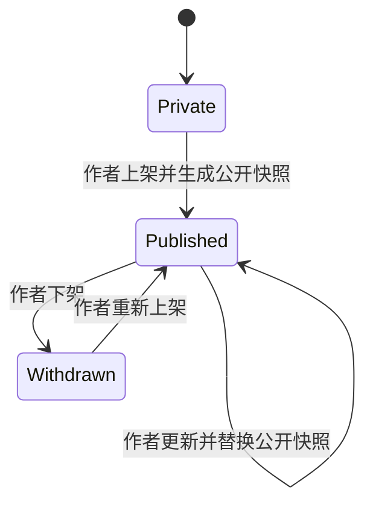
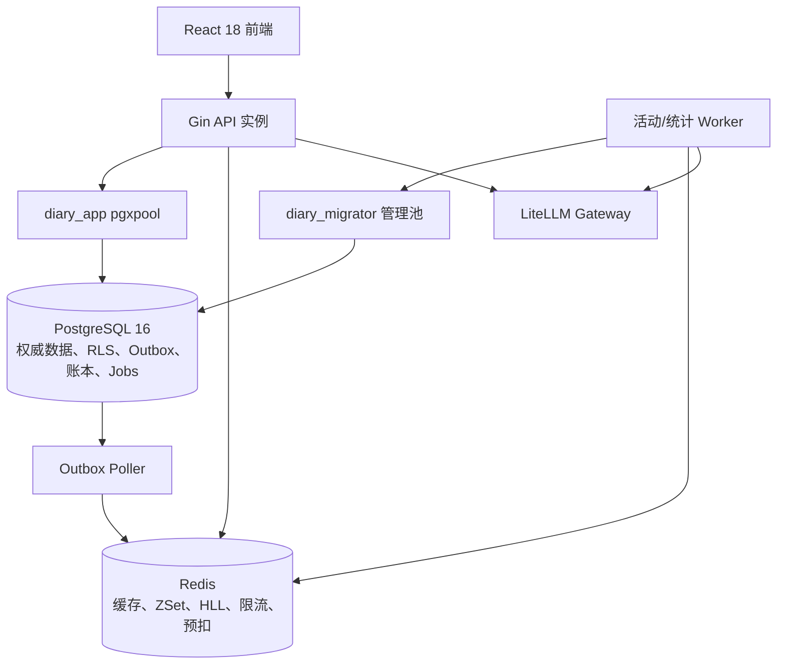
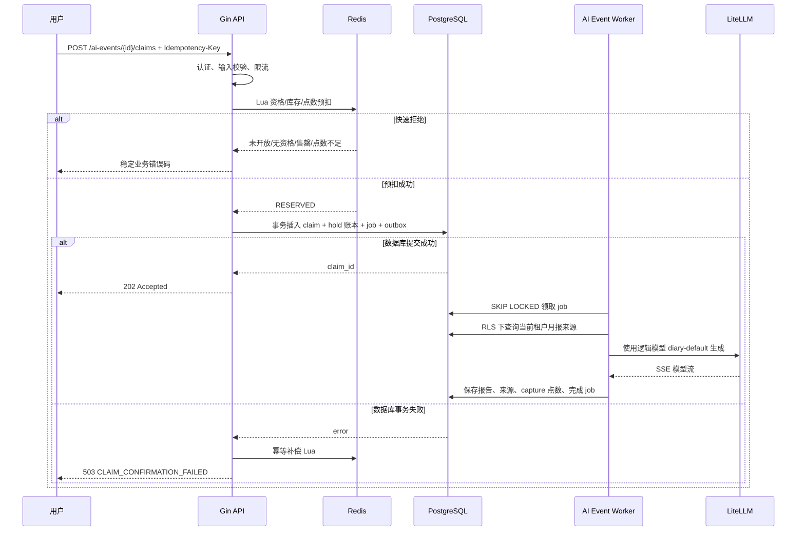

# 模板广场与限量 AI 深度月报技术方案

> 状态：设计草案  
> 适用仓库：Diary Listener / Cortex  
> 目标版本：分阶段交付  
> 最后更新：2026-08-01

## 1. 文档目标

本文给出两个新增业务的完整产品、前端、后端、数据库、Redis、异步任务、安全、运维与测试设计：

1. **日记模板与写作提示广场**：用户使用 Markdown 创建模板，可选择仅自己使用或自主上架到模板广场，其他用户可以预览、收藏、点赞并据此创建笔记。
2. **每日限量 AI 深度月报活动**：用户拥有月度 AI 点数额度；每天固定时间开放有限名额，满足连续记录 5 天条件的用户可以参与。Redis 负责原子资格预检、库存预扣和高并发削峰，PostgreSQL 保存活动、领取、点数账本与生成任务的最终事实。

本文是实施前的技术基线，不直接改变当前数据库或 API。正式实施时必须同步更新 `AGENTS.md`、`README.md`、`docs/api.md`、数据库初始化基线和版本化迁移。

## 2. 产品边界与核心原则

### 2.1 范围

模板广场包含：

- 官方模板和用户自定义模板；
- Markdown 编辑、GFM 预览和从模板创建笔记；
- 私有模板、我的公开模板、公开模板浏览；
- 收藏、点赞、使用次数、今日热门、趋势榜、新人榜；
- 基于显式兴趣和使用历史的轻量个性化推荐；
- 用户自主上架、下架和举报；
- 热门模板详情缓存与浏览事件异步统计。

限量 AI 活动包含：

- 月度 AI 点数余额；
- 每日固定时间开放的限量深度月报名额；
- Dashboard 活动弹窗、倒计时与独立活动路由；
- 连续 5 天记录资格校验；
- 每日每用户最多领取一次；
- 固定点数冻结、成功扣减、失败释放；
- 历史活动与近期成功用户名单；
- Redis Lua 原子预扣、限流、异步生成、超时补偿和对账。

### 2.2 非范围

- 不引入支付、充值、退款或可提现积分；AI 点数仅为产品内不可交易额度。
- 不公开日记正文、笔记标题、附件、搜索记录或 AI Prompt。
- 不做关注关系、私信、评论和团队模板协作。
- Redis 不保存不可恢复的唯一业务事实，不作为日记正文、模板原稿、活动领取或点数余额的权威来源。
- 不允许客户端提交 `tenant_id` 决定数据访问范围。

### 2.3 一致性原则

| 数据 | 权威来源 | Redis 角色 | 一致性要求 |
| --- | --- | --- | --- |
| 私有模板原稿 | PostgreSQL | 不缓存或短缓存 | 强一致 |
| 公开模板快照 | PostgreSQL | Cache Aside | 最终一致，允许秒级陈旧 |
| 点赞/收藏关系 | PostgreSQL | 热集合与计数加速 | PostgreSQL 最终裁决 |
| 浏览/使用事件 | PostgreSQL 事件明细或聚合 | Stream/HLL/ZSet | 至少一次消费、幂等聚合 |
| 活动配置 | PostgreSQL | 活动窗口和库存镜像 | 开场前预热，定期对账 |
| 活动领取 | PostgreSQL | Lua 预扣和快速拒绝 | 唯一约束最终裁决 |
| AI 点数 | PostgreSQL 账本 | Lua 中的可用额度镜像 | 账本强一致、Redis 可重建 |
| AI 生成任务 | PostgreSQL job 表 | 可选通知/进度缓存 | 租约、重试、审计持久化 |

## 3. 用户体验与信息架构

### 3.1 笔记页面

导航栏仍保留“笔记本”，路由根为 `/notes`。页面顶部增加一级分段：

```text
笔记本
├── 模板广场（默认）
│   ├── 我的模板
│   │   ├── 私有模板
│   │   └── 已公开/已下架
│   └── 公开模板
│       ├── 推荐
│       ├── 今日热门
│       ├── 趋势榜
│       └── 新人榜
└── 我的笔记
    ├── 笔记列表
    └── Markdown 编辑器
```

推荐路由：

| 路由 | 页面 | 说明 |
| --- | --- | --- |
| `/notes` | 重定向 | 默认跳转 `/notes/templates/public` |
| `/notes/templates/public` | 公开模板 | 默认进入的模板广场 |
| `/notes/templates/mine` | 我的模板 | 私有、公开、下架状态 |
| `/notes/templates/new` | 新建模板 | Markdown 编辑与预览 |
| `/notes/templates/:templateId` | 模板详情 | 公开模板或当前用户自己的模板 |
| `/notes/templates/:templateId/edit` | 编辑模板 | 仅所有者可编辑原稿 |
| `/notes/list` | 我的笔记 | 原 `NoteList` |
| `/notes/new?template_id=:id` | 从模板创建 | 创建新笔记并预填 Markdown |
| `/notes/:noteId` | 笔记编辑 | 保留原有路由 |

`/notes` 默认展示“模板广场”，但必须保留用户上次选择作为本地偏好；产品若严格要求每次优先广场，则不恢复该偏好。

### 3.2 模板创建与公开流程

模板字段：

- 标题；
- 一句话说明；
- Markdown 正文；
- 分类与标签；
- 封面色或官方图标，不允许第一阶段上传公开图片；
- 可见性：`private` 或“公开”；
- 版本号和更新时间，用于乐观冲突保护。

推荐的 Markdown 模板示例：

```markdown
# 今日复盘

## 今天完成了什么？

- 

## 哪件事最值得记住？

> 

## 明天最重要的一件事

- [ ] 
```

公开由模板作者自主决定，但仍通过独立公开快照隔离私有原稿：



作者修改私有原稿时，已公开快照保持原版本；作者明确执行更新上架后，才用新版本替换公开快照。
本期不提供管理员审核，模板上架和下架均由作者决定。

### 3.3 从模板创建笔记

点击“使用模板”后，前端调用服务端的原子接口创建笔记，不应只在浏览器复制正文：

1. 服务端确认公开快照仍可用，或模板属于当前用户；
2. 创建普通笔记，正文初始化为模板 Markdown；
3. 保存 `template_usage`，记录使用的公开快照版本；
4. 写入 Outbox 事件；
5. 返回新笔记 ID，前端跳转 `/notes/{noteId}`；
6. 用户后续修改笔记不会反向修改模板。

该流程能保证使用统计可信，并避免已下架模板仍被新建使用。请求必须携带幂等键，防止双击创建两篇笔记。

### 3.4 AI 活动页面

新增导航项“AI 限量活动”，推荐路由 `/ai-events`：

- 当前活动名称、开放时间、固定消耗点数和剩余名额；
- 未开始时显示服务端时间校准后的倒计时；
- 开始后显示“立即领取”；
- 显示资格状态：连续记录天数、月度可用点数、今日是否已领取；
- 展示最近 7 天成功名单，活动名单完全匿名；
- 显示当前用户历史领取和生成结果；
- 活动结束或无库存时给出稳定状态，不使用客户端时间作最终判断。

Dashboard 在活动开始前的配置窗口内弹出一次提醒。活动每天按 `Asia/Shanghai` 20:00 开放，
20:10 关闭，共 10 个名额，每次固定消耗 100 点；这些值保存于数据库活动配置，不在前端或
后端代码中硬编码。弹窗包含倒计时和“查看活动”按钮；用户关闭后当日不重复弹出。关闭状态仅影响 UI，不影响资格。

## 4. 现有实现复用与调整

### 4.1 Markdown 编辑器

现有 `NoteEditor` 已使用：

- `@uiw/react-codemirror`；
- `@codemirror/lang-markdown`；
- `react-markdown`；
- `remark-gfm`。

模板编辑器应抽取共用组件 `MarkdownComposer`：

```ts
type MarkdownComposerProps = {
  value: string;
  onChange: (value: string) => void;
  disabled?: boolean;
  minHeight?: string;
  previewMode?: 'tabs' | 'split';
};
```

模板广场预览必须设置 `skipHtml`，禁止执行原始 HTML。链接需增加协议白名单、`rel="nofollow noopener noreferrer"`，图片第一阶段可以完全禁用或只允许后端图片代理的可信地址。Markdown 最大 64 KiB，标题最大 120 字，说明最大 500 字。

### 4.2 现有报告能力

活动生成继续复用 `AIWorkflow.GenerateReport` 的“只基于当前租户来源”约束，但增加独立的 `AIEventWorkflow` 编排层：

```go
type AIEventWorkflow struct {
    Reports   ReportGenerator
    Store     *store.Store
    Clock     Clock
}
```

`AIClient` 仍只负责模型流；资格、点数、来源校验、任务状态、审计与 RLS 均留在业务层。活动生成没有来源时标记为 `failed`，错误码为 `REPORT_NO_SOURCES`，并释放冻结点数。

### 4.3 作业队列

复用现有 PostgreSQL `FOR UPDATE SKIP LOCKED` 和有限租约模式，新建 `ai_event_jobs`。Redis Stream 不作为生成任务的唯一队列。若保留 Stream，它只承担高吞吐事件统计或“有新任务”的唤醒通知；worker 即使丢失通知，也会轮询 PostgreSQL 找到任务。

## 5. 总体架构



推荐新增包：

```text
backend/internal/
├── cache/
│   ├── redis.go
│   ├── keys.go
│   └── scripts/
│       ├── template_reaction.lua
│       └── ai_event_claim.lua
├── marketplace/
│   ├── service.go
│   ├── ranking.go
│   ├── publishing.go
│   └── worker.go
├── aievent/
│   ├── service.go
│   ├── eligibility.go
│   ├── worker.go
│   └── reconciliation.go
├── server/
│   ├── templates.go
│   └── ai_events.go
└── store/
    ├── templates.go
    ├── outbox.go
    ├── ai_points.go
    └── ai_events.go
```

handler 只负责 HTTP 契约，SQL 和事务必须位于 `internal/store`。

## 6. PostgreSQL 数据模型

以下是逻辑模型，实施时拆分为新的版本化迁移，并同步到 `backend/db/schema.sql` 初始化基线。

### 6.1 公开身份

公开模板和活动名单不能直接暴露登录用户名。新增显式公开身份：

```sql
CREATE TABLE public_profiles (
    user_id integer PRIMARY KEY REFERENCES users(id) ON DELETE CASCADE,
    public_id uuid NOT NULL UNIQUE,
    nickname varchar(40) NOT NULL,
    avatar_key varchar(100),
    discoverable boolean NOT NULL DEFAULT false,
    created_at timestamptz NOT NULL DEFAULT now(),
    updated_at timestamptz NOT NULL DEFAULT now(),
    version integer NOT NULL DEFAULT 1,
    CONSTRAINT ck_public_profile_nickname CHECK (char_length(nickname) BETWEEN 2 AND 40)
);
```

`nickname` 需要敏感词、控制字符、同形字符和冒充官方检查。公开模板作者在上架前必须设置
公开昵称；活动名单不使用该昵称，统一返回完全匿名的临时显示名，例如 `记录者·A7K2`。
API 永不返回 `user_id`、邮箱、登录用户名或租户 ID。

### 6.2 私有模板原稿

```sql
CREATE TABLE writing_templates (
    id bigint GENERATED ALWAYS AS IDENTITY PRIMARY KEY,
    tenant_id uuid NOT NULL REFERENCES tenants(id),
    created_by integer NOT NULL REFERENCES users(id),
    title varchar(120) NOT NULL,
    description varchar(500) NOT NULL DEFAULT '',
    content_markdown text NOT NULL,
    category varchar(40) NOT NULL,
    status varchar(20) NOT NULL DEFAULT 'private',
    version integer NOT NULL DEFAULT 1,
    created_at timestamptz NOT NULL DEFAULT now(),
    updated_at timestamptz NOT NULL DEFAULT now(),
    deleted_at timestamptz,
    CONSTRAINT uq_writing_templates_tenant_id_id UNIQUE (tenant_id, id),
    CONSTRAINT ck_writing_template_status CHECK
      (status IN ('private','published','withdrawn')),
    CONSTRAINT ck_writing_template_content_size CHECK
      (octet_length(content_markdown) BETWEEN 1 AND 65536)
);
```

该表启用并强制 RLS。普通租户只能访问自己的原稿；公开读取绝不查询该表。

### 6.3 用户发布记录和公开快照

```sql
CREATE TABLE template_publications (
    id bigint GENERATED ALWAYS AS IDENTITY PRIMARY KEY,
    tenant_id uuid NOT NULL,
    template_id bigint NOT NULL,
    template_version integer NOT NULL,
    title varchar(120) NOT NULL,
    description varchar(500) NOT NULL,
    content_markdown text NOT NULL,
    category varchar(40) NOT NULL,
    content_sha256 char(64) NOT NULL,
    status varchar(20) NOT NULL DEFAULT 'published',
    published_at timestamptz NOT NULL DEFAULT now(),
    withdrawn_at timestamptz,
    UNIQUE (tenant_id, template_id, template_version),
    FOREIGN KEY (tenant_id, template_id)
      REFERENCES writing_templates(tenant_id, id)
);

CREATE TABLE published_template_snapshots (
    id bigint GENERATED ALWAYS AS IDENTITY PRIMARY KEY,
    public_template_id uuid NOT NULL,
    source_publication_id bigint NOT NULL UNIQUE REFERENCES template_publications(id),
    author_public_id uuid NOT NULL,
    version integer NOT NULL,
    title varchar(120) NOT NULL,
    description varchar(500) NOT NULL,
    content_markdown text NOT NULL,
    category varchar(40) NOT NULL,
    status varchar(20) NOT NULL DEFAULT 'published',
    published_at timestamptz NOT NULL DEFAULT now(),
    withdrawn_at timestamptz,
    UNIQUE (public_template_id, version)
);

CREATE UNIQUE INDEX uq_published_template_active
ON published_template_snapshots(public_template_id)
WHERE status = 'published';
```

公开接口通过受控 Store 方法读取 `published_template_snapshots`。公开快照不保存 `tenant_id`、正文来源笔记或其他私人字段，从结构上限制跨租户泄漏。
发布事务先校验作者已设置公开昵称，再创建发布记录和公开快照并写入 Outbox，不经过管理员
审核。作者下架时立即将快照改为不可见并清理缓存；举报只记录用户反馈，本期不触发管理员
审核或自动上下架。

### 6.4 点赞、收藏、使用、举报

```sql
CREATE TABLE template_reactions (
    tenant_id uuid NOT NULL,
    user_id integer NOT NULL,
    public_template_id uuid NOT NULL,
    kind varchar(20) NOT NULL,
    created_at timestamptz NOT NULL DEFAULT now(),
    PRIMARY KEY (tenant_id, user_id, public_template_id, kind),
    CONSTRAINT ck_template_reaction_kind CHECK (kind IN ('like','favorite'))
);

CREATE TABLE template_usages (
    id bigint GENERATED ALWAYS AS IDENTITY PRIMARY KEY,
    tenant_id uuid NOT NULL,
    user_id integer NOT NULL,
    public_template_id uuid,
    source_template_id bigint,
    snapshot_version integer NOT NULL,
    note_id integer NOT NULL,
    idempotency_key varchar(128) NOT NULL,
    created_at timestamptz NOT NULL DEFAULT now(),
    UNIQUE (tenant_id, idempotency_key),
    UNIQUE (tenant_id, note_id)
);

CREATE TABLE template_reports (
    id bigint GENERATED ALWAYS AS IDENTITY PRIMARY KEY,
    reporter_tenant_id uuid NOT NULL,
    reporter_user_id integer NOT NULL,
    public_template_id uuid NOT NULL,
    reason varchar(30) NOT NULL,
    details varchar(1000) NOT NULL DEFAULT '',
    status varchar(20) NOT NULL DEFAULT 'open',
    created_at timestamptz NOT NULL DEFAULT now(),
    UNIQUE (reporter_tenant_id, reporter_user_id, public_template_id, reason)
);
```

聚合计数另存 `template_public_stats`，避免每次详情页执行全量 `count(*)`。该表由幂等事件消费者更新，Redis 排行榜可以从它重建。

### 6.5 Outbox

```sql
CREATE TABLE outbox_events (
    id uuid PRIMARY KEY,
    aggregate_type varchar(50) NOT NULL,
    aggregate_id varchar(100) NOT NULL,
    event_type varchar(80) NOT NULL,
    payload jsonb NOT NULL,
    occurred_at timestamptz NOT NULL DEFAULT now(),
    available_at timestamptz NOT NULL DEFAULT now(),
    processed_at timestamptz,
    attempt_count integer NOT NULL DEFAULT 0,
    lease_owner varchar(100),
    lease_until timestamptz,
    last_error_code varchar(50)
);
```

模板发布、撤回、使用、点赞、收藏以及活动领取状态变化与业务数据在同一 PostgreSQL 事务写入 Outbox。消费者使用 `FOR UPDATE SKIP LOCKED` 和有限租约领取。

### 6.6 AI 点数账本

“AI 点数”与模型 Token 必须分开：

- 产品向用户展示点数，例如月度 1,000 点；
- 一次活动固定消耗 100 点；
- 实际模型 input/output token 写入既有 `ai_usage_records`；
- 固定点数不会因为供应商 tokenizer 差异而变化。

```sql
CREATE TABLE ai_point_accounts (
    tenant_id uuid PRIMARY KEY REFERENCES tenants(id),
    period_start date NOT NULL,
    granted_points bigint NOT NULL,
    consumed_points bigint NOT NULL DEFAULT 0,
    held_points bigint NOT NULL DEFAULT 0,
    version integer NOT NULL DEFAULT 1,
    updated_at timestamptz NOT NULL DEFAULT now(),
    CHECK (granted_points >= 0 AND consumed_points >= 0 AND held_points >= 0),
    CHECK (consumed_points + held_points <= granted_points)
);

CREATE TABLE ai_point_ledger (
    id bigint GENERATED ALWAYS AS IDENTITY PRIMARY KEY,
    tenant_id uuid NOT NULL,
    period_start date NOT NULL,
    event_id uuid NOT NULL,
    entry_type varchar(20) NOT NULL,
    points bigint NOT NULL,
    reference_type varchar(40) NOT NULL,
    reference_id varchar(100) NOT NULL,
    created_at timestamptz NOT NULL DEFAULT now(),
    UNIQUE (tenant_id, event_id),
    CONSTRAINT ck_ai_point_entry_type
      CHECK (entry_type IN ('grant','hold','capture','release','adjustment'))
);
```

余额不能只靠 `tenants.ai_token_quota` 推算。该旧字段可以继续表示供应商 Token 安全上限，新点数账本负责产品权益，两者均需通过才允许调用 AI。

### 6.7 活动、领取与任务

```sql
CREATE TABLE ai_flash_events (
    id bigint GENERATED ALWAYS AS IDENTITY PRIMARY KEY,
    public_id uuid NOT NULL UNIQUE,
    event_date date NOT NULL,
    timezone varchar(64) NOT NULL,
    opens_at timestamptz NOT NULL,
    closes_at timestamptz NOT NULL,
    total_slots integer NOT NULL,
    points_cost integer NOT NULL,
    required_streak_days integer NOT NULL DEFAULT 5,
    status varchar(20) NOT NULL DEFAULT 'scheduled',
    created_at timestamptz NOT NULL DEFAULT now(),
    updated_at timestamptz NOT NULL DEFAULT now(),
    UNIQUE (event_date, timezone),
    CHECK (total_slots > 0 AND points_cost > 0),
    CHECK (closes_at > opens_at)
);

CREATE TABLE ai_flash_claims (
    id bigint GENERATED ALWAYS AS IDENTITY PRIMARY KEY,
    event_id bigint NOT NULL REFERENCES ai_flash_events(id),
    tenant_id uuid NOT NULL,
    user_id integer NOT NULL,
    request_id uuid NOT NULL,
    status varchar(20) NOT NULL,
    points_cost integer NOT NULL,
    streak_days_at_claim integer NOT NULL,
    claimed_at timestamptz NOT NULL DEFAULT now(),
    finished_at timestamptz,
    report_note_id integer,
    error_code varchar(50),
    UNIQUE (event_id, tenant_id),
    UNIQUE (tenant_id, request_id),
    CONSTRAINT ck_ai_flash_claim_status CHECK
      (status IN ('reserved','queued','running','succeeded','failed','expired','cancelled'))
);

CREATE TABLE ai_event_jobs (
    id bigint GENERATED ALWAYS AS IDENTITY PRIMARY KEY,
    claim_id bigint NOT NULL UNIQUE REFERENCES ai_flash_claims(id),
    status varchar(20) NOT NULL DEFAULT 'queued',
    attempt_count integer NOT NULL DEFAULT 0,
    max_attempts integer NOT NULL DEFAULT 3,
    available_at timestamptz NOT NULL DEFAULT now(),
    lease_owner varchar(100),
    lease_until timestamptz,
    last_error_code varchar(50),
    created_at timestamptz NOT NULL DEFAULT now(),
    updated_at timestamptz NOT NULL DEFAULT now()
);
```

每日活动按 `Asia/Shanghai` 配置为 20:00 开放、20:10 关闭、10 个名额、固定消耗 100 点。
调度器把每日配置写入 `ai_flash_events`，领取逻辑只读取数据库记录，不在代码中硬编码这些值。

领取事务必须锁定点数账户行，插入 `hold` 账本、领取记录和 job。生成成功时自动创建月报、
保存来源并在同一事务将 `hold` 转为 `capture`；确定失败、资格回滚或保留超时时执行 `release`。

## 7. 连续 5 天资格定义

资格必须由 PostgreSQL 权威计算，不能信任客户端或只读 Redis Bitmap。

建议规则：

- 使用活动配置的 IANA 时区计算本地日期；
- 连续 5 天包含活动当天，即活动当地日期及之前连续 4 个自然日每天至少有一篇未删除的有效笔记；
- 活动当天的有效笔记必须在 20:00 开场前完成，开场后新增或补写不改变本场资格；
- 有效类型为 `normal` 或 `daily`，周期报告不计入；
- 每篇有效笔记正文至少 50 个 Unicode 字符，纯空白、模板占位符和自动生成报告不计入；
- 同一天多篇只算一天；
- 活动领取后删除或清空来源笔记不撤销已进入生成的资格，但记录审计；明显滥用由风控处理。

建议维护可重建的日聚合表：

```sql
CREATE TABLE tenant_daily_writing_stats (
    tenant_id uuid NOT NULL,
    local_date date NOT NULL,
    timezone varchar(64) NOT NULL,
    eligible_note_count integer NOT NULL,
    eligible_word_count bigint NOT NULL,
    updated_at timestamptz NOT NULL DEFAULT now(),
    PRIMARY KEY (tenant_id, local_date, timezone)
);
```

活动预热阶段批量计算符合条件的租户，并写 Redis Eligibility Set。领取时仍把 `streak_days` 签名快照或资格版本传入 PostgreSQL事务复核。若 Redis 预热遗漏，可以安全拒绝并允许后台修复；不能在活动高峰临时扫描 5 天原始笔记。

## 8. Redis 数据设计

### 8.1 Key 规范

统一前缀包含环境和版本：

```text
diary:{env}:v1:{domain}:{identifier}
```

禁止在 Key 中出现邮箱、登录用户名、昵称、完整正文、原始 Token、Prompt 或租户名称。租户维度使用 UUID；公开维度使用 `public_id`。

### 8.2 模板缓存与排行榜

| Key | 类型 | TTL | 内容 |
| --- | --- | --- | --- |
| `tpl:detail:{public_id}` | String/JSON | 5–15 分钟 + 抖动 | 公开快照详情，不含租户 ID |
| `tpl:null:{public_id}` | String | 15–60 秒 | 不存在/已下架负缓存 |
| `tpl:rank:daily:{yyyyMMdd}` | ZSet | 8 天 | 今日热度 |
| `tpl:rank:trend:{yyyyWW}` | ZSet | 21 天 | 趋势得分 |
| `tpl:rank:new:{yyyyWW}` | ZSet | 21 天 | 新发布模板热度 |
| `tpl:likes:{public_id}` | Set | 可选 24h | 点赞者内部 public user ID |
| `tpl:favorites:{public_id}` | Set | 可选 24h | 收藏者内部 public user ID |
| `tpl:uv:{public_id}:{yyyyMMdd}` | HLL | 8 天 | 近似独立访客 |
| `tpl:events` | Stream | 截断长度 | 浏览/点击/使用统计事件 |

集合缓存不是权威关系。缓存 miss 时查询 PostgreSQL；写请求先完成数据库唯一约束，再通过 Outbox 更新 Redis，或者使用 Lua 快速反馈后由数据库事务校正。

### 8.3 热度公式

每日热度可以按事件增量：

```text
score = 1 × 有效浏览
      + 3 × 收藏
      + 2 × 点赞
      + 8 × 使用模板创建笔记
      - 20 × 有效举报
```

趋势榜采用时间衰减，后台每 5 分钟从分钟桶计算：

```text
trend = recent_score / pow(hours_since_publish + 2, 1.3)
```

防刷规则：

- 同用户同模板浏览事件每 10 分钟最多计一次；
- HLL 只用于展示近似 UV，不决定钱、配额或处罚；
- 点赞/收藏依赖 PostgreSQL 唯一键；
- “使用”必须成功创建笔记才计分；
- 同租户短时间批量操作触发限流；
- 排名消费者可以对异常用户贡献设置每日上限。

### 8.4 活动 Key

为 Redis Cluster 兼容性，Lua 涉及的 Key 必须使用相同 hash tag：

```text
flash:{event_public_id}:meta
flash:{event_public_id}:stock
flash:{event_public_id}:eligible
flash:{event_public_id}:claimed
flash:{event_public_id}:points:{tenant_id}
flash:{event_public_id}:reservation:{request_id}
```

实际形式需使用 `{event_public_id}` hash tag，例如：

```text
diary:prod:v1:flash:{550e8400-e29b-41d4-a716-446655440000}:stock
```

TTL 至少覆盖活动关闭时间加 48 小时，便于补偿与对账。活动结束后由清理任务删除，不依赖同步请求清理。

## 9. Lua 原子脚本设计

### 9.1 点赞/取消点赞

Lua 只能提供 Redis 层快速状态和计数更新，PostgreSQL 唯一约束仍是最终裁决。更稳妥的首版路径是“数据库事务 + Outbox + Redis 更新”；只有实测数据库写入成为瓶颈后才启用 Lua 前置。

伪代码：

```lua
-- KEYS[1] reaction set, KEYS[2] ranking zset
-- ARGV[1] actor public id, ARGV[2] template id, ARGV[3] operation
if ARGV[3] == 'like' then
  if redis.call('SADD', KEYS[1], ARGV[1]) == 1 then
    redis.call('ZINCRBY', KEYS[2], 2, ARGV[2])
    return 1
  end
  return 0
end
if redis.call('SREM', KEYS[1], ARGV[1]) == 1 then
  redis.call('ZINCRBY', KEYS[2], -2, ARGV[2])
  return 1
end
return 0
```

消费者必须能够根据 PostgreSQL 真值重放或修正 Set/ZSet。

### 9.2 AI 活动领取

领取脚本只做高并发快速预扣，返回稳定状态：

```lua
-- KEYS: meta, stock, eligible, claimed, points, reservation
-- ARGV: tenant_id, request_id, now_ms, points_cost, reservation_json, ttl_seconds

local opens_at = tonumber(redis.call('HGET', KEYS[1], 'opens_at_ms'))
local closes_at = tonumber(redis.call('HGET', KEYS[1], 'closes_at_ms'))
local now = tonumber(ARGV[3])

if now < opens_at then return {1, 'NOT_OPEN'} end
if now >= closes_at then return {2, 'CLOSED'} end
if redis.call('SISMEMBER', KEYS[3], ARGV[1]) == 0 then
  return {3, 'NOT_ELIGIBLE'}
end
if redis.call('SISMEMBER', KEYS[4], ARGV[1]) == 1 then
  return {4, 'ALREADY_CLAIMED'}
end
if redis.call('EXISTS', KEYS[6]) == 1 then
  return {0, 'IDEMPOTENT_REPLAY'}
end

local available_points = tonumber(redis.call('GET', KEYS[5]) or '-1')
if available_points < tonumber(ARGV[4]) then
  return {5, 'INSUFFICIENT_POINTS'}
end
local stock = tonumber(redis.call('GET', KEYS[2]) or '0')
if stock <= 0 then return {6, 'SOLD_OUT'} end

redis.call('DECR', KEYS[2])
redis.call('DECRBY', KEYS[5], ARGV[4])
redis.call('SADD', KEYS[4], ARGV[1])
redis.call('SET', KEYS[6], ARGV[5], 'EX', ARGV[6])
return {0, 'RESERVED'}
```

重要限制：

- `now_ms` 最好由 Redis `TIME` 获取，避免相信客户端时间；
- 脚本不直接生成数据库 ID；请求 ID 由后端生成 UUID；
- Lua 成功后必须立即执行 PostgreSQL确认事务；
- PostgreSQL确认失败时执行幂等补偿脚本：返还库存、返还点数镜像、移除 claimed、标记 reservation 已补偿；
- 补偿失败写入 reconciliation 表并报警；
- 数据库唯一冲突意味着已有成功记录，此时不得盲目返还库存，应查询现有领取再决定。

## 10. 活动领取完整链路



### 10.1 为什么返回 202

生成耗时较长且有外部依赖，领取成功只代表“名额与点数已冻结、任务已排队”。接口返回：

```json
{
  "claim_id": "clm_...",
  "status": "queued",
  "points_held": 100,
  "status_url": "/api/v1/ai-events/.../claims/clm_..."
}
```

前端通过轮询或 SSE 查看进度。SSE 只推送状态变化，不直接转发完整日记或模型 Prompt。

### 10.2 失败与点数处理

| 情况 | 库存 | 点数 | 领取状态 |
| --- | --- | --- | --- |
| Redis 预检拒绝 | 不变 | 不变 | 无记录或返回既有记录 |
| Redis 成功、DB 失败 | 补偿返还 | 补偿镜像 | 无记录/对账异常 |
| 无报告来源 | 名额不返还或按活动规则配置 | release | `failed` |
| LiteLLM 暂时失败且可重试 | 不返还 | 继续 hold | `queued/running` |
| 达最大重试次数 | 不返还 | release | `failed` |
| 生成并保存成功 | 已消费 | capture | `succeeded` |
| worker 租约过期 | 不变 | 继续 hold | 由其他 worker 重试 |

生成最终失败时返还点数、不返普通名额；平台故障可以人工补发专属名额。该规则写入活动配置，不能由客户端决定。

## 11. API 设计

所有业务接口使用 `/api/v1`，统一稳定 `code`、`message` 和可选 `details`。

### 11.1 模板 API

| 方法 | 路径 | 说明 |
| --- | --- | --- |
| `GET` | `/api/v1/templates/public` | 公开模板列表、榜单或搜索 |
| `GET` | `/api/v1/templates/public/{public_id}` | 公开模板详情 |
| `GET` | `/api/v1/templates/mine` | 当前租户模板列表 |
| `POST` | `/api/v1/templates` | 创建私有模板 |
| `GET` | `/api/v1/templates/{id}` | 获取自己的模板原稿 |
| `PATCH` | `/api/v1/templates/{id}` | 乐观锁更新原稿 |
| `DELETE` | `/api/v1/templates/{id}` | 软删除私有模板 |
| `POST` | `/api/v1/templates/{id}/publish` | 作者上架当前版本并生成公开快照 |
| `POST` | `/api/v1/templates/{id}/withdraw` | 作者下架公开快照 |
| `PUT` | `/api/v1/templates/public/{public_id}/like` | 点赞，幂等 |
| `DELETE` | `/api/v1/templates/public/{public_id}/like` | 取消点赞，幂等 |
| `PUT` | `/api/v1/templates/public/{public_id}/favorite` | 收藏，幂等 |
| `DELETE` | `/api/v1/templates/public/{public_id}/favorite` | 取消收藏，幂等 |
| `POST` | `/api/v1/templates/public/{public_id}/use` | 原子创建笔记并记录使用 |
| `POST` | `/api/v1/templates/public/{public_id}/views` | 上报有效浏览，可采样 |
| `POST` | `/api/v1/templates/public/{public_id}/reports` | 举报模板 |

列表参数：

```text
ranking=recommended|daily|trending|new
category=...
query=...
cursor=...
page_size=20
```

榜单采用游标分页。Cursor 由服务端签名并包含 `ranking_version`、`score` 和 `public_id`，不得让客户端自由拼接 Redis offset。排行榜缓存丢失时从 PostgreSQL 聚合表降级返回。

创建模板请求：

```json
{
  "title": "每日复盘",
  "description": "适合睡前整理一天",
  "content_markdown": "# 今日复盘\n\n## 今天完成了什么？\n",
  "category": "reflection"
}
```

更新请求必须携带 `expected_version`。跨租户访问自己的模板资源统一返回 404。

### 11.2 AI 点数和活动 API

| 方法 | 路径 | 说明 |
| --- | --- | --- |
| `GET` | `/api/v1/ai-points/balance` | 当月 grant/held/consumed/available |
| `GET` | `/api/v1/ai-events/current` | 当前或下一场活动、服务端时间、弹窗窗口 |
| `GET` | `/api/v1/ai-events/history` | 最近活动和完全匿名成功名单 |
| `GET` | `/api/v1/ai-events/{public_id}` | 活动详情和当前用户资格 |
| `POST` | `/api/v1/ai-events/{public_id}/claims` | 领取名额，要求 Idempotency-Key |
| `GET` | `/api/v1/ai-events/{public_id}/claims/me` | 当前用户本场领取状态 |
| `GET` | `/api/v1/ai-event-claims/{claim_id}` | 查询任务状态与报告 ID |
| `GET` | `/api/v1/ai-event-claims/{claim_id}/events` | 可选 SSE 状态流 |

活动详情示例：

```json
{
  "event": {
    "id": "evt_public_uuid",
    "opens_at": "2026-08-01T20:00:00+08:00",
    "closes_at": "2026-08-01T20:10:00+08:00",
    "server_time": "2026-08-01T19:58:12.345+08:00",
    "total_slots": 10,
    "remaining_slots_approx": 10,
    "points_cost": 100,
    "status": "scheduled"
  },
  "eligibility": {
    "eligible": true,
    "required_streak_days": 5,
    "current_streak_days": 7,
    "available_points": 600,
    "already_claimed": false,
    "reasons": []
  }
}
```

`remaining_slots_approx` 仅用于展示；领取结果只以 Lua 和数据库确认为准。

### 11.3 稳定错误码

模板相关：

- `TEMPLATE_NOT_FOUND`
- `TEMPLATE_VERSION_CONFLICT`
- `TEMPLATE_CONTENT_INVALID`
- `TEMPLATE_ALREADY_SUBMITTED`
- `TEMPLATE_NOT_PUBLISHED`
- `TEMPLATE_MODERATION_REJECTED`
- `TEMPLATE_REACTION_RATE_LIMITED`
- `TEMPLATE_USE_CONFLICT`

活动相关：

- `AI_EVENT_NOT_OPEN`
- `AI_EVENT_CLOSED`
- `AI_EVENT_NOT_ELIGIBLE`
- `AI_EVENT_ALREADY_CLAIMED`
- `AI_EVENT_SOLD_OUT`
- `AI_POINTS_INSUFFICIENT`
- `AI_EVENT_RATE_LIMITED`
- `AI_EVENT_CLAIM_CONFIRMATION_FAILED`
- `AI_EVENT_JOB_FAILED`
- `AI_EVENT_REDIS_UNAVAILABLE`

对于活动领取，Redis 不可用时默认 **fail-closed**，避免数据库在突发流量下超卖；模板浏览 Redis 不可用时 **fail-open**，直接降级到 PostgreSQL。

## 12. 前端代码设计

### 12.1 目录

```text
frontend/src/
├── api/
│   ├── templates.ts
│   ├── aiEvents.ts
│   └── aiPoints.ts
├── components/markdown/
│   ├── MarkdownComposer.tsx
│   └── SafeMarkdown.tsx
├── features/notes/
│   ├── NotesLandingPage.tsx
│   ├── TemplateMarketplacePage.tsx
│   ├── MyTemplatesPage.tsx
│   ├── TemplateDetailPage.tsx
│   └── TemplateEditorPage.tsx
└── features/aiEvents/
    ├── AIEventPage.tsx
    ├── AIEventCountdown.tsx
    ├── AIEventClaimButton.tsx
    ├── AIEventHistory.tsx
    └── DashboardEventModal.tsx
```

### 12.2 NotesPage 路由调整

概念代码：

```tsx
<Routes>
  <Route index element={<Navigate to="templates/public" replace />} />
  <Route path="templates/public" element={<TemplateMarketplacePage />} />
  <Route path="templates/mine" element={<MyTemplatesPage />} />
  <Route path="templates/new" element={<TemplateEditorPage />} />
  <Route path="templates/:templateId" element={<TemplateDetailPage />} />
  <Route path="templates/:templateId/edit" element={<TemplateEditorPage />} />
  <Route path="list" element={<NoteList />} />
  <Route path=":id" element={<NoteEditor />} />
</Routes>
```

模板详情的“使用模板”mutation 成功后：

```ts
queryClient.invalidateQueries({ queryKey: ['notes'] });
navigate(`/notes/${result.note_id}`);
```

不要把模板正文放入 URL、localStorage 或埋点。

### 12.3 倒计时

浏览器用响应中的 `server_time` 计算偏移：

```ts
const offsetMs = Date.parse(serverTime) - Date.now();
const now = () => Date.now() + offsetMs;
```

倒计时只用于展示。按钮点击后仍由后端和 Redis 时间裁决。页面聚焦、网络恢复及倒计时归零时重新获取活动状态，避免后台标签页计时漂移。

### 12.4 Dashboard 弹窗

查询键：

```ts
['ai-event', 'current']
```

本地关闭记录：

```text
ai-event-modal-dismissed:{event_public_id}=true
```

本地记录不包含身份或活动领取结果。弹窗出现条件由服务端返回 `show_dashboard_prompt`，前端不自行推算活动时区规则。

### 12.5 隐私化名单

前端只渲染服务端返回的 `display_name`，不接收原昵称后自行遮罩。返回内容例如：

```json
{
  "display_name": "记录者·A7K2",
  "claimed_at": "2026-08-01T20:00:01+08:00"
}
```

名单限制最近若干条，时间可以降精度到分钟，避免通过精确时间关联用户行为。

## 13. 后端服务设计

### 13.1 依赖接口

Redis 应通过小接口注入，方便无 Redis 单元测试和故障模拟：

```go
type TemplateCache interface {
    GetPublicTemplate(context.Context, uuid.UUID) ([]byte, bool, error)
    SetPublicTemplate(context.Context, uuid.UUID, []byte, time.Duration) error
    DeletePublicTemplate(context.Context, uuid.UUID) error
}

type FlashAllocator interface {
    Reserve(context.Context, FlashReserveInput) (FlashReserveResult, error)
    Compensate(context.Context, FlashCompensation) error
}
```

不要让 handler 直接操作 Redis，也不要让通用 `Store` 同时承担缓存逻辑。

### 13.2 Cache Aside 详情查询

```go
func (s *MarketplaceService) PublicTemplate(ctx context.Context, id uuid.UUID) (PublicTemplate, error) {
    if cached, ok, err := s.cache.GetPublicTemplate(ctx, id); err == nil && ok {
        return decodePublicTemplate(cached)
    }

    value, err := s.store.GetPublishedTemplate(ctx, id)
    if errors.Is(err, pgx.ErrNoRows) {
        _ = s.cache.SetNegativeTemplate(ctx, id, jitter(30*time.Second))
        return PublicTemplate{}, apierror.NotFound("TEMPLATE_NOT_FOUND")
    }
    if err != nil {
        return PublicTemplate{}, err
    }

    _ = s.cache.SetPublicTemplate(ctx, id, encode(value), jitter(10*time.Minute))
    return value, nil
}
```

并发 miss 时，单实例使用 `singleflight.Group` 合并回源；多实例热点重建锁只在确认发生缓存击穿后增加。发布、撤回和下架事务提交后通过 Outbox 删除详情与负缓存。

### 13.3 个性化推荐

首版不需要复杂机器学习：

```text
candidate_score = 0.45 × 趋势标准分
                + 0.25 × 分类偏好
                + 0.15 × 收藏相似度
                + 0.10 × 新鲜度
                + 0.05 × 探索随机项
```

约束：

- 不把私人笔记正文送入推荐系统；
- 只使用模板分类、公开互动和显式偏好；
- 已举报、已下架、自己刚使用过的模板过滤；
- 推荐失败时降级到趋势榜；
- 提供关闭个性化推荐选项；
- 排序特征和版本写入非敏感审计字段，便于解释。

### 13.4 用户自主发布

本期不实现管理员审核服务或内部审核 CLI。作者上架时执行 Markdown 大小、链接、图片、密钥和
隐私模式等确定性校验；校验通过后，在一个事务中生成公开快照、更新状态、写审计和 Outbox。
作者可以随时下架自己的模板。举报仅保存为用户反馈，不自动改变模板状态，也不引入管理员
审核流程。

## 14. Redis 故障与一致性恢复

### 14.1 降级矩阵

| 功能 | Redis 故障行为 |
| --- | --- |
| 私有模板 CRUD | 不受影响 |
| 公开模板详情 | PostgreSQL 回源，增加本地限流 |
| 公开榜单 | 返回 PostgreSQL 持久化榜单快照或“暂不可用” |
| 点赞/收藏 | PostgreSQL直接写，异步等待缓存恢复 |
| 浏览 UV | 允许丢失近似统计，不影响业务事实 |
| 从模板创建笔记 | PostgreSQL正常执行 |
| 活动详情/倒计时 | PostgreSQL可读，剩余量标记不可用 |
| 活动领取 | fail-closed，返回 503，不直接冲击数据库库存 |
| 已领取任务执行 | PostgreSQL worker 继续运行 |

### 14.2 重建工具

提供只读扫描 + 明确确认的管理命令：

```powershell
Set-Location backend
go run ./cmd/admin redis rebuild-template-rankings --window 7d
go run ./cmd/admin redis warm-ai-event --event-id <uuid>
go run ./cmd/admin ai-events reconcile --event-id <uuid>
go run ./cmd/admin ai-points reconcile --period 2026-08
```

注意：当前规范规定 `backend/cmd/server/main.go` 是唯一后端入口。如确需 `cmd/admin`，必须先修改架构规范；否则把这些能力实现为 `backend/scripts` 调用的受保护内部管理 API，或在 server 二进制中提供显式、不可与服务模式混用的管理子命令。未经边界调整不得直接新增第二入口。

### 14.3 对账

活动期间每分钟、活动结束后立即及次日执行对账：

- Redis claimed 数量与 PostgreSQL claims 数量；
- Redis stock 与 `total_slots - confirmed_claims`；
- Redis points 镜像与 PostgreSQL账户 available；
- `reserved` 超过确认 TTL 的孤儿预扣；
- `held_points` 与未终态 claim 合计；
- succeeded claim 是否存在 report note 和来源；
- job 是否存在重复运行或过期租约。

修复必须幂等并记录审计，禁止简单把 Redis 数量覆盖数据库。

## 15. 安全、隐私与滥用防护

### 15.1 租户隔离

- 私有模板、反应关系、使用记录、领取、点数和任务均保留 `tenant_id` 条件并通过 `Store.WithTx` 设置 transaction-local RLS。
- 公共模板仅来自脱敏公开快照，不查询其他租户原稿。
- 活动成功名单通过专门 DTO 返回，不暴露数据库标识。
- 跨租户私有资源访问统一表现为 404。

### 15.2 Markdown 安全

- `react-markdown` 使用 `skipHtml`；
- 禁止 `javascript:`、`data:`、`file:` 等协议；
- 外链添加安全属性并可通过跳转提示页；
- 第一阶段禁止远程图片，防止跟踪像素和泄露访问 IP；
- 后端保存前验证 UTF-8、大小、控制字符和极端嵌套；
- 导出时模板和笔记使用独立目录，避免文件名穿越；
- 模板正文不会自动获得附件访问权限。

### 15.3 限流

建议维度：

| 接口 | 限制示例 |
| --- | --- |
| 模板搜索/列表 | 每用户 60/min，每 IP 180/min |
| 浏览上报 | 每用户每模板 1/10min 计分 |
| 点赞/收藏 | 每用户 30/min |
| 上架模板 | 每用户 5/day |
| 举报 | 每用户 20/day |
| 活动详情 | 每用户 30/min，开场前允许短时提升 |
| 活动领取 | 每用户 3/min + 每 IP 30/min |

限流键使用 Token 摘要、内部用户 ID或不可逆 IP 前缀哈希，不保存原始 Token 和完整 IP。代理头只信任明确配置的反向代理。

### 15.4 AI 数据边界

- 活动只选择当前租户符合月份和类型的笔记；
- 发送 LiteLLM 的观测元数据不含邮箱、姓名、昵称或完整正文；
- 供应商真实 Key 不进入前端、Redis、数据库业务字段或日志；
- 生成前保存来源 ID 集合，生成后校验引用仍属于当前租户；
- 用户领取活动即明确授权本次 AI 深度月报在生成成功后自动写入；写入前仍须创建 revision，
  并保存和校验当前租户的来源记录。若同周期月报已存在，必须按领取接口中明确的覆盖选择执行
  乐观冲突保护，不得静默覆盖。

## 16. 高并发容量与热点治理

### 16.1 目标假设

首期压测模型：

- 10 个活动名额；
- 开场 5 秒内 10,000 次领取尝试；
- 峰值 3,000 RPS；
- 95% 请求在 Redis 层快速拒绝；
- PostgreSQL 只接受最多 10 个成功确认事务和少量幂等查询；
- API p99：售罄快速拒绝小于 150 ms，成功确认小于 500 ms（不含 AI 生成）；
- 不超卖、不重复扣点、不跨租户生成。

### 16.2 热点 Key

单库存 Key 是热点但对 3,000 RPS 通常可接受。更高规模时才考虑分桶库存：

```text
stock:{event}:0 ... stock:{event}:15
```

分桶会增加余量汇总、用户路由和补偿复杂度，不应提前采用。首先通过压测决定。

### 16.3 数据库连接与 worker

- API 与 worker 使用不同池或明确预算；
- 总连接数不超过 PostgreSQL `max_connections` 的安全额度；
- AI worker 数受 LiteLLM 配额和 CPU/内存限制，不与领取 RPS线性扩容；
- claim 确认事务只执行短 SQL，不调用 Redis、HTTP 或 AI；
- worker 租约大于正常单次生成时间并定期续租；
- 已开始 SSE 输出后不从头重试模型流。

### 16.4 幂等

客户端每次点击生成 UUID `Idempotency-Key`，重试沿用同一个值。服务端同时保证：

- Redis reservation Key 唯一；
- `UNIQUE(event_id, tenant_id)`；
- `UNIQUE(tenant_id, request_id)`；
- 每个 claim 最多一个 job；
- 点数账本 `event_id` 唯一；
- 报告保存与 claim 成功在同一事务或使用可恢复状态机。

## 17. 部署设计

Compose 新增内部 Redis，不暴露宿主机端口：

```yaml
redis:
  image: redis:7.4-alpine
  command:
    - redis-server
    - --appendonly
    - "yes"
    - --appendfsync
    - everysec
    - --maxmemory
    - 512mb
    - --maxmemory-policy
    - noeviction
  volumes:
    - redis_data:/data
  healthcheck:
    test: ["CMD", "redis-cli", "ping"]
```

说明：

- 活动预扣使用 `noeviction`，避免关键 Key 被淘汰；模板缓存需要容量监控和显式 TTL；如容量与策略冲突，生产环境应拆分缓存 Redis 与活动协调 Redis。
- Redis 密码/ACL 通过 secret 注入，不写入镜像、URL 日志或前端。
- 后端通过 `REDIS_URL` 访问，配置连接、命令和读写超时。
- `/healthz` 不依赖 Redis；`/readyz` 仍以数据库为核心。Redis 不可用应通过独立指标反映，而不是让核心笔记服务整体不就绪。
- 活动开放前的 readiness 检查必须验证 Redis 脚本、活动预热和对账状态；未就绪则活动标记暂停。
- Redis 数据卷不进入租户完整备份。所有关键数据可由 PostgreSQL重建。
- 完整备份包含当前租户的私有模板和个人收藏，不包含公开投影、公共排名、举报、活动库存或
  其他租户可见数据。
- 用户删除账号或租户时，已公开模板立即下架并清理相关缓存；公开统计只保留匿名聚合。

配置建议：

```text
REDIS_URL=redis://redis:6379/0
REDIS_REQUIRED=false
TEMPLATE_CACHE_TTL_SECONDS=600
TEMPLATE_CACHE_JITTER_SECONDS=180
AI_FLASH_EVENTS_ENABLED=false
AI_FLASH_CONFIRM_TIMEOUT_SECONDS=10
AI_FLASH_RESERVATION_TTL_SECONDS=172800
AI_EVENT_WORKERS=2
AI_EVENT_LEASE_SECONDS=600
AI_EVENT_DEFAULT_TIMEZONE=Asia/Shanghai
AI_EVENT_DAILY_OPEN_HOUR=14
AI_EVENT_DAILY_OPEN_MINUTE=0
```

功能默认关闭，通过 feature flag 分阶段启用。

## 18. 可观测性

新增 Prometheus 指标，不含正文或直接身份信息：

```text
template_cache_requests_total{result="hit|miss|error"}
template_public_requests_total{operation="view|like|favorite|use"}
template_outbox_lag_seconds
template_publication_requests_total{result="published|withdrawn|rejected"}
template_rank_rebuild_duration_seconds

ai_flash_claim_requests_total{result="reserved|sold_out|ineligible|duplicate|error"}
ai_flash_redis_script_duration_seconds
ai_flash_confirm_duration_seconds
ai_flash_compensations_total{result="success|failed"}
ai_flash_stock_drift
ai_flash_point_drift
ai_event_jobs{status="queued|running|success|failed"}
ai_event_job_duration_seconds
ai_point_holds_total
ai_point_releases_total
```

日志只记录：request ID、公开活动 ID、内部 claim ID、状态、稳定错误码和耗时。不得记录原始 Token、邮箱、昵称、模板正文、日记正文、Prompt、上游响应正文或 Redis reservation JSON 全文。

告警：

- 任意库存为负；
- PostgreSQL confirmed claims 超过 total slots；
- 点数账户出现负可用额度；
- 补偿失败大于 0；
- 对账漂移持续 2 个周期；
- Outbox lag 超过 60 秒；
- worker 租约过期率异常；
- 活动开放前 Redis 未预热；
- 模板缓存错误率或数据库回源量突增。

## 19. 测试方案

### 19.1 单元测试

- Markdown 大小、协议和 HTML 过滤；
- 模板状态机与乐观冲突；
- 排名公式和时间衰减；
- Cache Aside 正缓存、负缓存、抖动和降级；
- Lua 点赞幂等；
- Lua 活动未开始、关闭、无资格、已领取、点数不足、售罄和成功；
- 连续 5 天跨月、跨年、夏令时和时区边界；
- 点数 hold/capture/release 状态机；
- 昵称隐私化和 DTO 不泄漏内部字段。

### 19.2 数据库集成测试

- RLS 下用户只能看到自己的模板原稿；
- 公开快照不包含租户私有字段；
- 跨租户私有模板访问返回 404；
- 相同活动用户并发领取只产生一条 claim；
- 相同幂等键返回相同结果；
- 领取、hold、job 和 Outbox 原子提交；
- 生成成功、来源保存和点数 capture 原子完成；
- worker 竞争同一 job 只产生一个有效 run；
- 失败重试和过期租约恢复；
- 空租户完整恢复私有模板和个人收藏，不恢复公开投影、公共排名、举报和活动库存。

### 19.3 前端测试

- `/notes` 默认进入公开模板；
- “我的模板/公开模板/我的笔记”切换；
- Markdown 编辑、预览和危险 HTML 不执行；
- 模板版本冲突提示；
- 使用模板成功跳转笔记编辑器；
- Dashboard 弹窗当日关闭后不重复；
- 倒计时基于服务端偏移，后台恢复后重新同步；
- 资格原因、售罄、重复领取和点数不足状态；
- 活动 202 后轮询/SSE 状态；
- 成功名单只渲染完全匿名字段。

### 19.4 并发与故障测试

使用 k6 或 Vegeta：

1. 10,000 虚拟用户在 5 秒内领取 10 个名额；
2. 验证 Redis stock、PostgreSQL claims 和点数账本一致；
3. 在 Lua 成功后、数据库提交前注入失败，验证补偿；
4. 活动中重启一个 API 实例；
5. worker 生成中断电，验证租约恢复；
6. Redis 短暂不可用，模板降级、领取关闭；
7. Outbox 重复消费，验证排名与统计幂等；
8. 同一请求重复 100 次，只创建一个 claim、一个 job 和一个点数 hold。

### 19.5 必跑命令

后端：

```powershell
Set-Location backend
gofmt -w <changed-go-files>
go vet ./...
go test ./...
go build ./cmd/server
```

前端：

```powershell
Set-Location frontend
npm run format:check
npm test
npm run build
```

部署：

```powershell
docker compose config --quiet
.\backend\scripts\non_ai_smoke.ps1
.\backend\scripts\ai_acceptance.ps1
```

另需增加 Redis 故障降级、活动并发与跨租户安全验收。

## 20. 分阶段实施计划

### Phase 0：规范与基线

- 正式确认公共内容、AI 点数和限量活动进入产品范围；
- 更新 `AGENTS.md`，明确公开投影是经过用户主动上架授权的跨租户读取例外；
- 定义隐私政策、社区规范、举报处理和点数规则；
- 补 HTTP、连接池、SQL、worker 和 Redis 指标；
- 建立压测基线。

验收：产品边界、安全评审、数据保留和删除规则全部明确。

### Phase 1：私有 Markdown 模板

- 抽取 `MarkdownComposer`/`SafeMarkdown`；
- 实现私有模板 CRUD 和乐观锁；
- `/notes` 信息架构调整，默认模板广场框架；
- 从自己的模板创建笔记；
- 暂不依赖 Redis。

验收：Redis/AI 不可用时私有模板和笔记正常。

### Phase 2：用户发布与公开模板

- 公开身份、用户自主上架和公开快照；
- 公开模板列表/详情、举报和作者下架；
- 从公开模板创建笔记；
- 先用 PostgreSQL聚合统计。

验收：无法通过任何公开接口读取原稿、租户 ID、登录名或日记内容。

### Phase 3：Redis 热榜与互动

- Cache Aside、负缓存、随机 TTL；
- 点赞、收藏、HLL、ZSet 排名和 Stream 统计；
- Outbox、幂等消费者和重建工具；
- 轻量推荐与关闭个性化选项。

验收：Redis 清空后可重建；Redis 故障不影响核心笔记功能。

### Phase 4：AI 点数与资格聚合

- 点数账户和不可变账本；
- 月度 grant、余额 API；
- 连续记录日聚合；
- Dashboard 活动入口和页面，但活动领取 feature flag 关闭。

验收：点数账本对账为零漂移；时区资格测试通过。

### Phase 5：限量 AI 活动

- 活动配置、预热、Lua 预扣和补偿；
- PostgreSQL claim/job、worker、自动生成和写入月报；
- 历史活动、匿名名单、SSE 状态；
- 10,000 并发领取压测与故障演练。

验收：零超卖、零重复扣点、零跨租户来源、补偿可对账。

## 21. 关键决策记录

| 决策 | 选择 | 原因 |
| --- | --- | --- |
| 模板格式 | Markdown/GFM | 复用现有编辑器与导出能力 |
| 公开方式 | 用户自主发布快照 | 不放宽私有模板 RLS，作者明确上架或更新公开版本 |
| 默认笔记页 | 模板广场 | 符合产品要求，原笔记列表迁到 `/notes/list` |
| 模板使用 | 服务端原子创建笔记 | 可信统计、下架检查、幂等 |
| 排行榜 | Redis ZSet + PG 快照 | 高速读取且可恢复 |
| UV | HyperLogLog | 只需近似值，节省内存 |
| AI 权益 | 固定点数 + 实际 Token 审计 | 用户可理解、成本仍可观测 |
| 活动资格 | PG 日聚合预计算，Redis Set 预热 | 高峰不扫描原始笔记，PG 保持权威 |
| 抢名额 | Redis Lua 预扣 + PG 确认 | 原子快速拒绝并保证最终事实 |
| 生成队列 | PostgreSQL job + 租约 | 可靠、可审计、复用现有模式 |
| Redis Stream | 统计/唤醒辅助 | 不承担唯一可靠任务状态 |
| 生成结果 | 成功后自动写入月报 | 用户领取即为本次明确授权，仍保留 revision 和来源 |
| Redis 故障 | 模板降级、活动领取关闭 | 核心可用与防超卖之间的平衡 |

## 22. 已确认产品规则

1. 活动每天按 `Asia/Shanghai` 20:00 开放，持续 10 分钟，共 10 个名额，固定消耗 100 点；全部由数据库配置，不硬编码。
2. 连续 5 天包含活动当天；活动当天只计算 20:00 开场前完成的有效笔记。
3. AI 深度月报生成成功后自动写入，领取行为视为本次明确授权。
4. 平台故障导致生成最终失败时返还点数、不返普通名额，可以人工补发。
5. 公开模板作者上架前必须设置公开昵称，活动名单完全匿名。
6. 用户删除账号或租户时，已公开模板立即下架并清理缓存，统计只保留匿名聚合。
7. 完整备份包含私有模板和个人收藏，不包含公开投影、公共排名、举报和活动库存。
8. 本期不做管理员审核，模板的上架和下架均由作者自主决定。
