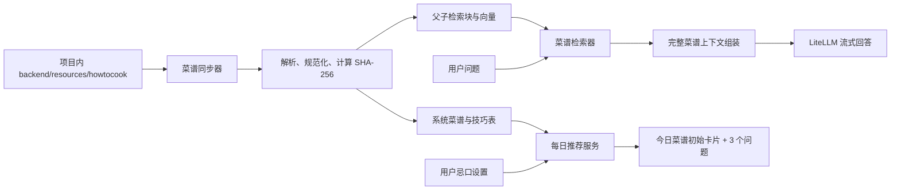

# “今日菜谱”改造技术方案

## 1. 文档目的

本文描述将现有“个人知识库 + 成长助手”改造为“系统菜谱知识库 + 今日菜谱”的完整实施方案，作为后续开发、数据库迁移、测试和发布验收的依据。

本次只调整知识问答产品形态，不改变项目既定技术栈：

- 前端：React 18、TypeScript、Webpack 5、Ant Design。
- 后端：Go、Gin、pgx/v5，唯一入口仍为 `backend/cmd/server/main.go`。
- 数据库：PostgreSQL 16。
- AI：仅通过 LiteLLM 的 OpenAI 兼容接口访问。
- Embedding：`iic/nlp_gte_sentence-embedding_chinese-small`（中文 GTE Small），通过
  ModelScope 下载并由 SentenceTransformer 编码，固定输出 512 维向量。
- Rerank：`BAAI/bge-reranker-v2-m3`，使用 SentenceTransformer Cross-Encoder 精排。
- 项目内的 HowToCook 受控副本是系统菜谱的内容源，运行时检索使用已同步到 PostgreSQL 的索引，不在每次请求时直接扫描文件。

AI 是服务端部署的必备能力，不提供“未配置 AI 也可按正常状态运行”的产品模式。生成模型、
Embedding 或 Reranker 未配置、未加载、超时或不可用时，相关接口必须返回稳定的服务端错误；
禁止向用户伪装成“没有找到内容”、空答案或正常降级结果。

## 2. 目标、范围与产品规则

### 2.1 目标

1. 删除用户可见的“知识库”入口和知识文件导入、集合管理、预览、下载、删除、重新索引能力。
2. 将 `E:\Codebase\HowToCook` 中需要的菜谱和烹饪技巧目录复制到本项目的
   `backend/resources/howtocook`，再由该项目内副本构建只读、全局共享的系统知识库。
3. 将“成长助手”页面和导航名称改为“今日菜谱”。
4. 用户可以自由提问菜品做法、原料、用量、步骤、技巧、替代方案等问题；答案必须以系统菜谱语料为依据，并尽可能返回完整做法。
5. 用户每天首次进入“今日菜谱”时，中心区域展示一个按“用户 + 本地日期 + 语料版本”稳定选出的随机菜品。
6. 推荐菜品下方展示 3 个可点击的假设问题，点击后直接发起问答。
7. 设置页新增跨设备保存的“忌口”设置；每日推荐必须排除命中忌口的菜品。

### 2.2 明确的产品规则

- “每日随机”不是每次刷新都变化：同一用户在同一自然日、相同语料版本和相同忌口设置下得到同一菜品。
- 日期按用户时区计算。第一版未提供独立时区设置时，使用前端传入的 IANA 时区（如 `Asia/Shanghai`），服务端校验后使用；缺失或非法时回退到服务端配置的默认时区。
- 忌口匹配采用“结构化标签 + 原料标准化文本”的确定性过滤，不让大模型决定是否命中忌口。
- 如果过滤后没有可推荐菜品，页面展示明确空状态，不能绕过忌口随机一个菜品。
- 一般问答不因忌口而限制检索范围：用户仍可主动询问任何菜品。忌口只影响每日推荐，回答中若命中忌口可显示提醒。
- 无可靠来源时继续返回稳定错误 `KNOWLEDGE_NO_EVIDENCE`，不得让模型凭常识编造菜谱。
- 菜谱来源对所有租户只读；用户不能新增、修改或删除系统菜谱。

### 2.3 非目标

- 不做菜谱编辑后台、用户自建菜谱、营养或过敏医学诊断。
- 不在请求链路或应用启动时访问、拉取 HowToCook 外部仓库。
- 后端运行时不读取 `E:\Codebase\HowToCook` 或任何宿主机系统路径；该路径只在开发者执行
  “更新项目内菜谱副本”的维护脚本时作为显式输入。
- 不将 HowToCook 的 `.git`、GitHub 配置、根 README 或构建文件纳入知识库。

## 3. 现状与差距

### 3.1 当前前端

- `frontend/src/App.tsx`
  - 导航含 `/knowledge`“知识库”和 `/assistant`“成长助手”。
  - 分别懒加载 `KnowledgePage` 与 `GrowthAssistantPage`。
- `frontend/src/features/knowledge/KnowledgePage.tsx`
  - 提供集合、上传、状态筛选、预览、下载、删除和重新索引。
- `frontend/src/features/assistant/GrowthAssistantPage.tsx`
  - 可以在“知识库”和“笔记本”来源之间切换。
  - 空会话只显示通用空状态。
  - 引用知识文件时跳转 `/knowledge?document_id=...`。
- `frontend/src/features/settings/SettingsPage.tsx`
  - 只有保存在当前浏览器的主题设置，没有服务端用户偏好。
- `frontend/src/api/knowledge.ts`
  - 同时混合个人知识库管理、会话和问答类型/API。

### 3.2 当前后端与数据

- `backend/internal/server/server.go` 暴露个人知识集合和文档 CRUD、上传、下载、预览、重新索引及问答接口。
- `backend/internal/server/knowledge.go`、`knowledge_worker.go` 处理用户上传和异步索引。
- `backend/internal/server/knowledge_chat.go` 支持 `knowledge`、`growth`、`all` 三种来源范围。
- `backend/internal/store/knowledge*.go` 和 `backend/db/schema.sql` 中的知识表均以租户个人知识资源为核心。
- 当前会话表的 `source_scope` 仍允许 `knowledge`、`growth`、`all`。
- 迁移 `000009_knowledge_markdown` 等存在未提交改动，实施时必须以实际合并后的最新迁移编号顺延，不能修改已经应用的迁移。

### 3.3 HowToCook 内容源

当前外部源目录包含：

- `dishes/**/*.md`：369 份菜谱 Markdown，是推荐候选和菜谱问答的主要来源。
- `tips/**/*.md`：18 份烹饪技巧 Markdown，只参与问答检索，不作为“今日菜品”候选。
- 部分菜谱同目录含 JPG/JPEG/PNG 图片，Markdown 使用相对路径引用。
- 常见章节包括简介、难度、卡路里、必备原料和工具、计算、操作、附加内容。
- 内容许可为 Unlicense。发布包仍应保留来源说明和许可证副本。

复制到本项目的目录结构固定为：

```text
backend/resources/howtocook/
├── dishes/                 # 菜谱 Markdown 及其正文引用的本地图片
├── tips/                   # 烹饪技巧 Markdown 及其正文引用的本地图片
├── LICENSE                 # HowToCook 原始许可证
└── SOURCE.json             # 上游地址、commit、复制时间和文件清单摘要
```

更新脚本只复制 `dishes`、`tips` 和 `LICENSE`，不复制 `.git`、`.github`、`node_modules`、
根 README、`package.json` 等无关内容。菜谱目录中的 JPG、JPEG、PNG、WebP 等 Markdown
本地引用资源随对应目录复制，避免正文出现失效相对链接。同步器只读取项目内
`dishes/**/*.md` 和 `tips/**/*.md`，并拒绝目录穿越及指向语料根目录外的符号链接。

## 4. 总体架构



核心决策如下：

1. 新增独立的“系统菜谱语料”表，不伪造某个租户，也不复制 369 份菜谱到每个租户。
2. 系统语料表不受租户 RLS 选择影响，但业务代码只暴露只读查询；用户设置、会话、消息和引用仍按 Principal/RLS 隔离。
3. 同步是显式的部署/运维动作；后端启动可检查语料是否可用，但不在普通应用启动中执行临时 DDL。
4. 检索先定位菜谱，再补全整篇菜谱或相关连续章节，避免只用零散块回答而遗漏完整步骤。
5. 每日推荐由服务端计算，前端只负责展示，防止不同设备产生不同结果或绕过忌口。

## 5. 数据库设计

新增版本化迁移，建议名称为：

- `backend/internal/migrations/sql/000010_recipe_corpus.up.sql`
- `backend/internal/migrations/sql/000010_recipe_corpus.down.sql`

如果实施时 `000010` 已被占用，使用下一个可用编号。同步更新 `backend/db/schema.sql` 作为新实例基线。

### 5.1 `recipe_documents`

全局只读菜谱/技巧元数据与规范化全文：

| 字段 | 类型 | 说明 |
| --- | --- | --- |
| `id` | `bigint identity` | 主键 |
| `source_path` | `text unique` | 相对 `backend/resources/howtocook` 的 `/` 分隔路径 |
| `kind` | `varchar(16)` | `dish` 或 `tip` |
| `category` | `varchar(64)` | `dishes` 下一级目录，如 `soup` |
| `title` | `varchar(255)` | 从一级标题提取，回退到文件名 |
| `summary` | `text` | 标题后的简介段落 |
| `ingredients` | `text[]` | “必备原料和工具”中规范化后的条目 |
| `dietary_terms` | `text[]` | 用于忌口过滤的规范化词项 |
| `difficulty` | `varchar(16) null` | 原文难度 |
| `calories_text` | `varchar(64) null` | 保留原文，避免误当精确营养数据 |
| `content_markdown` | `text` | 清理后的完整 Markdown |
| `content_sha256` | `char(64)` | 幂等同步依据 |
| `source_revision` | `varchar(64)` | 从 `SOURCE.json` 读取的上游 commit；缺失时为项目内目录清单摘要 |
| `is_active` | `boolean` | 源文件移除时置为 false |
| `created_at/updated_at` | `timestamptz` | 审计时间 |

索引：

- `UNIQUE(source_path)`。
- `btree(kind, is_active, category)`。
- `GIN(ingredients)`、`GIN(dietary_terms)`。
- 标题与正文中文全文检索索引；沿用项目现有 PostgreSQL 中文检索配置。

### 5.2 `recipe_parent_chunks` 与 `recipe_child_chunks`

复用 `backend/internal/knowledge/chunker.go` 的父子分块模型，但使用独立系统表，避免把全局语料塞入租户知识表。

必须保存：

- `document_id`、块序号、标题路径、Markdown 文本、token 数。
- 子块 `search_vector`、`vector(512)` embedding、embedding model、index version。
- 唯一约束 `(document_id, index_version, chunk_index)`。

系统表不包含 `tenant_id`。应用数据库角色仅授予 `SELECT`；同步命令通过迁移/管理连接写入。若同步必须复用后端二进制，则显式要求 `MIGRATION_DATABASE_URL`，不得使用低权限 `DATABASE_URL` 写系统语料。

### 5.3 向量维度迁移

现有个人知识块使用 1024 维向量，不能把新模型产生的 512 维结果直接写入原列。recipe corpus
迁移必须把新 `recipe_child_chunks.embedding` 定义为 `vector(512)`。

如果本次同时把整个项目的个人知识检索也切换到中文 GTE Small，则在同一个版本化迁移中：

1. 删除依赖旧 1024 维列的 pgvector 索引。
2. 将现有 `knowledge_child_chunks.embedding` 和 `embedding_model` 置空，不能截断或转换旧向量。
3. 将 embedding 列重建为 `vector(512)`。
4. 重建适用于 512 维的向量索引。
5. 为仍处于 active/ready 的历史文档创建新 index version 和重新索引任务。
6. 在重新索引完成前将文档标记为 `indexing`，菜谱问答返回索引尚未就绪的服务端错误；
   不能仅用 FTS 冒充完整的正常检索，也不能将旧文档永久标成 ready 却没有可用向量。

新模型标识必须完整保存为 `iic/nlp_gte_sentence-embedding_chinese-small`。服务启动时调用 embedding
健康检查并验证响应维度恰好为 512；维度不符返回 `EMBEDDING_DIMENSION_MISMATCH`，禁止写库。

### 5.4 `recipe_sync_runs`

记录每次同步，支持可观测性和故障恢复：

- `id`、`source_revision`、`status`（`running/success/failed`）。
- 扫描、创建、更新、停用、失败文件数量。
- 稳定失败码和脱敏错误摘要。
- `started_at`、`finished_at`。

同步使用 advisory lock，保证多实例或重复命令不会并发覆盖。

### 5.5 用户忌口

建议新增 `user_preferences`，而不是把业务偏好塞入 `users`：

| 字段 | 类型 | 说明 |
| --- | --- | --- |
| `tenant_id` | `uuid` | 显式租户条件，参与 RLS |
| `user_id` | `uuid` | 与当前账号一一对应 |
| `dietary_restrictions` | `text[]` | 规范化后的忌口关键词 |
| `timezone` | `varchar(64)` | IANA 时区，可先由接口自动保存 |
| `version` | `integer` | 乐观冲突保护 |
| `created_at/updated_at` | `timestamptz` | 时间戳 |

约束：

- 主键或唯一键 `(tenant_id, user_id)`。
- RLS policy 同时校验 transaction-local tenant 与 user。
- 单项去空格后 1–32 个字符，最多 50 项，总 UTF-8 字节数设上限。
- 服务端统一做 Unicode NFKC、去首尾空白、英文小写和去重；保留中文原词。

前端可提供常用项（花生、坚果、海鲜、虾、蟹、牛肉、羊肉、猪肉、鸡蛋、乳制品、酒精、辣椒、香菜）作为快捷标签，同时允许自定义输入。

### 5.6 会话与引用

建议把新会话来源收敛为 `recipe`：

- `conversations.source_scope` 新增 `recipe`，新建“今日菜谱”会话固定写入该值。
- 旧 `knowledge/growth/all` 会话只保留历史读取能力，前端“今日菜谱”列表默认只查询 `recipe`。
- 新引用类型使用 `recipe_document`，引用 `recipe_documents.id`。
- 新增 `recipe_message_sources`，保存消息、菜谱、块、索引版本、排序及最小引用片段。

不建议直接把 `knowledge_message_sources.document_id` 外键改指向新表，否则会混淆个人知识文档与系统菜谱的生命周期。

### 5.7 原个人知识数据的处理

第一阶段采用“停止入口、保留数据”的可回滚策略：

- 删除前端入口并停止注册个人知识 CRUD 路由。
- 保留现有表和磁盘文件，不在本次迁移中物理删除用户数据。
- 停止个人知识索引 worker 和新增写入。
- 备份/恢复暂时仍能识别旧格式，恢复后旧知识数据不可见但不丢失。

经过一个发布周期且确认不需要回滚后，再单独设计清理迁移和数据导出通知。不能在本功能迁移中直接 `DROP` 或删除用户上传文件。

## 6. HowToCook 同步与解析

### 6.1 项目内目录和部署

菜谱语料固定放在：

```text
backend/resources/howtocook
```

后端配置只需在 `backend/internal/config/config.go`、`.env.example` 增加与业务行为相关的：

```text
RECIPE_DEFAULT_TIMEZONE=Asia/Shanghai
RECIPE_MAX_DOCUMENT_CHARS=200000
RECIPE_SYNC_ON_START=false
```

约束：

- 不提供 `RECIPE_SOURCE_DIR`，避免运行环境再次依赖任意系统路径。
- 本地运行时以 `backend` 为工作目录，读取 `resources/howtocook`。
- 后端 Dockerfile 必须通过 `COPY backend/resources/howtocook /app/resources/howtocook`
  （以实际 build context 调整源路径）把语料直接打进后端镜像，不增加宿主机 volume。
- 容器中的工作目录固定为 `/app`，应用读取 `/app/resources/howtocook`。这是镜像内部项目资源，
  不是宿主机系统路径。
- 构建产物必须包含该目录；启动时若目录或 `SOURCE.json` 缺失，记录
  `RECIPE_CORPUS_MISSING`，但不影响 `/healthz`。
- HowToCook 上游 commit 记录在 `SOURCE.json`、镜像标签和发布说明中。
- `backend/resources/howtocook/LICENSE` 是随副本发布的原始许可证；
  可另外在 `docs/licenses/HowToCook-LICENSE` 保留一份面向文档的副本。

### 6.2 更新项目内菜谱副本

新增维护脚本：

```text
backend/scripts/update_recipe_corpus.ps1
```

示例调用：

```powershell
.\backend\scripts\update_recipe_corpus.ps1 -SourcePath 'E:\Codebase\HowToCook'
```

该脚本是唯一使用外部源路径的环节，而且只在开发者明确更新语料时运行，不由后端服务调用。
脚本流程：

1. 校验 `SourcePath` 下存在 `dishes`、`tips` 和 `LICENSE`。
2. 将源文件复制到一个位于仓库 `tmp` 下的临时目录。
3. 只纳入 `dishes`、`tips`、`LICENSE` 白名单；排除 `.git`、隐藏工具目录、包依赖和未知顶层文件。
4. 检查 Markdown 的相对本地图片引用，引用文件存在时一并复制；缺失时终止更新并报告相对路径。
5. 生成 `SOURCE.json`，至少包含 `upstream_url`、`upstream_commit`、`copied_at`、
   Markdown 数量、资源数量和全目录清单 SHA-256。
6. 在完整校验通过后，以可恢复的目录替换方式更新
   `backend/resources/howtocook`；不得边扫描边覆盖正式副本。
7. 运行解析器校验和同步 dry-run，失败时保留原项目内副本。

项目必须提交这份语料副本，确保其他开发者、CI 和生产构建使用完全相同的内容。更新语料应作为
独立提交或至少在变更说明中列出上游 commit 和文件数量，便于代码审查发现大规模内容变化。

### 6.3 新增同步代码

建议新增：

- `backend/internal/recipe/document.go`：领域结构。
- `backend/internal/recipe/parser.go`：Markdown 标题、章节、原料和元数据解析。
- `backend/internal/recipe/normalizer.go`：原料/忌口词标准化及别名展开。
- `backend/internal/recipe/sync.go`：安全扫描、摘要、增量同步编排。
- `backend/internal/recipe/corpus.go`：统一解析项目资源路径并读取 `SOURCE.json`。
- `backend/internal/store/recipes.go`：系统菜谱 SQL。
- `backend/internal/store/recipe_sync.go`：同步 claim/run SQL。
- `backend/cmd/server/main.go`：增加显式子命令或启动参数 `recipes sync`；仍保持此文件为唯一后端入口。

建议命令：

```powershell
Set-Location backend
go run ./cmd/server recipes sync
```

同步流程：

1. 从固定项目资源位置 `resources/howtocook` 读取 `SOURCE.json` 并确认目录完整。
2. 递归扫描白名单 `dishes/**/*.md`、`tips/**/*.md`。
3. 拒绝超限文件、非法 UTF-8、语料根目录外符号链接和异常相对路径。
4. 读取一级标题；`dishes` 文件没有有效标题或没有“操作”章节时记录失败，不进入推荐池。
5. 解析原料、难度、卡路里、简介；保留完整 Markdown。
6. 处理相对图片和链接：问答上下文中移除图片语法或改为已知的只读资源标识，绝不把本机绝对路径发给前端或 AI。
7. 以 `source_path + content_sha256` 幂等 upsert。
8. 仅对新增或变化文件重新分块和 embedding。
9. 本轮未扫描到的旧文档置 `is_active=false`，引用仍可显示“来源已下线”。
10. 全部文件处理完成后提交新 `source_revision` 并把 run 标记 success。单文件失败不应用半成品索引；必须记录稳定错误码。

### 6.4 忌口词项生成

每份菜谱的 `dietary_terms` 由以下信息确定性生成：

- 标题。
- 原料清单。
- 正文中明确出现的核心原料。
- 维护在代码/配置中的别名表，例如：
  - `虾仁/明虾/九节虾 -> 虾, 海鲜`
  - `螃蟹/蟹黄 -> 蟹, 海鲜`
  - `花生米/花生酱 -> 花生, 坚果`
  - `牛奶/黄油/奶油/芝士 -> 乳制品`
  - `料酒/米酒/白酒/啤酒 -> 酒精`

不能只用文件名过滤，例如“黄油煎虾”必须同时命中“虾”“海鲜”“乳制品”。别名表需单元测试覆盖，且在页面注明忌口过滤是辅助功能，严重过敏用户仍需核对原料。

### 6.5 Embedding 与 Rerank 本地服务

#### Embedding

新增 `local-embedding` 服务，职责保持单一：接收 OpenAI 兼容 embeddings 请求，用
SentenceTransformer 编码并返回 512 维向量。

固定配置：

```text
EMBEDDING_MODEL=iic/nlp_gte_sentence-embedding_chinese-small
EMBEDDING_DIMENSIONS=512
```

实现要求：

1. 镜像构建阶段使用 ModelScope SDK 的 `snapshot_download` 下载固定 revision，不能在每次请求
   或容器启动时联网下载。
2. 运行时使用本地模型目录初始化
   `sentence_transformers.SentenceTransformer(local_model_path)`。
3. 使用 `model.encode(texts, normalize_embeddings=true)` 批量编码，返回 float 数组。
4. 启动时用固定中文样例做一次预热，并断言 `get_sentence_embedding_dimension() == 512`。
5. 设置批量文本数、单文本字符数、总字符数和请求超时上限，避免内存耗尽。
6. 容器以非 root 用户运行，模型目录只读；运行时配置离线模式。
7. 暴露 `/healthz` 以及 OpenAI 兼容 `/v1/embeddings`，响应中的 model 使用完整 ModelScope ID。

为遵守项目 AI 网关边界，Backend 仍请求 LiteLLM 的逻辑模型 `cortex-embedding`；LiteLLM
把该逻辑模型转发到容器内 `local-embedding` 的 OpenAI 兼容接口。Backend 不直接调用模型服务，
也不直接访问 ModelScope。

后端默认配置改为：

```text
RAG_EMBEDDING_BASE_URL=http://llm-gateway:4000/v1
RAG_EMBEDDING_MODEL=cortex-embedding
RAG_EMBEDDING_DIMENSIONS=512
RAG_EMBEDDING_SEND_DIMENSIONS=false
```

LiteLLM 配置中 `cortex-embedding` 的实际本地模型映射到
`iic/nlp_gte_sentence-embedding_chinese-small`。虚拟密钥继续只允许所需的逻辑模型。

#### Rerank

将现有 Qwen3 专用 reranker 实现替换为通用 Cross-Encoder：

```text
RERANK_MODEL=BAAI/bge-reranker-v2-m3
```

实现要求：

1. 镜像构建阶段通过 ModelScope 下载固定 revision。
2. 运行时使用
   `sentence_transformers.CrossEncoder(local_model_path)` 加载模型。
3. 对 `(query, document)` pair 调用 `predict`，按分数降序返回
   `index/relevance_score`，保持当前 `/rerank` HTTP 契约，减少 Go 客户端改动。
4. 不沿用 Qwen3 reranker 的 yes/no token 打分、prompt 模板或自定义 logits 逻辑。
5. 对最大候选数、query 长度、document 长度、batch size 和超时设硬上限。
6. 启动预热必须验证相同文本分数高于明显无关文本；健康检查不返回模型内部路径。
7. Rerank 是本地确定性检索组件，不处理租户身份数据；Backend 只发送候选最小文本，
   不发送邮箱、姓名或完整会话。

后端默认配置改为：

```text
RAG_RERANK_BASE_URL=http://reranker-service:8080
RAG_RERANK_MODEL=BAAI/bge-reranker-v2-m3
```

Reranker 是必备检索组件。不可用时必须返回 `RERANK_UNAVAILABLE`，不得跳过精排后继续生成，
也不得从其他供应商下载或切换未批准模型。

## 7. 后端 API 设计

所有业务接口继续使用 `/api/v1`，错误响应保持 `code/message/details` 契约。

### 7.1 今日推荐

新增：

```http
GET /api/v1/recipes/today?timezone=Asia%2FShanghai
Authorization: Token ...
```

响应：

```json
{
  "local_date": "2026-07-30",
  "timezone": "Asia/Shanghai",
  "corpus_revision": "abc123...",
  "recipe": {
    "id": 42,
    "title": "黄瓜皮蛋汤",
    "category": "soup",
    "summary": "一道快手家常汤品……",
    "difficulty": "★★",
    "calories_text": "311 大卡",
    "ingredients": ["黄瓜", "皮蛋", "大蒜", "小葱"],
    "dietary_warnings": []
  },
  "suggested_questions": [
    "黄瓜皮蛋汤需要哪些食材和用量？",
    "请完整说明黄瓜皮蛋汤的制作步骤。",
    "做黄瓜皮蛋汤时有哪些容易忽略的技巧？"
  ]
}
```

每日选择算法：

1. 查询所有 `kind='dish' AND is_active=true` 且未命中当前用户忌口的菜谱 ID。
2. 构造种子文本：`user_id + "\n" + local_date + "\n" + corpus_revision + "\n" + restrictions_hash`。
3. 对每个候选计算 `SHA-256(seed + "\n" + recipe_id)`。
4. 选择摘要字节序最小的菜谱。

这样无需保存“首次访问”记录，也能在多实例、重启和多设备之间稳定。不能使用 Go `math/rand`，因为实现或候选排序变化会导致不可审计结果。

错误：

- `RECIPE_CORPUS_UNAVAILABLE`：未成功同步语料，503。
- `RECIPE_NO_ELIGIBLE_DISH`：忌口过滤后无候选，404，`details` 可返回候选总数和被过滤数量，但不含内部路径。
- `INVALID_TIMEZONE`：时区非法，400；也可选择回退默认时区，但契约必须固定并测试。

### 7.2 用户偏好

新增：

```http
GET /api/v1/settings/preferences
PUT /api/v1/settings/preferences
```

PUT 请求：

```json
{
  "dietary_restrictions": ["花生", "海鲜", "香菜"],
  "timezone": "Asia/Shanghai",
  "version": 1
}
```

响应返回规范化结果和新版本。版本冲突返回 `PREFERENCES_VERSION_CONFLICT`（409）。Store 方法必须通过 `Store.WithTx` 设置 RLS 上下文并保留显式 `tenant_id/user_id` 条件。

### 7.3 菜谱问答

优先新增语义清晰的端点：

```http
POST /api/v1/recipes/chat
GET /api/v1/recipes/messages/{message_id}/sources
```

请求不再接受 `source_scope`、`collection_ids` 或 `document_ids`：

```json
{
  "question": "黄油煎虾怎么做？没有米酒可以替代吗？",
  "request_id": "uuid",
  "conversation_id": 12,
  "featured_recipe_id": 42
}
```

`featured_recipe_id` 只作为检索提示，服务端必须验证它是有效系统菜谱；不能强制答案只引用该菜谱。用户点击推荐问题时带上该字段，自由提问时可省略。

SSE 继续使用 `retrieval -> delta -> sources -> done`，来源改为：

```json
{
  "source_type": "recipe_document",
  "source_id": 42,
  "title": "黄油煎虾",
  "kind": "dish",
  "heading": "操作",
  "snippet": "1. 鲜虾摘除头部……",
  "source_deleted": false
}
```

为了平滑迁移，可让旧 `/api/v1/knowledge/chat` 在一个版本内仅对 `source_scope=recipe` 转发到新流程，但新前端必须使用 `/api/v1/recipes/chat`。个人知识上传相关路由不再注册。

### 7.4 检索和完整答案策略

新增 `RecipeRetriever`，不要把菜谱规则堆入 HTTP handler：

1. 标题精确/别名匹配优先，例如“宫保鸡丁怎么做”直接提升对应菜谱。
2. 使用中文 GTE Small 生成的 512 维 embedding + PostgreSQL FTS 混合召回子块。
3. 使用 `BAAI/bge-reranker-v2-m3` Cross-Encoder 精排；服务不可用时终止请求并返回稳定服务端错误。
4. 对入选菜谱加载完整 `content_markdown`；超出统一 token 预算时，至少保留原料、计算、操作和与问题相关的附加内容。
5. 通用技巧问题可同时引入 `tips` 文档。
6. 多菜比较问题允许选择多个菜谱，但每个来源都必须经过当前有效语料校验。
7. 将实际送给模型的来源保存到 `recipe_message_sources`。

提示词应明确：

- 只能依据提供的菜谱和技巧回答。
- 用户询问“怎么做”时应完整覆盖原料/用量、准备和顺序步骤，不得只输出检索片段摘要。
- 原文没有替代方案时要明确“来源未说明”，可在不冒充来源事实的前提下拒答或提示用户换一种问法。
- 不宣称医疗、过敏或精确营养结论。
- 引用编号必须经过现有的来源校验流程。

AI 由服务端统一部署且为必选依赖：

- 配置缺失属于部署错误，服务不得以“AI 可选”模式启动为 ready。
- 生成模型不可用时返回 `AI_GENERATION_UNAVAILABLE`（503）。
- Embedding 服务不可用或返回非 512 维向量时返回 `EMBEDDING_UNAVAILABLE` 或
  `EMBEDDING_DIMENSION_MISMATCH`（503）。
- Reranker 不可用时返回 `RERANK_UNAVAILABLE`（503）。
- 菜谱索引尚未完成时返回 `RECIPE_INDEX_NOT_READY`（503）。
- 上述错误由后端转换为稳定 `code/message/request_id`，不得把 LiteLLM、ModelScope、模型容器
  地址、异常堆栈或上游响应正文传给前端。
- 不再使用 `AI_NOT_CONFIGURED` 表示一种可接受的运行模式；如果为兼容旧客户端保留该 code，
  其 HTTP 状态仍必须是 503，监控和 readiness 必须判定部署异常。

## 8. 前端改造

### 8.1 路由与导航

修改 `frontend/src/App.tsx`：

- 删除 `KnowledgePage` 的懒加载、`BookOutlined` 和 `/knowledge` 菜单项。
- 将 `/assistant` 菜单名称由“成长助手”改为“今日菜谱”，图标可继续使用 `BulbOutlined` 或换成合适的餐饮图标。
- 建议新规范路径为 `/recipes`；为旧书签保留 `<Navigate from="/assistant" to="/recipes" replace />`。
- `/knowledge` 不再呈现导入页，重定向 `/recipes`。

### 8.2 今日菜谱页面

建议将：

- `frontend/src/features/assistant/GrowthAssistantPage.tsx`
- `frontend/src/features/assistant/GrowthAssistantPage.css`
- `frontend/src/features/assistant/GrowthAssistantPage.test.tsx`

重命名为：

- `frontend/src/features/recipes/TodayRecipePage.tsx`
- `frontend/src/features/recipes/TodayRecipePage.css`
- `frontend/src/features/recipes/TodayRecipePage.test.tsx`

页面行为：

- 删除来源范围 Select，所有会话固定为菜谱来源。
- 会话侧栏标题改为“今日菜谱”，只列 `source_scope=recipe` 会话。
- 空会话加载 `GET /api/v1/recipes/today`。
- 成功时在中心卡片展示菜名、简介、难度、卡路里原文和主要食材；不要在首屏直接展示整篇菜谱。
- 卡片下展示 3 个问题按钮/标签。点击后将问题写入消息区并立即调用统一 `send(question, featuredRecipeId)`，不依赖异步 `setInput` 后再读取 state。
- 用户一旦发送问题，推荐卡片转为普通会话消息上方的小型上下文卡，或隐藏但保留“返回今日推荐”操作。
- 输入占位改为“询问菜品做法、食材用量或烹饪技巧，Shift+Enter 换行”。
- 引用卡片不再跳转已删除的 `/knowledge`。第一版可用只读 Drawer 展示来源摘要；若增加详情页则跳转 `/recipes/{id}`，该页不得提供编辑/下载本机源文件功能。
- `RECIPE_NO_ELIGIBLE_DISH` 时展示“当前忌口设置下没有可推荐菜品”，并提供前往 `/settings` 的按钮。
- `RECIPE_CORPUS_UNAVAILABLE`、`AI_GENERATION_UNAVAILABLE`、`EMBEDDING_UNAVAILABLE` 和
  `RERANK_UNAVAILABLE` 分别展示“服务端暂时不可用”错误及 `request_id`，避免统一误报为
  “没有找到内容”。前端不得自行生成兜底菜谱答案。

### 8.3 API 模块

拆分 `frontend/src/api/knowledge.ts`：

- 新增 `frontend/src/api/recipes.ts`
  - `getTodayRecipe`
  - `streamRecipeChat`（可继续由页面读取 SSE，建议抽成可测试函数）
  - 菜谱、推荐问题和引用类型。
- 新增 `frontend/src/api/preferences.ts`
  - `getPreferences`
  - `updatePreferences`
- 会话 API 移到 `frontend/src/api/conversations.ts`。
- 移除前端可达代码中的集合和文档上传 CRUD 类型及函数。

### 8.4 设置页

修改：

- `frontend/src/features/settings/SettingsPage.tsx`
- `frontend/src/features/settings/SettingsPage.css`
- 新增 `frontend/src/features/settings/SettingsPage.test.tsx`（若尚无）。

新增“饮食偏好”卡片：

- 使用 Ant Design `Select mode="tags"` 或自定义 TagEditor。
- 显示常用忌口快捷项并允许自定义。
- 说明文字：“忌口仅用于过滤每日推荐；严重过敏请始终核对完整原料。”
- 从服务端读取，保存时提交 `version`。
- 保存成功后使 React Query 的 `['today-recipe']` 缓存失效，当前页面下次进入会按新设置重新选择。
- 主题仍可仅保存在浏览器，但页面总说明要改为同时包含“外观和饮食偏好”，不能再声称全部设置仅保存在当前浏览器。

### 8.5 删除的前端文件

功能完成并确认无引用后删除：

- `frontend/src/features/knowledge/KnowledgePage.tsx`
- `frontend/src/features/knowledge/KnowledgePage.css`
- `frontend/src/features/knowledge/KnowledgePage.test.tsx`

删除前用 `rg` 确认无路由、测试、样式和 API 引用。这里的“删除”仅指前端导入页面代码，不代表立即清理数据库中的旧用户知识数据。

## 9. 后端文件级改动清单

### 9.1 修改

- `backend/cmd/server/main.go`
  - 接入 `recipes sync` 显式命令和依赖装配；保持唯一入口。
- `backend/internal/config/config.go`
  - 增加默认时区、解析限制和同步开关配置；将 Embedding 默认维度改为 512，将 Rerank
    默认模型改为 `BAAI/bge-reranker-v2-m3`；不增加外部菜谱系统路径配置。
- `backend/internal/server/server.go`
  - 注册 `/api/v1/recipes/today`、`/recipes/chat`、菜谱来源、偏好接口。
  - 停止注册知识集合和文档 CRUD/上传接口。
- `backend/internal/server/knowledge_chat.go`
  - 抽取可复用 SSE/会话逻辑；或由新 `recipe_chat.go` 替代，不再混合笔记来源。
- `backend/internal/server/knowledge_sse.go`
  - 泛化为菜谱 SSE，稳定错误中不泄漏源路径或上游正文。
- `backend/internal/store/legacy.go`
  - 会话 source scope 支持 `recipe`，新接口拒绝旧 scope。
- `backend/internal/store/knowledge_search.go`
  - 保留历史兼容代码；新检索放独立文件，避免继续扩大个人知识语义。
- `backend/db/schema.sql`
  - 同步新增表、约束、索引、RLS、角色授权和迁移基线。
- `.env.example`
  - 文档化与时区、解析限制和同步行为有关的 `RECIPE_*` 配置；将
    `RAG_EMBEDDING_DIMENSIONS` 改为 512、`RAG_RERANK_MODEL` 改为
    `BAAI/bge-reranker-v2-m3`，不提供外部源路径。
- `docker-compose.yml`
  - 不挂载 HowToCook 宿主目录；确认后端镜像已包含项目内语料，`db`、`llm-gateway`
    继续不暴露宿主端口。
  - 增加 `local-embedding` 服务和健康检查，让 LiteLLM 依赖其 healthy；更新 reranker
    模型、资源限制、健康检查和离线运行配置。
- `litellm-config.yaml`
  - 将逻辑模型 `cortex-embedding` 指向 `local-embedding` 的 OpenAI 兼容接口。
- `local-reranker/app.py`
  - 删除 Qwen3 yes/no token 实现，改为 SentenceTransformer `CrossEncoder`。
- `local-reranker/Dockerfile`
  - 改用 ModelScope 下载固定 revision 的 `BAAI/bge-reranker-v2-m3`。
- `local-reranker/compatibility_check.py`
  - 改为 Cross-Encoder 兼容性及相关性顺序检查。
- `local-reranker/test_app.py`
  - 更新模型 ID、排序和限制测试。
- 后端 Dockerfile
  - 将 `backend/resources/howtocook` 复制到镜像内 `/app/resources/howtocook`。
- `README.md`
  - 产品导航、启动步骤、菜谱同步、配置和许可说明。
- `docs/api.md`
  - 删除用户知识上传 API 作为当前能力的描述，增加菜谱与偏好 API。
- `docs/page/ASSISTANT_PAGE_ARCHITECTURE.md`
  - 改写为今日菜谱页面架构，或新增 `TODAY_RECIPE_PAGE_ARCHITECTURE.md` 后让旧文档标记已替代。
- `docs/page/KNOWLEDGE_PAGE_ARCHITECTURE.md`
  - 标记个人知识库页面已移除，说明历史数据保留策略。
- `docs/IMPLEMENTATION_GAPS.md`
  - 更新差距状态和后续物理清理项。

### 9.2 新增

- `backend/internal/recipe/document.go`
- `backend/internal/recipe/parser.go`
- `backend/internal/recipe/parser_test.go`
- `backend/internal/recipe/normalizer.go`
- `backend/internal/recipe/normalizer_test.go`
- `backend/internal/recipe/sync.go`
- `backend/internal/recipe/sync_test.go`
- `backend/internal/recipe/corpus.go`
- `backend/internal/recipe/corpus_test.go`
- `local-embedding/app.py`
- `local-embedding/test_app.py`
- `local-embedding/compatibility_check.py`
- `local-embedding/requirements.txt`
- `local-embedding/Dockerfile`
- `backend/internal/store/recipes.go`
- `backend/internal/store/recipes_test.go`
- `backend/internal/store/recipe_sync.go`
- `backend/internal/server/recipe_chat.go`
- `backend/internal/server/recipe_chat_test.go`
- `backend/internal/server/recipes.go`
- `backend/internal/server/recipes_test.go`
- `backend/internal/server/preferences.go`
- `backend/internal/server/preferences_test.go`
- 下一可用编号的 recipe corpus migration up/down。
- `backend/scripts/recipe_sync_acceptance.ps1`
- `backend/scripts/update_recipe_corpus.ps1`
- `backend/resources/howtocook/dishes/**`
- `backend/resources/howtocook/tips/**`
- `backend/resources/howtocook/LICENSE`
- `backend/resources/howtocook/SOURCE.json`
- `docs/licenses/HowToCook-LICENSE`

### 9.3 停用后再删除

以下后端文件不能在第一步简单删除，因为研究功能当前仍可能把结果“保存到个人知识库”，备份也可能包含知识文档：

- `backend/internal/server/knowledge.go`
- `backend/internal/server/knowledge_worker.go`
- `backend/internal/store/knowledge.go`
- `backend/internal/store/knowledge_jobs.go`

实施时需同步处理 `backend/internal/server/research.go` 的“保存到个人知识库”：

- 若研究功能保留，必须把按钮和 API 改为“保存为笔记/研究草稿”，不能写入系统菜谱库。
- `frontend/src/features/research/ResearchPage.tsx`、`frontend/src/api/research.ts` 及对应测试、`docs/api.md` 一并调整。
- 在替代保存目标完成前，不应删除上述底层个人知识代码；可以停止对普通用户暴露知识管理路由。

## 10. 安全、隐私和运维要求

- 用户提交的 `tenant_id` 仍一律不可信；偏好与会话从 Principal 解析。
- 菜谱系统表全局共享，但不能通过 SQL/接口暴露服务器绝对路径、Git 凭据或工作树信息。
- 发送给 LiteLLM 的 metadata 只含后端生成的非直接身份标识、`request_type=recipe_chat`、环境和追踪 ID；不含邮箱、姓名、忌口列表或完整问题正文。
- 普通日志只记文档 ID、同步 revision、计数和稳定错误码，不记录完整菜谱、问题、回答或本机路径。
- 更新脚本和同步器不得跟随语料根目录外链接；Markdown HTML 继续禁用或清理。
- AI 是部署必选项。普通非 AI 数据接口不得伪造 AI 成功结果；其是否继续提供由网关/编排层的
  故障隔离决定，但整体服务必须明确报告非 ready。
- `/healthz` 仍只反映后端进程存活，避免依赖故障导致容器被无休止重启。
- `/readyz` 必须验证数据库、LiteLLM 生成路由、512 维 Embedding 服务、Reranker 服务以及
  至少一个成功的菜谱索引 revision。任何必备项失败时返回 503 和脱敏的组件状态。
- 增加仅供运维使用的依赖状态检查或在 `/readyz` 中返回稳定组件名；不能返回内部 URL、
  密钥、模型缓存路径或上游响应正文。
- 新增指标：
  - `cortex_recipe_documents_active`
  - `cortex_recipe_sync_failures_total`
  - `cortex_recipe_recommendation_requests_total`
  - `cortex_recipe_recommendation_empty_total`
  - `cortex_recipe_retrieval_requests_total`
- 完整备份不复制全局系统菜谱；只备份用户偏好、菜谱会话和引用标识。恢复后若语料 revision 不同，旧引用显示“来源版本已变化”，不得错误关联同 ID 的不同内容。

## 11. 测试方案

### 11.1 后端单元测试

- Markdown 解析：
  - 标准菜谱、嵌套目录、中文标题、图片、相对链接。
  - 缺标题、缺操作、非法 UTF-8、超长文件。
  - `tips` 不进入每日推荐候选。
- 忌口：
  - “虾”命中“九节虾”，“海鲜”命中虾/蟹。
  - “乳制品”命中黄油/牛奶。
  - 不做危险的任意子串误杀，例如短词边界测试。
  - NFKC、大小写、空白、重复项和数量上限。
- 同步：
  - 相同 SHA 不重复 embedding。
  - 文件更新产生新 index version。
  - 文件移除只停用，不破坏历史引用。
  - advisory lock 下仅一个同步 run。
  - 目录穿越和源外 symlink 被拒绝。
- Embedding：
  - ModelScope 固定 revision 能在镜像构建时下载，运行时断网仍可加载。
  - 中文单条和批量编码均严格返回 512 维。
  - 归一化后向量范数在允许误差内为 1。
  - 超长文本、超大批量和维度异常被拒绝。
  - 数据库不接受旧 1024 维向量；模型切换后旧文档进入重建索引流程。
- Rerank：
  - `BAAI/bge-reranker-v2-m3` 由 ModelScope 固定 revision 下载并离线加载。
  - 相关中文候选排在无关候选之前。
  - 返回索引与输入候选一一对应，分数按降序排列。
  - Cross-Encoder 服务不可用时后端返回 `RERANK_UNAVAILABLE`，且不调用生成模型。
- 推荐：
  - 同一用户/日期/revision/忌口结果稳定。
  - 不同日期有机会产生不同菜品。
  - 候选顺序变化不改变结果。
  - 命中忌口的菜永不返回。
  - 无候选返回 `RECIPE_NO_ELIGIBLE_DISH`。
  - 时区跨日边界正确。
- 检索：
  - 精确菜名优先。
  - “怎么做”上下文包含原料、计算和完整操作。
  - 无证据时不调用生成模型。
  - 引用只能是当前有效系统菜谱/技巧。
- RLS：
  - 用户 A 不能读写用户 B 的忌口或会话。
  - 系统菜谱可由两个租户只读查询，但均不能通过业务连接修改。

### 11.2 前端测试

- 导航不存在“知识库”和“成长助手”，存在“今日菜谱”。
- `/knowledge` 和 `/assistant` 正确重定向。
- 空会话显示今日菜品和 3 个问题。
- 点击问题只发送一次，并带 `featured_recipe_id`。
- 自由问题不受推荐问题限制。
- SSE 增量、停止生成、错误、来源卡片正确。
- 页面不再出现来源范围选择。
- 忌口加载、添加、自定义、删除、版本冲突和保存成功。
- 无符合忌口菜品时显示设置入口。
- 任一必备 AI 组件不可用时页面显示服务端返回的明确错误和请求 ID，不显示虚假的空来源回答，
  也不在浏览器侧降级生成答案。

### 11.3 集成与验收

新增 `backend/scripts/recipe_sync_acceptance.ps1`，至少验证：

1. 对提交在 `backend/resources/howtocook/SOURCE.json` 中的固定 HowToCook commit 扫描
   369 份 `dishes` 和 18 份 `tips`（数量随上游版本变化时使用清单断言，不硬编码到业务代码）。
2. 重复同步没有重复记录和重复索引。
3. 随机抽取菜谱的标题、原料、操作与源 Markdown 一致。
4. 设置“海鲜”后，多日种子采样均不推荐含虾/蟹/鱼等已定义海鲜词项的菜。
5. 点击“请完整说明制作步骤”得到含来源且覆盖全部操作序号的回答。
6. 两个租户的偏好、会话和引用隔离。
7. 在没有 `E:\Codebase\HowToCook` 且没有任何 HowToCook volume 的 CI/容器中，仍能完成构建、
   同步和今日推荐验收。
8. Embedding 响应维度严格为 512，数据库列、Go 配置、LiteLLM 路由和索引 worker 一致。
9. Rerank 响应来自 `BAAI/bge-reranker-v2-m3`，中文相关候选的验收排序正确。

提交前执行：

```powershell
Set-Location backend
gofmt -w <本次修改的 Go 文件>
go vet ./...
go test ./...
go build ./cmd/server

Set-Location ..\frontend
npm run format:check
npm test
npm run build

Set-Location ..
docker compose config --quiet
.\backend\scripts\non_ai_smoke.ps1
.\backend\scripts\ai_acceptance.ps1
.\backend\scripts\recipe_sync_acceptance.ps1
```

新空库还需复核表数量、RLS、角色授权、ready、注册和登录；原“18 张表”验收基线必须按新增表重新更新。

## 12. 分阶段实施顺序

### 阶段 A：系统语料基础设施

1. 增加迁移、系统菜谱表、偏好表和角色授权。
2. 将固定 HowToCook commit 的白名单内容复制并提交到 `backend/resources/howtocook`。
3. 新增中文 GTE Small 本地 Embedding 服务，把 pgvector 列及配置迁移到 512 维并重建索引。
4. 将 Reranker 替换为 ModelScope 下载的 `BAAI/bge-reranker-v2-m3` Cross-Encoder。
5. 实现项目内语料解析、规范化、同步和索引。
6. 修改后端镜像构建以包含语料，并补充 `SOURCE.json` 和许可说明。
7. 完成模型、更新脚本、同步/解析/RLS 单元与集成测试。

退出条件：可在空库幂等同步全部菜谱和技巧，应用角色只能读取系统语料。

### 阶段 B：推荐与问答后端

1. 实现偏好 API。
2. 实现确定性每日推荐。
3. 实现 RecipeRetriever、完整上下文组装、SSE 回答及引用保存。
4. 收敛会话 scope 并保留旧会话兼容读取。

退出条件：忌口过滤可靠，同日结果稳定，菜谱做法回答完整且所有事实有来源。

### 阶段 C：前端替换

1. 新增“今日菜谱”页面和 API 模块。
2. 增加推荐卡与 3 个问题。
3. 增加忌口设置。
4. 删除知识库导航、上传页和来源切换。
5. 处理旧 URL 重定向和引用展示。

退出条件：普通用户无法再导入知识库，今日菜谱主流程和设置完整可用。

### 阶段 D：研究、备份与兼容清理

1. 将“小红书研究 -> 保存到个人知识库”替换为允许的目标。
2. 更新备份/恢复格式，系统菜谱不进入租户备份。
3. 停止个人知识 worker。
4. 经过回滚观察期后，另行决定是否物理清理旧表和旧文件。

退出条件：仓库中没有任何用户可触发的个人知识写入口，旧数据处置经过明确确认。

## 13. 验收标准

- 导航和页面不再提供“知识库导入”，用户无法通过公开 API 上传、删除或重新索引知识文件。
- “成长助手”在 UI、路由标题、测试和文档中统一替换为“今日菜谱”。
- HowToCook 的菜谱、技巧和必要图片已复制进仓库并按固定 revision 成功、幂等地同步；
  开发、CI 和生产运行均不读取 `E:\Codebase\HowToCook` 或其他宿主机菜谱路径。
- 所有新建向量均由 ModelScope 固定 revision 的
  `iic/nlp_gte_sentence-embedding_chinese-small` 经 SentenceTransformer 生成且严格为
  512 维；旧 1024 维向量不会与新索引混用。
- 精排统一使用 ModelScope 固定 revision 的 `BAAI/bge-reranker-v2-m3`
  SentenceTransformer Cross-Encoder，现有 Qwen3 专用打分逻辑已移除。
- 每位用户每天得到稳定的随机菜品；不同用户可不同；推荐绝不命中其已保存的忌口词项。
- 首页显示 3 个与当日菜品有关且可直接点击的问题。
- 用户仍可自由输入任意烹饪问题。
- “怎么做”类回答包含来源中完整的原料/用量和操作步骤；无证据不生成。
- 菜谱引用可追踪到系统菜谱，且不会链接到已删除的个人知识库页面。
- 忌口跨设备保存、使用版本冲突保护并满足租户隔离。
- AI 配置缺失或任一必备模型服务不可用时，`/readyz` 为 503；相关页面展示稳定服务端错误，
  监控能够区分生成、Embedding、Reranker 和菜谱索引故障。
- 后端、前端、Compose、非 AI smoke、AI acceptance 和菜谱同步验收全部通过。

## 14. 实施前必须确认的两项产品决策

以下两项不阻塞本方案主体，但进入代码实施前应由产品负责人确认：

1. 小红书研究结果后续保存到“笔记本”还是仅保留“研究草稿”。本方案禁止其写入只读系统菜谱库。
2. 是否提供只读菜谱详情页 `/recipes/{id}`。如果不提供，引用使用 Drawer 展示标题、章节和最小片段；不能继续跳转旧 `/knowledge` 页面。
