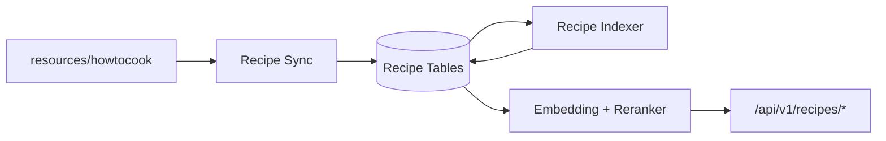

# 今日菜谱与静态知识库实现说明

> 状态：已移除（2026-08-05）
> 本文保留为历史记录。今日菜谱及 HowToCook 静态知识库功能已整体下线：后端
> `/api/v1/recipes/*` 路由与 `internal/recipe`、`cmd/rag-eval`、评测数据集和验收脚本均已
> 删除；前端 `/recipes`、`/assistant` 重定向到 `/knowledge` 个人知识库。

## 历史实现要点（供追溯）

- 旧系统知识库唯一来源曾为 `backend/resources/howtocook`，语料一次性迁移到用户 `Diving`
  的运行时私有知识库，不再作为系统级语料或应用种子分发。
- 菜谱与技巧曾写入 `recipe_documents`、`recipe_parent_chunks`、`recipe_child_chunks`
  和索引任务表；这些表仍保留在数据库中，但不再有代码读写。
- `/recipes` 曾提供今日推荐、三个建议问题和自由问答；`/api/v1/settings/preferences`
  曾保存忌口与时区，现已缩减为模板广场个性化开关。

## 数据流（历史记录）



## 当前验收

```powershell
Set-Location backend
go vet ./...
go test ./...
go build ./cmd/server

Set-Location ..\frontend
npm run format:check
npm test
npm run build

Set-Location ..
docker compose config --quiet
.\backend\scripts\non_ai_smoke.ps1
.\backend\scripts\ai_acceptance.ps1
.\backend\scripts\research_acceptance.ps1
.\backend\scripts\template_ai_event_acceptance.ps1
.\backend\scripts\backup_acceptance.ps1
```

当前验收必须证明：新实例由 `backend/db/schema.sql` 基线加版本化迁移初始化（共 57 张表），
`/recipes`、`/assistant` 均重定向到 `/knowledge`，个人知识库上传、索引、混合问答、跨租户
隔离与 3 GiB 配额生效，且仓库不再提供 `/api/v1/recipes/*` 路由。
