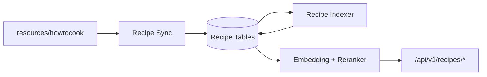

# 今日菜谱与静态知识库实现说明

## 已实现边界

- 系统知识库唯一来源为 `backend/resources/howtocook`。
- 语料 revision 固定在 `SOURCE.json`，服务启动时幂等同步。
- 菜谱与技巧写入独立的 `recipe_documents`、`recipe_parent_chunks`、`recipe_child_chunks` 和索引任务表。
- `/recipes` 提供今日推荐、三个建议问题和自由问答。
- `/knowledge`、`/assistant` 页面及 `/api/v1/knowledge/*` 已删除。
- 用户知识文件上传、集合、预览、下载、删除、重建索引和通用知识问答已删除。
- 研究、日报、周报、月报和个人笔记不会写入或参与 HowToCook 检索。
- 迁移 `000012_remove_personal_knowledge` 会永久删除旧个人知识数据库表和历史数据。

## 数据流



## 验收

```powershell
Set-Location backend
go vet ./...
go test ./...
go build ./cmd/server

Set-Location ..\frontend
npm run format:check
npm test
npm run build

Set-Location ..
docker compose config --quiet
.\backend\scripts\recipe_sync_acceptance.ps1
```

验收必须证明生产构建不依赖宿主机外部 HowToCook 路径，语料 revision 稳定，忌口过滤生效，
菜谱问答只保存当前系统语料引用，且 `/knowledge` 和 `/api/v1/knowledge/*` 不可访问。
