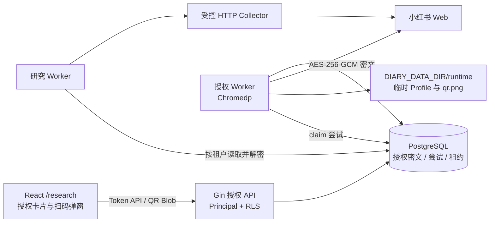

# 小红书多租户授权功能页实现说明

## 1. 目标与范围

该功能集成在现有单词路由 `/research`，不新增独立二级路由。页面用于管理当前个人租户的小红书扫码授权，并让研究 worker 在采集时使用该租户自己的会话。

实现范围包括查询状态、发起扫码、轮询、读取二维码、验证、重新授权、取消和撤销；不包含账号密码托管、Cookie 手工导入、跨租户共享账号、自动化发布或 Redis 缓存。

## 2. 总体架构



后端仍由 `backend/cmd/server/main.go` 单入口启动。授权 worker 与研究 worker 是同一 Go 进程中的后台协程，不新增 Python 服务。

## 3. 前端实现

主要文件：

- `frontend/src/features/research/ResearchPage.tsx`
- `frontend/src/features/research/ResearchPage.css`
- `frontend/src/api/research.ts`

授权卡片复用项目的 Ant Design 组件。TanStack Query 管理状态：

1. 页面加载时查询当前租户授权；尚未授权的 404 映射为 `null`。
2. 点击“扫码授权”创建 attempt，并每两秒轮询。
3. 状态进入 `waiting_for_scan` 后，以携带 Token 的 Blob 请求加载二维码。
4. 状态变为 `authorized` 后关闭弹窗并刷新授权卡片。
5. Blob URL 在刷新、关闭和卸载时释放。

前端永远不会接触 Cookie、加密密文、nonce、密钥版本或服务器文件路径。

## 4. 后端组件

### 4.1 HTTP 层

`backend/internal/server/xhs_authorization.go` 负责检查配置、读取可信 Principal、校验 UUID 与二维码有效期，以及输出稳定错误。二维码响应设置 `Cache-Control: no-store, private`。路由在 `backend/internal/server/server.go` 注册，均要求活跃租户。

### 4.2 授权 worker

`backend/internal/server/xhs_authorization_worker.go`：

1. 通过 PostgreSQL `FOR UPDATE SKIP LOCKED` claim attempt。
2. 创建租户与 attempt 独立的 `0700` 临时目录。
3. 使用独立 Chromium User Data Dir 打开登录页。
4. 生成 `0600` 页面截图供前端扫码。
5. 轮询 Cookie，以 `web_session` 判断登录完成。
6. 序列化并加密会话后更新授权记录。
7. 完成、失败、取消或超时后清理临时目录。

配置或 Chromium 不可用时只禁用授权，不影响笔记、知识库和公开链接研究。

### 4.3 研究 worker

`backend/internal/server/research_worker.go` 读取当前租户授权，解密并按域名、路径、安全标记和有效期筛选 Cookie。使用 PostgreSQL 租约防止多个 worker 并发使用同一租户账号；冲突时任务重新排队且不消耗重试次数。关键词模式无授权返回 `XHS_AUTH_REQUIRED`，URL 模式可匿名尝试。

## 5. 数据与安全设计

迁移为 `backend/internal/migrations/sql/000005_xhs_authorization.up.sql`。

| 表 | 用途 |
| --- | --- |
| `xhs_authorizations` | 每租户唯一授权、AES-GCM 密文、nonce、状态、版本和使用租约 |
| `xhs_auth_attempts` | 扫码状态、二维码相对路径、有效期和 worker 租约 |

两表均启用并强制执行 RLS。Store 查询仍显式携带 `tenant_id`，跨租户 attempt 查询表现为 404。

```text
算法：AES-256-GCM
密钥：XHS_SESSION_ENCRYPTION_KEY 解码后的 32 字节
AAD：xhs-session|<tenant_id>|<authorization_id>|<key_version>
```

修改租户 ID、授权 ID、版本、密文或 nonce 都会导致认证解密失败。撤销会清空密文和 nonce，并取消该租户运行中的研究任务。

二维码必须落在 `DIARY_DATA_DIR/runtime/xhs-auth`，API 再次检查解析后的路径边界，拒绝绝对路径和 `..` 穿越。临时文件不属于静态资源、导出或备份。

## 6. 状态模型

```text
授权：pending -> authorized -> expired / revoked
         `-----> failed

扫码：queued -> starting -> waiting_for_scan -> authorized
                             |-> verification_required
                             `-> failed / expired / cancelled
```

二维码只允许在活跃扫码状态且未过期时读取。

## 7. API

| 方法 | 路径 | 作用 |
| --- | --- | --- |
| `GET` | `/api/v1/research/xhs/authorization` | 当前租户授权状态 |
| `POST` | `/api/v1/research/xhs/authorizations` | 创建扫码 attempt |
| `GET` | `/api/v1/research/xhs/authorizations/{attempt_id}` | 查询扫码状态 |
| `GET` | `/api/v1/research/xhs/authorizations/{attempt_id}/qr` | 鉴权获取二维码图片 |
| `POST` | `/api/v1/research/xhs/authorizations/{attempt_id}/cancel` | 取消扫码 |
| `POST` | `/api/v1/research/xhs/authorization/verify` | 验证授权 |
| `DELETE` | `/api/v1/research/xhs/authorization` | 撤销授权 |

完整 HTTP 契约和错误行为见 [API 文档](api.md#小红书研究)。

## 8. 配置与部署

```dotenv
XHS_AUTHORIZATION_ENABLED=false
XHS_AUTHORIZATION_TTL_SECONDS=180
XHS_SESSION_ENCRYPTION_KEY=
XHS_SESSION_KEY_VERSION=1
XHS_CHROME_PATH=/usr/bin/chromium-browser
```

Docker 后端镜像安装 Alpine Chromium。生产启用前必须生成独立的 32 字节随机 Base64 密钥，不得把真实密钥提交到仓库或写入日志。

当前不需要 Redis。状态、幂等约束、claim 和同账号串行租约均由 PostgreSQL 提供。

## 9. 关键错误码

| 错误码 | 含义 |
| --- | --- |
| `XHS_AUTH_NOT_CONFIGURED` | 功能、密钥或运行环境未配置 |
| `XHS_AUTH_REQUIRED` | 当前租户没有有效授权 |
| `XHS_AUTH_IN_PROGRESS` | 已有未结束的扫码任务 |
| `XHS_AUTH_EXPIRED` | 已保存会话失效 |
| `XHS_QR_PENDING` | 二维码尚未生成 |
| `XHS_QR_EXPIRED` | 二维码任务结束或超时 |
| `XHS_BROWSER_UNAVAILABLE` | Chromium 无法启动或访问登录页 |
| `XHS_VERIFICATION_REQUIRED` | 登录页要求额外安全验证 |
| `XHS_SESSION_DECRYPT_FAILED` | 会话无法安全解密 |

## 10. 验收要点

- 后端 vet、test、build 与前端 format、test、build 通过。
- Docker 镜像内 Chromium 可执行。
- 迁移、授权表、RLS 和 FORCE RLS 正确。
- attempt 能进入 `waiting_for_scan`，二维码返回 200。
- 第二租户访问第一租户 attempt 返回 404。
- 关闭授权后核心能力和非 AI 冒烟测试仍通过。

