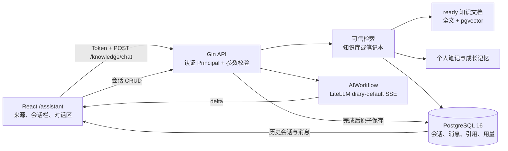

# 成长助手页架构与功能说明

## 1. 目标与范围

本文说明 `/assistant` 成长助手页当前已经实现的页面结构、会话生命周期、检索问答链路、
持久化、安全边界、错误处理和验收方式。

当前页面支持：

- 在“知识库”和“笔记本”之间选择回答来源。
- 基于当前个人租户的可信来源进行流式问答。
- 展示 Markdown 回答和经过服务端校验的来源引用。
- 查看、打开、重命名和删除历史会话。
- 折叠左侧会话栏。
- 在不提前持久化空记录的情况下开始新会话。
- 在长会话中使用摘要和近期消息作为对话上下文。

当前页面不支持跨租户知识共享、互联网搜索、无依据的通用聊天、同时混合两类来源、在助手页
筛选知识集合或知识文件、会话搜索、附件上传和模型选择。知识文件管理与索引由 `/knowledge`
页面负责，笔记内容仍以 PostgreSQL 为权威来源。

## 2. 总体架构



`backend/cmd/server/main.go` 是唯一后端入口。页面不会直连模型供应商，也不在浏览器保存
LiteLLM Key、供应商 Key、检索向量或服务端 Prompt。

## 3. 页面结构与交互

主要前端文件：

- `frontend/src/features/assistant/GrowthAssistantPage.tsx`
- `frontend/src/features/assistant/GrowthAssistantPage.css`
- `frontend/src/features/assistant/GrowthAssistantPage.test.tsx`
- `frontend/src/api/knowledge.ts`

路由 `/assistant` 由 `ProtectedRoute` 保护。页面使用 React 18、Ant Design、TanStack Query、
`react-markdown` 和 `remark-gfm`。

### 3.1 固定页面布局

页面占满应用内容区并阻止页面级上下滚动，主要分为：

- 左侧会话栏。
- 右侧来源栏。
- 右侧单一对话区。

消息数量超过可用高度时，只有消息区域上下滚动。新消息和流式内容到达后，页面自动把消息区
滚动到末尾。小屏幕下隐藏独立会话栏，对话区继续占满可用高度。

### 3.2 左侧会话栏

左栏顶部提供：

- “新建会话”按钮。
- 折叠或展开按钮。

历史记录按服务端返回的更新时间倒序展示标题和消息数量。点击记录会加载完整消息，并恢复该
会话保存的来源类型。历史记录支持：

- 乐观锁重命名。
- 二次确认后删除。
- 当前会话删除后回到干净空白状态。

页面不提供会话搜索。折叠后只保留展开按钮，并把主对话区扩展到空出的宽度。

### 3.3 新会话生命周期

“新建会话”是本地界面动作，不调用 `POST /api/v1/conversations`：

1. 中止仍在进行的当前请求。
2. 清除当前 `conversation_id`、消息和输入内容。
3. 保留当前选择的来源类型。
4. 用户发送第一条问题时，请求不携带 `conversation_id`。
5. 只有回答完整生成且来源仍然有效时，后端才在事务中创建会话并保存首轮消息。
6. SSE `done` 事件返回新 `conversation_id` 后，前端刷新历史记录。
7. 后端基于首轮问题和回答生成简洁标题；标题生成失败不影响会话与回答保存。

因此，用户只点击“新建会话”或输入后离开页面都不会产生空会话记录。问题没有证据、AI 失败、
用户中止或来源保存校验失败时，也不会创建成功会话。

### 3.4 来源栏

页面顶部只保留来源类型选择：

| 页面名称 | `source_scope` | 检索范围 |
| --- | --- | --- |
| 知识库 | `knowledge` | 当前租户状态为 `ready` 的知识文档 |
| 笔记本 | `growth` | 当前用户的个人笔记与可用成长来源 |

切换来源会中止当前请求并开始一个本地干净会话，避免把不同来源类型的消息继续写入同一会话。
页面不展示集合或文件范围下拉框，也不会发送 `collection_ids` 或 `document_ids`。

### 3.5 空状态、输入与发送

空会话时，对话区中央显示简洁提示和输入框。首次发送后切换为：

- 上方历史消息和流式回答。
- 下方固定输入框。

输入框行为：

- 随输入内容向上扩展，不向下挤出页面。
- 最少一行、最多四行。
- 超过四行后在输入框内部滚动并自动换行。
- Enter 发送，Shift+Enter 换行。
- 空白内容和重复发送会被忽略。
- 右侧只有发送按钮；生成中同一位置变为停止按钮。

### 3.6 消息与引用

用户和助手消息使用不同方向与样式。助手回答通过安全 Markdown 渲染，禁用原始 HTML。
服务端在生成结束并成功保存后返回引用，页面展示：

- 来源标题。
- 标题路径或页码。
- 有限来源片段。
- 来源已删除提示。

来源引用由服务端根据当前租户重新校验，浏览器提交的引用不能成为权威来源。

## 4. 前端状态管理

主要查询键：

```text
assistant-conversations
```

页面不再查询知识集合和知识文件，也没有会话搜索查询键。历史会话的完整消息在用户点击时通过
普通 API 加载。

主要本地状态：

| 状态 | 用途 |
| --- | --- |
| `items` | 当前界面的用户、助手消息与引用 |
| `input` | 当前问题输入 |
| `sending` | 流式请求状态 |
| `scope` | `knowledge` 或 `growth` |
| `conversationId` | 已持久化会话；本地新会话为 `undefined` |
| `sidebarCollapsed` | 会话栏折叠状态 |
| `AbortController` | 停止当前流式请求 |

重命名、删除和首轮问答成功后会失效 `assistant-conversations` 查询。打开历史会话失败时显示
“无法打开该会话”；普通问答失败时保留用户消息，并显示稳定的失败反馈。

## 5. HTTP API 与 SSE

所有接口都要求活跃租户的登录 Token。用户和租户由服务端 Principal 解析，不接收客户端
`tenant_id` 作为资源选择依据。

| 方法 | 路径 | 当前页面用途 |
| --- | --- | --- |
| `GET` | `/api/v1/conversations` | 获取历史会话 |
| `GET` | `/api/v1/conversations/{conversation_id}` | 打开会话及消息 |
| `PATCH` | `/api/v1/conversations/{conversation_id}` | 使用标题和版本号重命名 |
| `DELETE` | `/api/v1/conversations/{conversation_id}` | 删除会话 |
| `POST` | `/api/v1/knowledge/chat` | 检索并以具名 SSE 返回回答 |

后端仍保留 `POST /api/v1/conversations` 契约，但当前页面的新建按钮不会调用它。

Chat 请求包含：

```json
{
  "question": "用户问题",
  "request_id": "客户端生成的 UUID",
  "source_scope": "knowledge",
  "conversation_id": 123
}
```

本地新会话省略 `conversation_id`。页面不会发送集合和文件筛选字段。

SSE 事件：

| 事件 | 页面处理 |
| --- | --- |
| `retrieval` | 后端报告本次检索来源，不直接作为最终引用显示 |
| `delta` | 追加助手流式文本 |
| `sources` | 保存成功后绑定可信引用 |
| `done` | 接收会话 ID 并刷新历史记录 |
| `error` | 停止本次生成并显示失败反馈 |

流已经输出后不会从头自动重试。用户点击停止会取消浏览器请求。

## 6. 后端检索、生成与持久化

主要后端文件：

- `backend/internal/server/knowledge_chat.go`
- `backend/internal/server/knowledge_sse.go`
- `backend/internal/server/legacy.go`
- `backend/internal/store/knowledge_search.go`
- `backend/internal/store/legacy.go`

### 6.1 问答流程

1. 校验问题长度、请求 ID、来源类型和可选会话 ID。
2. 使用 `request_id` 查找已完成请求，支持安全幂等回放。
3. 知识库来源执行中文全文检索和可用的向量检索。
4. 笔记本来源只读取当前用户的可信候选。
5. 无来源时返回 `KNOWLEDGE_NO_EVIDENCE`，不调用模型生成无依据答案。
6. 对知识候选重排并限制上下文长度。
7. 构造只允许引用当前上下文的 Prompt，通过 LiteLLM 流式生成。
8. 完整生成后再次校验来源，在事务中保存会话、用户消息、助手消息和引用。
9. 返回 `sources` 与 `done`，并记录 AI 用量。

### 6.2 会话上下文与摘要

已有会话会读取历史摘要和消息作为对话上下文，但历史对话不被当作事实来源。长会话达到阈值
后，后端生成摘要并使用摘要版本做乐观冲突保护；近期未摘要消息继续保留在上下文中。

首轮成功后，后端生成 10–30 个汉字的标题。自动标题只允许更新初始版本且消息数不超过首轮，
避免覆盖用户手工重命名的标题。

### 6.3 保存时机

模型流式文本可以先显示，但持久化只在完整生成成功后执行。保存使用脱离客户端取消信号且带
有限超时的上下文，确保已完整生成的回答有机会原子落库。若来源在生成期间失效，返回
`KNOWLEDGE_SOURCE_INVALID`，不保存不可验证引用。

## 7. 数据模型与租户安全

| 表 | 用途 |
| --- | --- |
| `conversations` | 用户、来源类型、标题、版本、摘要和时间 |
| `messages` | 会话中的用户与助手消息、请求幂等信息和状态 |
| `knowledge_message_sources` | 助手消息到知识文档父子块的引用 |
| `message_sources` | 助手消息到笔记等个人来源的引用 |
| `ai_usage_records` | 请求类型、模型、Token、状态和会话关联 |

会话、消息和引用均绑定租户；会话还显式绑定用户。Store 操作通过 `Store.WithTx` 设置
transaction-local RLS 上下文，并在 SQL 中保留 `tenant_id` 和 `user_id` 条件。跨租户或跨用户
访问统一表现为 404。

重命名携带 `version`，并发更新返回 `CONVERSATION_VERSION_CONFLICT`。删除会话为明确用户操作，
数据库级联删除消息和关联引用，并写入审计记录。

Prompt、普通日志和错误响应不得包含其他租户内容、密钥、内部地址或未受限的完整正文。

## 8. 错误与降级

| 错误码 | 含义 |
| --- | --- |
| `KNOWLEDGE_NO_EVIDENCE` | 当前来源没有足够可信证据 |
| `AI_NOT_CONFIGURED` | AI 未配置 |
| `AI_REQUEST_FAILED` | 流式生成服务失败 |
| `KNOWLEDGE_SOURCE_INVALID` | 生成期间来源失效 |
| `CONVERSATION_NOT_FOUND` | 会话不存在或不属于当前用户 |
| `CONVERSATION_VERSION_CONFLICT` | 会话标题已被并发更新 |
| `CONVERSATION_SUMMARY_CONFLICT` | 会话摘要版本冲突 |

AI 或 LiteLLM 不可用时，历史会话管理、笔记、知识库、附件、导出和备份仍然可用。Embedding
不可用时后端可以继续使用可用的关键词检索；没有可信结果时仍拒绝无依据回答。标题或摘要生成
失败不会使已完成的问答失败。

## 9. 自动化测试与验收

### 9.1 前端门禁

```powershell
Set-Location frontend
npm run format:check
npm test
npm run build
```

当前页面测试覆盖：

- 来源选项只有知识库和笔记本。
- 不显示会话搜索。
- 不显示知识集合或知识文件范围筛选。
- 空状态和输入框可访问。
- 点击新建会话不会调用持久化创建接口。
- 会话栏提供可访问的折叠操作。

### 9.2 后端门禁

```powershell
Set-Location backend
go vet ./...
go test ./...
go build ./cmd/server
```

后端应持续覆盖检索、无证据拒答、SSE、请求幂等、来源保存校验、会话版本冲突、摘要和租户隔离。

### 9.3 端到端验收

1. 未登录访问 `/assistant` 跳转到登录页。
2. 页面自身不出现纵向滚动条，长消息只在消息区域滚动。
3. 左侧会话栏可以折叠和展开，主对话区随之调整宽度。
4. 页面没有会话搜索、集合筛选或文件筛选。
5. 新建会话后数据库中不产生空会话。
6. 首次成功问答后才出现历史记录，并生成简洁标题。
7. 切换知识库和笔记本会开始干净会话，检索范围与选择一致。
8. 输入框向上扩展到四行，超过后内部滚动；Enter 与 Shift+Enter 行为正确。
9. 流式回答逐步显示，停止按钮能够取消请求。
10. 成功回答显示当前租户的可验证引用，无证据问题明确失败。
11. 打开、重命名和删除历史会话正常，旧版本重命名返回 409。
12. 租户 B 访问租户 A 的会话、消息和引用全部返回 404。

## 10. 维护约束

- 不把历史对话当作事实来源；回答仍必须由本次可信检索提供证据。
- 不允许客户端提交的来源、会话 ID 或 `tenant_id` 绕过 Principal 和 RLS。
- 不在页面重新加入知识集合或文件范围选择，除非产品和 API 文档同步调整。
- 新会话继续采用首轮成功后延迟持久化，避免空会话污染历史记录。
- 不绕过 LiteLLM 直连供应商。
- 流已经输出后不得从头自动重试。
- 新增会话字段或引用表变化必须使用版本化迁移，并同步 `backend/db/schema.sql`。
- 页面、API、检索、SSE 或持久化行为变化时，同步更新本文、`../api.md` 和 `../SDD.md`。
