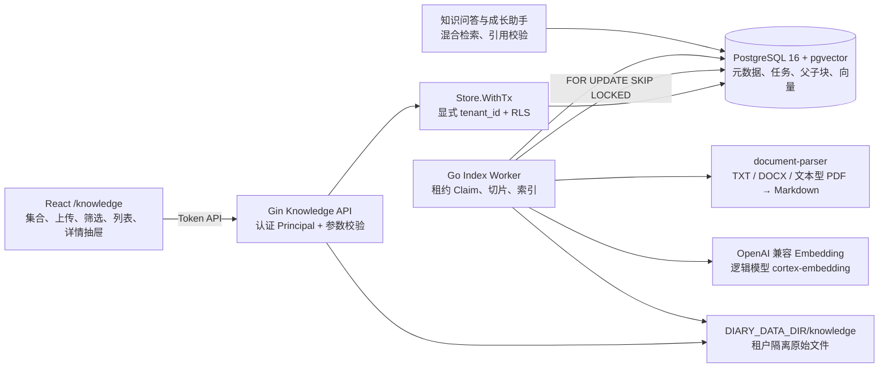

# 个人知识库文档页架构与功能说明

## 1. 目标与范围

本文说明 `/knowledge` 个人知识库文档页当前已经实现的页面结构、前后端职责、文档处理链路、
数据模型、安全边界、错误处理和验收方式，作为后续维护、测试和功能扩展的实现依据。

当前页面用于管理个人租户的知识集合与知识文件，支持：

- 创建和删除知识集合。
- 上传中英文 TXT、Markdown、文本型 PDF 和 DOCX。
- 按集合、文件名和处理状态筛选文档。
- 查看解析、索引状态以及父块、子块数量。
- 查看已完成文档的文本提取预览。
- 下载原始文件。
- 对失败文档发起重新索引。
- 删除文档并立即停止其参与检索。

当前范围不包含 OCR、扫描型 PDF 识别、在线编辑知识正文、集合层级嵌套、知识文件共享，
也不将转换后的 Markdown 作为权威存储。PostgreSQL 保存文档元数据和索引数据，原始文件保存
在 `DIARY_DATA_DIR` 的租户隔离目录中。

## 2. 总体架构



`backend/cmd/server/main.go` 仍是唯一后端入口。文档解析器是仅供后端访问的内部 sidecar，
不连接数据库、不持有 LiteLLM 或供应商密钥，也不向宿主机暴露端口。

## 3. 页面结构与交互

主要前端文件：

- `frontend/src/features/knowledge/KnowledgePage.tsx`
- `frontend/src/features/knowledge/KnowledgePage.css`
- `frontend/src/features/knowledge/KnowledgePage.test.tsx`
- `frontend/src/api/knowledge.ts`

路由 `/knowledge` 由 `ProtectedRoute` 保护，页面使用 React 18、Ant Design 和 TanStack Query。

### 3.1 页面标题区

- 标题为“个人知识库”。
- 副标题明确支持 TXT、Markdown、文本型 PDF、DOCX，并说明使用父子索引。
- “新建集合”按钮打开集合创建弹窗。

### 3.2 集合与筛选工具栏

- 集合选择器默认展示全部知识集合。
- 文件名搜索在提交搜索词后查询服务端。
- 状态筛选支持 `uploaded`、`extracting`、`indexing`、`ready`、`failed` 和 `deleting`。
- 显示当前条件下的文件总数。
- 选择集合后允许删除当前集合；只有空集合能够删除。
- 切换集合、搜索或状态时，分页回到第一页。

### 3.3 文件上传区

- 支持拖放和点击选择。
- 支持多文件上传。
- 浏览器选择范围限制为 `.txt`、`.pdf`、`.docx`。
- 上传时可以附带当前集合 ID。
- 每个文件独立提交、显示成功或失败消息，不因单个文件失败阻断其他文件。
- 上传成功返回 `202 Accepted`，表示文件已持久化并进入异步索引队列。
- 页面明确提示扫描 PDF 不支持 OCR。

### 3.4 文档列表

列表展示：

- 原始文件名。
- 中文处理状态和脱敏失败说明。
- 父块、子块数量。
- 文件大小。
- 查看详情、下载、重新索引和删除操作。

当列表中存在 `uploaded`、`extracting` 或 `indexing` 文档时，前端每三秒刷新一次列表；
所有文档进入终态后停止轮询。

失败文档显示“重新索引”操作。删除操作要求二次确认，并提示删除后文档立即停止参与检索。
分页固定每页 20 条，由服务端返回 `items` 和 `total`。

### 3.5 文件详情抽屉

点击行或查看按钮打开详情抽屉，展示：

- 当前处理状态。
- 文件类型。
- 提取字符数。
- 页数。
- 失败原因。
- 文本提取预览。

只有 `ready` 文档会请求预览接口。预览来自当前有效父块的有限文本片段，不读取或返回其他租户
文档，也不把完整磁盘路径暴露给浏览器。

### 3.6 响应式与主题

页面复用应用现有 Ant Design token 和主题变量。小于 768px 时：

- 标题区域保留紧凑间距。
- 工具栏控件扩展为整行宽度。
- 详情仍通过抽屉呈现，避免在主列表中堆叠大量正文。

## 4. 前端状态管理

TanStack Query 使用以下主要查询键：

```text
knowledge-collections
knowledge-documents + collectionId + search + status + page
knowledge-preview + documentId
```

Mutation 成功后的失效规则：

| 操作 | 刷新范围 |
| --- | --- |
| 创建集合 | `knowledge-collections` |
| 删除集合 | 清空当前集合并刷新 `knowledge-collections` |
| 上传文件 | `knowledge-documents` |
| 重新索引 | `knowledge-documents` |
| 删除文件 | `knowledge-documents` |

下载使用认证请求获取 Blob，再创建短生命周期对象 URL 触发浏览器保存，完成后立即释放 URL。
前端不会接触服务端存储路径。

## 5. HTTP API

所有接口均要求活跃租户的登录 Token，并从服务端可信 Principal 解析用户和租户。

| 方法 | 路径 | 作用 |
| --- | --- | --- |
| `GET` | `/api/v1/knowledge/collections` | 列出当前租户集合 |
| `POST` | `/api/v1/knowledge/collections` | 创建集合 |
| `DELETE` | `/api/v1/knowledge/collections/{collection_id}` | 删除空集合 |
| `GET` | `/api/v1/knowledge/documents` | 搜索、筛选和分页查询文档 |
| `POST` | `/api/v1/knowledge/documents` | 上传文件并排队索引 |
| `GET` | `/api/v1/knowledge/documents/{document_id}` | 获取文档元数据 |
| `GET` | `/api/v1/knowledge/documents/{document_id}/preview` | 获取提取预览 |
| `GET` | `/api/v1/knowledge/documents/{document_id}/download` | 鉴权下载原始文件 |
| `POST` | `/api/v1/knowledge/documents/{document_id}/reindex` | 创建新版本索引任务 |
| `DELETE` | `/api/v1/knowledge/documents/{document_id}` | 停止检索并删除文件 |

文档列表支持：

```text
collection_id
search
status
limit
offset
```

`limit` 默认 20，服务端上限为 100。

## 6. 上传与文件安全

上传处理位于 `backend/internal/server/knowledge.go`：

1. 使用 `http.MaxBytesReader` 和配置上限限制请求体。
2. 只接受 TXT、Markdown、PDF、DOCX 扩展名。
3. 服务端生成随机文件名，原始文件名仅作为展示元数据。
4. 文件先写入同目录临时文件，并同步落盘。
5. 计算 SHA-256，用于租户内重复文件约束。
6. 校验实际文件结构后再原子移动到目标路径。
7. 数据库成功创建文档和索引任务后才提交上传结果。
8. 任一步骤失败都会清理未提交临时文件。

文件类型校验包括：

- TXT 必须是 UTF-8，且不能包含 NUL 字节。
- PDF 必须具有 `%PDF-` 文件签名。
- DOCX 必须是合法 ZIP 容器，并包含 `[Content_Types].xml` 和 `word/document.xml`。
- DOCX 拒绝绝对路径、`..` 路径、过多条目、异常压缩比和超限解压规模。

原始文件保存为：

```text
DIARY_DATA_DIR/knowledge/<tenant-id>/<year>/<month>/<server-uuid>.<ext>
```

数据库只保存安全相对路径。下载、Worker 读取和删除都会重新解析路径并检查其仍位于
`DIARY_DATA_DIR/knowledge` 内。

## 7. 文档处理与索引流水线

### 7.1 状态模型

```text
uploaded -> extracting -> indexing -> ready
              |             |
              `-----------> failed -> reindex -> uploaded

任意可见状态 -> deleting -> 删除完成
```

状态和计数持久化在 PostgreSQL，前端轮询只读取权威状态。

### 7.2 Worker Claim

Go Worker 从 `knowledge_index_jobs` 使用 `FOR UPDATE SKIP LOCKED` 和五分钟有限租约认领任务。
多个后端实例竞争时，同一索引版本只能被一个 Worker 有效处理。失败任务根据错误类型进行有限
重试，进程退出或租约过期后可由其他 Worker 恢复。

### 7.3 Markdown 解析服务

配置 `DOCUMENT_PARSER_URL` 后，Worker 调用内部 Python 解析服务：

- TXT：UTF-8 文本规范化为 Markdown。
- DOCX：提取段落和基本结构并转换为 Markdown。
- 文本型 PDF：按页提取并生成 Markdown 与页码元数据。
- 扫描型 PDF：不执行 OCR，返回 `DOCUMENT_OCR_REQUIRED`。

解析请求和响应均受文件大小、字符数、页数和超时限制。未配置解析服务时，Worker 使用 Go
内置提取路径作为兼容方案；已配置但暂时不可用时，任务按稳定失败状态处理并允许重试。无论
使用哪种解析器，后续切片和索引语义保持一致。

### 7.4 父子切片与 Embedding

解析后的 `knowledge.Document` 进入统一父子切片流程：

- 父块保存较完整的上下文、标题路径和页码范围。
- 子块使用较小目标长度和重叠窗口，用于精确召回。
- 子块保存全文检索 `tsvector` 和 1024 维 pgvector embedding。
- Embedding 分批请求 OpenAI 兼容接口，逻辑模型默认为 `cortex-embedding`。
- 全部 embedding 成功后，在事务中写入新索引版本并将文档置为 `ready`。

重索引期间文档状态不为 `ready`，因此不会参与检索。新父子块和 embedding 在同一事务内原子
写入并替换旧索引，避免部分新索引对检索可见。

## 8. 数据模型

基线迁移为 `backend/internal/migrations/sql/000002_knowledge_base.up.sql`。

| 表 | 用途 |
| --- | --- |
| `knowledge_collections` | 租户内知识集合、说明、版本和软删除状态 |
| `knowledge_documents` | 文件元数据、存储路径、处理状态、计数和索引版本 |
| `knowledge_index_jobs` | 异步索引任务、租约、尝试次数和失败码 |
| `knowledge_parent_chunks` | 完整上下文块、标题路径、页码和相邻块关系 |
| `knowledge_child_chunks` | 精确检索块、全文索引、embedding 和模型信息 |
| `knowledge_message_sources` | AI 消息到文档及块的可验证引用 |

关键约束：

- 集合名称在当前租户内不区分大小写唯一。
- 文件 SHA-256 在当前租户的未删除文档内唯一。
- 文档路径在当前租户内唯一。
- 文档、父块、子块和引用均使用 `(tenant_id, id)` 复合关系。
- 每个文档索引版本只允许一个索引任务。

所有知识表均启用并强制执行 RLS。Store 操作仍通过 `Store.WithTx` 设置 transaction-local
租户上下文，并在 SQL 中保留显式 `tenant_id` 条件。跨租户枚举统一表现为 404。

## 9. 删除与重新索引

### 9.1 删除文档

删除不是直接先移除磁盘文件：

1. 数据库先将文档标记为 `deleting`，使其立即退出检索。
2. 原始文件重命名为受控 `.deleting` tombstone。
3. 删除 tombstone。
4. 若文件系统清理失败，返回 `DOCUMENT_CLEANUP_PENDING`，但文档不会重新参与检索。
5. 后台 cleaner 每分钟重试遗留 tombstone。

该顺序保证磁盘故障不会使已请求删除的内容继续被问答引用。

### 9.2 重新索引

失败文档可以调用 reindex 接口：

- 增加目标索引版本。
- 重置可重试处理状态。
- 创建新的唯一索引任务。
- 前端恢复三秒轮询。

只有新索引完整落库后，新的块和 embedding 才成为当前版本。

## 10. 检索与引用关系

知识文档达到 `ready` 后才参与检索。知识问答使用：

- 中文全文检索。
- pgvector 语义检索。
- 可选 reranker。
- 子块召回与父块上下文扩展。

回答前后均校验文档、索引版本和来源仍属于当前租户且可见。成功回答把文档、父块、子块、
页码、片段、分数和排名保存到 `knowledge_message_sources`。没有可信证据时返回
`KNOWLEDGE_NO_EVIDENCE`，不会让模型无依据生成答案。

## 11. 错误与降级

页面可见的主要稳定错误包括：

| 错误码 | 含义 |
| --- | --- |
| `DOCUMENT_UNSUPPORTED_TYPE` | 文件类型不支持 |
| `EMPTY_FILE` | 文件为空 |
| `DOCUMENT_TOO_LARGE` | 文件超过配置限制 |
| `DOCUMENT_INVALID_SIGNATURE` | 扩展名与实际结构不匹配或结构不安全 |
| `DOCUMENT_PARSE_LIMIT` | 页数、字符数或容器复杂度超限 |
| `DOCUMENT_ENCRYPTED` | 文档已加密，无法提取 |
| `DOCUMENT_OCR_REQUIRED` | PDF 缺少可提取文本，需要 OCR |
| `DOCUMENT_PARSE_FAILED` | 解析失败 |
| `EMBEDDING_UNAVAILABLE` | Embedding 服务暂时不可用 |
| `DOCUMENT_INDEX_FAILED` | 索引事务失败 |
| `DOCUMENT_FILE_MISSING` | 元数据存在但原始文件缺失 |
| `DOCUMENT_CLEANUP_PENDING` | 已停止检索，磁盘清理等待重试 |

AI、LiteLLM 或 reranker 不可用时，集合管理、上传、列表、预览、下载和删除仍然可用。
Embedding 不可用只会使待处理文档进入失败或重试状态，不影响已有 `ready` 文档和其他产品能力。

## 12. 配置与部署

主要配置：

```dotenv
KNOWLEDGE_MAX_FILE_BYTES=52428800
KNOWLEDGE_MAX_PDF_PAGES=500
KNOWLEDGE_MAX_EXTRACTED_CHARS=5000000
DOCUMENT_PARSER_URL=http://document-parser:8090
RAG_EMBEDDING_BASE_URL=http://llm-gateway:4000/v1
RAG_EMBEDDING_API_KEY=
RAG_EMBEDDING_MODEL=cortex-embedding
RAG_EMBEDDING_DIMENSIONS=1024
RAG_EMBEDDING_SEND_DIMENSIONS=false
```

Compose 中：

- `document-parser` 不暴露宿主机端口。
- parser 使用非 root 用户、只读根文件系统和临时目录。
- parser 不连接 PostgreSQL，也不持有 AI Key。
- `db` 和 `llm-gateway` 不暴露宿主机端口。
- backend 通过内部网络访问 parser、数据库和 LiteLLM。

`/healthz` 不依赖解析器、Embedding 或 AI；`/readyz` 只验证数据库可用。

## 13. 测试与验收

### 13.1 前端

```powershell
Set-Location frontend
npm run format:check
npm test
npm run build
```

页面测试至少覆盖标题、可访问筛选控件和空状态。后续页面交互变更应补充上传、轮询、详情、
重索引、删除确认和错误反馈测试。

### 13.2 后端

```powershell
Set-Location backend
go vet ./...
go test ./...
go build ./cmd/server
```

后端测试覆盖文件签名、UTF-8、DOCX 安全、提取限制、父子切片、解析 client、混合检索、
来源校验、任务租约和租户隔离。

### 13.3 解析服务

解析服务固定测试 TXT 解码、文本规范化和非法编码。真实验收应上传：

- 中英文 TXT。
- 包含标题和段落的 DOCX。
- 多页文本型 PDF。
- 扫描型 PDF，预期返回 `DOCUMENT_OCR_REQUIRED`。

### 13.4 端到端验收

```powershell
docker compose config --quiet
.\backend\scripts\non_ai_smoke.ps1
.\backend\scripts\knowledge_acceptance.ps1
.\backend\scripts\ai_acceptance.ps1
```

验收要点：

1. 两个租户分别上传文件并完成索引。
2. 租户 B 读取、下载、删除租户 A 的文件全部返回 404。
3. TXT、DOCX、文本型 PDF 均进入 `ready`，页数和父子块计数合理。
4. 扫描 PDF 明确失败为 `DOCUMENT_OCR_REQUIRED`，不触发 OCR。
5. 文件名、集合、状态筛选和分页结果正确。
6. 详情抽屉只为 `ready` 文档返回提取预览。
7. 下载文件内容和原文件一致。
8. 失败文档重新索引后状态能够恢复。
9. 删除文档后立即无法下载、查看或参与检索。
10. 知识问答命中当前租户文档并返回可验证引用。
11. 无证据问题返回 `KNOWLEDGE_NO_EVIDENCE`。
12. Compose 中 backend、db、document-parser 和 llm-gateway 达到预期健康状态。

## 14. 维护约束

- 不把 Markdown 改为知识正文权威来源。
- 不在 Python parser 中加入数据库或业务 API。
- 未经新的产品决策不加入 OCR。
- handler 保持 HTTP 契约职责，SQL 和事务继续位于 Store。
- 新增知识表或字段必须增加版本化迁移，并同步 `backend/db/schema.sql`。
- 新的知识资源必须保留 RLS、显式 `tenant_id` 和跨租户 404。
- 页面、API、状态或处理链路发生变化时，同步更新本文、`docs/api.md` 和 `docs/SDD.md`。
