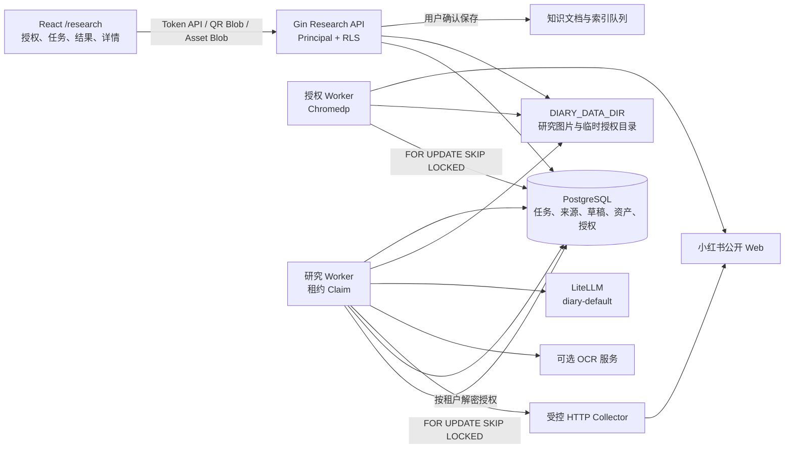

# 小红书研究页架构与功能说明

## 1. 目标与范围

本文说明 `/research` 页面当前已经实现的完整功能，而不仅是其中的扫码授权子功能。页面用于
创建小红书公开内容研究任务、跟踪采集进度、审核 AI 整理草稿，并由用户确认后保存到个人
知识库。

当前页面包括：

- 当前个人租户的小红书扫码授权、验证、重新授权、取消和撤销。
- 通过关键词或公开笔记链接创建研究任务。
- 查看任务进度、取消运行中任务和重试失败或已取消任务。
- 搜索、筛选、排序和分页查看研究结果。
- 查看来源原文、图片、OCR 结果和 AI 整理草稿。
- 编辑带乐观锁版本的摘要、关键观点、分类和建议标签。
- 单条或批量保存到知识库、忽略待审核结果。
- 对失败来源重新采集。
- 删除研究来源及其关联图片，并停止关联知识文档参与检索。

不包含账号密码托管、Cookie 手工导入、非公开内容采集、验证码绕过、自动化发布、跨租户账号
共享或 Redis 缓存。

## 2. 总体架构



后端仍由 `backend/cmd/server/main.go` 单入口启动。授权 Worker 和研究 Worker 都是同一 Go
进程中的后台协程。OCR 是可选内部服务；AI 整理只通过现有 LiteLLM 网关。

## 3. 前端页面结构

主要文件：

- `frontend/src/features/research/ResearchPage.tsx`
- `frontend/src/features/research/ResearchPage.css`
- `frontend/src/features/research/ResearchPage.test.tsx`
- `frontend/src/api/research.ts`

路由 `/research` 由 `ProtectedRoute` 保护，页面使用 React、Ant Design 和 TanStack Query。

### 3.1 标题和合规提示

- 页面标题为“小红书研究”。
- 副标题说明公开内容会被提炼并保存到个人知识库。
- “新建研究”按钮打开任务创建弹窗。
- 页面固定显示平台规则、版权和适用法律提示。

### 3.2 租户授权卡片

卡片显示当前租户的授权状态，并提供：

- 未授权时发起扫码授权。
- 已授权时验证授权。
- 已授权时重新授权。
- 撤销授权，撤销前提示运行中的任务也会取消。

扫码弹窗每两秒轮询 attempt。进入 `waiting_for_scan` 或 `verification_required` 后，通过携带
Token 的 Blob 请求获取从登录页面 DOM 中提取的二维码元素截图，不返回完整页面截图。授权成功后自动刷新卡片并关闭 attempt。二维码 Blob URL
在替换或组件卸载时释放。

前端永远不会读取 Cookie、密文、nonce、密钥版本、Chromium profile 或服务器文件路径。

### 3.3 新建研究弹窗

支持两种模式：

| 模式 | 输入 | 授权要求 |
| --- | --- | --- |
| `keyword` | 每行一个关键词 | 必须有当前租户有效授权 |
| `urls` | 每行一个公开笔记链接 | 可匿名尝试，授权可提高可访问性 |

表单还包括：

- 目标结果数，页面范围为 1–50，服务端仍执行最终上限校验。
- 可选目标知识集合。
- 客户端生成的 `idempotency_key`，防止重复创建任务。

### 3.4 研究任务标签页

任务列表展示：

- 关键词摘要或链接数量。
- `已整理 + 已失败 / 目标数` 进度。
- 当前状态。
- 创建时间。
- 可执行操作。

任务状态：

```text
queued -> collecting -> extracting -> organizing -> reviewing -> completed
   |           |            |             |
   `-----------+------------+-------------> failed
                                           |
                                           `-> retry -> queued

未完成任务 -> cancelled -> retry -> queued
```

存在 `queued`、`collecting`、`extracting` 或 `organizing` 任务时，前端每三秒刷新。失败和已取消
任务可重试；尚未进入 `reviewing` 或 `completed` 的任务可取消。列表固定每页 20 条。

### 3.5 研究结果标签页

结果区支持：

- 按标题或作者显示名搜索。
- 按来源状态筛选。
- 按采集时间或公开发布时间排序。
- 每页 20 条分页。
- 勾选多条 `pending_review` 结果进行批量保存或批量忽略。

结果状态：

```text
pending -> collecting -> organizing -> pending_review -> saved
                                      |              `-> ignored
                                      `-------------> failed
```

列表展示标题、作者显示名、AI 分类、状态和采集时间。

### 3.6 研究详情抽屉

详情抽屉宽度为 720，展示：

- 标题、作者显示名和公开来源链接。
- 脱敏后的失败说明。
- 来源原文。
- 受认证加载的来源图片。
- 每张图片的 OCR 状态与文本。
- AI 摘要、关键观点、分类和建议标签。

草稿处于 `pending` 时允许编辑并提交，提交携带当前 `version`，冲突时后端返回稳定的版本冲突
错误。详情操作根据状态变化：

- `pending_review`：更新草稿、忽略、保存到知识库。
- `failed`：重新采集。
- 所有可见来源：二次确认后删除。

## 4. 前端查询与状态管理

主要查询键：

```text
xhs-authorization
xhs-auth-attempt + attemptId
research-jobs + page
research-sources + status + search + sort + page
research-source + sourceId
knowledge-collections
```

创建、取消、重试、草稿更新、保存、忽略、重新采集和删除成功后，会统一刷新任务、结果和当前
详情。授权变化只刷新授权相关查询。

图片和二维码均通过认证 Blob API 加载，不使用公开静态目录。

## 5. 后端组件

### 5.1 HTTP 层

`backend/internal/server/research.go` 负责：

- 校验任务模式、关键词、URL、目标数量和幂等键。
- 搜索、筛选、排序和分页契约。
- 草稿字段长度、数量和版本校验。
- 保存、忽略、批量操作、重新采集和删除。
- 研究资产的认证下载。
- 将用户确认的草稿转换为知识文档并排队索引。

`backend/internal/server/xhs_authorization.go` 负责授权配置检查、UUID 校验、二维码有效期和稳定
错误响应。二维码响应使用 `Cache-Control: no-store, private`。

### 5.2 研究 Worker

`backend/internal/server/research_worker.go`：

1. 通过 PostgreSQL `FOR UPDATE SKIP LOCKED` 和有限租约 claim 任务。
2. 关键词模式读取并解密当前租户授权，使用租户级使用租约防止并发复用同一账号。
3. URL 模式规范化并校验域名、重定向和私网地址，阻止 SSRF。
4. 受控采集公开标题、作者显示名、正文、标签、发布时间和图片链接。
5. 将图片安全保存到 `DIARY_DATA_DIR`。
6. 配置 OCR 时提取图片文字；OCR 失败按资产记录，不丢弃已采集正文。
7. 通过 LiteLLM 生成结构化整理结果；AI 不可用时保留可人工审核的结果。
8. 保存来源和草稿，更新任务计数与状态。
9. 在安全检查点响应取消请求。

单条来源失败不会丢失同任务中已成功的结果。Worker 崩溃或租约过期后，任务可以重新 claim。

### 5.3 授权 Worker

`backend/internal/server/xhs_authorization_worker.go`：

1. Claim 当前到期的授权 attempt。
2. 创建租户与 attempt 独立的 `0700` Chromium 临时目录。
3. 打开小红书登录页并生成 `0600` 页面截图。
4. 从 Chromium 浏览器级 Cookie 存储轮询登录 Cookie，以小红书域的 `web_session`
   及其版本化名称判断授权完成；不把 `a1` 等匿名 Cookie 视为登录会话。
5. 将会话序列化后使用 AES-256-GCM 加密保存。
6. 完成、失败、取消或超时后清理临时目录。

配置或 Chromium 不可用只会禁用扫码授权，不影响笔记、知识库和公开链接研究。

## 6. 数据模型与安全

研究基线迁移：

- `backend/internal/migrations/sql/000003_xhs_research.up.sql`
- `backend/internal/migrations/sql/000005_xhs_authorization.up.sql`

| 表 | 用途 |
| --- | --- |
| `research_jobs` | 任务输入、状态、进度、重试、租约和目标集合 |
| `research_sources` | 规范化来源、正文、公开元数据、失败状态和软删除 |
| `research_assets` | 来源图片、安全相对路径、哈希和 OCR 状态 |
| `research_drafts` | AI/人工草稿、版本、来源快照和知识文档关联 |
| `xhs_authorizations` | 每租户唯一授权、密文、状态、版本和使用租约 |
| `xhs_auth_attempts` | 扫码状态、二维码路径、有效期和 Worker 租约 |

所有表启用并强制执行 RLS。Store 查询通过 `Store.WithTx` 设置 transaction-local 租户上下文，
同时保留显式 `tenant_id` 条件。跨租户任务、来源、图片和授权 attempt 统一表现为 404。

来源按规范化 URL 在租户内去重。客户端提交的 `tenant_id` 不用于资源选择。

### 6.1 授权加密

```text
算法：AES-256-GCM
密钥：XHS_SESSION_ENCRYPTION_KEY 解码后的 32 字节
AAD：xhs-session|<tenant_id>|<authorization_id>|<key_version>
```

修改租户 ID、授权 ID、版本、密文或 nonce 都会导致认证解密失败。撤销授权会擦除密文和 nonce，
并取消当前租户仍在执行的研究任务。

二维码和临时 profile 位于 `DIARY_DATA_DIR/runtime/xhs-auth`。API 再次校验路径边界，拒绝绝对
路径和 `..` 穿越。临时资料不进入静态资源、导出或备份。

## 7. AI 草稿与知识库写入

AI 输入只包含研究所需的公开标题、正文、OCR、公开标签等内容，不包含 Cookie、Token、内部
路径或其他租户数据。模型通过 LiteLLM 逻辑模型 `diary-default` 返回结构化结果：

- `summary`
- `key_points`
- `category`
- `suggested_tags`

结果先保存为 `pending` 草稿，用户可以编辑。保存到知识库时：

1. 重新读取当前租户来源和草稿。
2. 校验草稿状态、版本和来源快照。
3. 按固定模板生成 TXT 知识文件。
4. 创建 `knowledge_documents` 和索引任务。
5. 将草稿及来源标记为 `saved` 并记录知识文档 ID。

重复保存不会创建第二份知识文档。保存后的内容只有在知识索引进入 `ready` 后才参与成长助手
和知识问答检索。

删除研究来源时，关联知识文档先退出检索，研究图片和来源随后进入安全清理流程。

## 8. API

### 8.1 任务

| 方法 | 路径 | 作用 |
| --- | --- | --- |
| `POST` | `/api/v1/research/jobs` | 创建关键词或链接任务 |
| `GET` | `/api/v1/research/jobs` | 分页列出任务 |
| `GET` | `/api/v1/research/jobs/{job_id}` | 获取任务详情 |
| `POST` | `/api/v1/research/jobs/{job_id}/cancel` | 请求取消 |
| `POST` | `/api/v1/research/jobs/{job_id}/retry` | 重试失败或已取消任务 |

### 8.2 来源、草稿和资产

| 方法 | 路径 | 作用 |
| --- | --- | --- |
| `GET` | `/api/v1/research/sources` | 搜索、筛选、排序和分页 |
| `GET` | `/api/v1/research/sources/{source_id}` | 获取来源、草稿和资产 |
| `DELETE` | `/api/v1/research/sources/{source_id}` | 软删除来源并停止关联检索 |
| `POST` | `/api/v1/research/sources/{source_id}/retry` | 兼容的重新采集入口 |
| `POST` | `/api/v1/research/sources/{source_id}/recollect` | 重新采集来源 |
| `PATCH` | `/api/v1/research/sources/{source_id}/draft` | 乐观锁更新草稿 |
| `POST` | `/api/v1/research/sources/{source_id}/save` | 保存到知识库 |
| `POST` | `/api/v1/research/sources/{source_id}/ignore` | 忽略来源 |
| `POST` | `/api/v1/research/sources/batch-save` | 批量保存 |
| `POST` | `/api/v1/research/sources/batch-ignore` | 批量忽略 |
| `GET` | `/api/v1/research/assets/{asset_id}` | 鉴权读取来源图片 |

来源列表支持 `job_id`、`status`、`search`、`sort`、`limit` 和 `offset`。

### 8.3 小红书授权

| 方法 | 路径 | 作用 |
| --- | --- | --- |
| `GET` | `/api/v1/research/xhs/authorization` | 当前租户授权状态 |
| `POST` | `/api/v1/research/xhs/authorizations` | 创建扫码 attempt |
| `GET` | `/api/v1/research/xhs/authorizations/{attempt_id}` | 查询扫码状态 |
| `GET` | `/api/v1/research/xhs/authorizations/{attempt_id}/qr` | 鉴权获取二维码 |
| `POST` | `/api/v1/research/xhs/authorizations/{attempt_id}/cancel` | 取消扫码 |
| `POST` | `/api/v1/research/xhs/authorization/verify` | 验证授权 |
| `DELETE` | `/api/v1/research/xhs/authorization` | 撤销授权 |

完整契约见 [API 文档](../api.md#小红书研究)。

## 9. 配置与部署

主要配置包括：

```dotenv
RESEARCH_ENABLED=true
RESEARCH_OCR_URL=
XHS_AUTHORIZATION_ENABLED=false
XHS_AUTHORIZATION_TTL_SECONDS=180
XHS_SESSION_ENCRYPTION_KEY=
XHS_SESSION_KEY_VERSION=1
XHS_CHROME_PATH=/usr/bin/chromium-browser
```

研究任务数量、来源正文、图片数量、单图大小、请求间隔、HTTP 超时、Worker 数量、租约和重试
次数均有服务端配置上限。默认值偏保守。

Docker 后端镜像包含 Chromium。生产启用授权前必须生成独立的 32 字节随机 Base64 密钥。
真实密钥、Cookie 和二维码不得提交到仓库、进入日志或备份。

当前不引入 Redis。任务状态、幂等、去重、claim、授权和同账号串行租约均由 PostgreSQL 提供。

## 10. 关键错误码与降级

| 错误码 | 含义 |
| --- | --- |
| `XHS_COLLECTOR_UNAVAILABLE` | 研究采集功能未启用或不可用 |
| `RESEARCH_INVALID_MODE` | 任务模式无效 |
| `RESEARCH_INVALID_KEYWORD` | 关键词不符合限制 |
| `RESEARCH_INVALID_URL` | URL 非法、非白名单或存在 SSRF 风险 |
| `RESEARCH_LIMIT_EXCEEDED` | 任务输入或结果数量超限 |
| `RESEARCH_JOB_NOT_FOUND` | 当前租户任务不存在 |
| `RESEARCH_JOB_NOT_RETRYABLE` | 当前状态不可重试 |
| `RESEARCH_SOURCE_NOT_FOUND` | 当前租户来源不存在 |
| `RESEARCH_VERSION_CONFLICT` | 草稿已被其他请求更新 |
| `RESEARCH_ALREADY_SAVED` | 来源已经保存 |
| `XHS_AUTH_NOT_CONFIGURED` | 扫码授权未配置 |
| `XHS_AUTH_REQUIRED` | 关键词任务没有有效租户授权 |
| `XHS_AUTH_IN_PROGRESS` | 已有未结束扫码任务 |
| `XHS_AUTH_EXPIRED` | 已保存会话失效 |
| `XHS_QR_PENDING` | 二维码尚未生成 |
| `XHS_QR_EXPIRED` | 二维码任务结束或超时 |
| `XHS_BROWSER_UNAVAILABLE` | Chromium 无法启动或访问登录页 |
| `XHS_VERIFICATION_REQUIRED` | 登录页要求额外安全验证 |
| `XHS_SESSION_DECRYPT_FAILED` | 授权会话无法安全解密 |
| `XHS_RATE_LIMITED` | 平台触发限流 |
| `XHS_SOURCE_UNAVAILABLE` | 公开来源无法读取 |
| `XHS_LAYOUT_CHANGED` | 页面结构变化导致解析失败 |
| `OCR_UNAVAILABLE` | OCR 未配置或不可用，资产保留降级状态 |

降级原则：

- 授权未配置时，关键词任务不可用，公开链接模式仍可尝试。
- OCR 不可用时，正文来源仍可审核，资产显示 OCR 不可用或失败。
- AI 不可用或输出无效时，使用正文摘要、空关键观点和“待分类”形成可编辑的降级草稿。
- 研究功能不可用不影响笔记、知识库、附件、导出、备份和认证。
- `/healthz` 不依赖小红书、OCR 或 AI；`/readyz` 只验证数据库。

## 11. 测试与验收

### 11.1 自动化门禁

```powershell
Set-Location backend
go vet ./...
go test ./...
go build ./cmd/server

Set-Location ..\frontend
npm run format:check
npm test
npm run build

Set-Location ..
docker compose config --quiet
.\backend\scripts\research_acceptance.ps1
```

### 11.2 页面验收

1. 未登录访问 `/research` 跳转登录，登录后导航选中正确。
2. 授权未配置时显示稳定错误，不影响 URL 研究和其他页面。
3. 扫码 attempt 能进入等待扫码，二维码通过认证 Blob API 返回。
4. 授权成功后卡片自动刷新；验证、重新授权、取消和撤销均可执行。
5. 关键词和多链接任务均能创建，并展示进度、状态、取消和重试。
6. 研究结果支持搜索、状态筛选、排序、分页和批量选择。
7. 详情明确区分原文、来源图片/OCR 和 AI 草稿。
8. 草稿编辑持久化，旧版本更新返回 409。
9. 单条和批量保存只处理 `pending_review` 来源。
10. 保存后创建知识文档并进入异步索引；重复保存不产生重复文档。
11. 忽略、重新采集和删除行为与页面状态一致。
12. 删除来源后关联文档不再参与知识检索。

### 11.3 租户与安全验收

1. 租户 B 枚举租户 A 的任务、来源、图片、草稿和授权 attempt，全部返回 404。
2. 伪造 `tenant_id` 不改变服务端 Principal。
3. 私网 URL、环回地址、链路本地地址和恶意重定向被拒绝。
4. 多 Worker 竞争同一任务只产生一次有效 claim。
5. Worker 中止后，租约过期任务可以恢复。
6. 日志不包含供应商 Key、LiteLLM Key、Token、Cookie、二维码、完整正文或 OCR 全文。
7. 撤销授权后密文被擦除，当前租户运行中任务被取消。

## 12. 维护约束

- 页面文件改名时必须同步标题、范围、文件引用和 API 相对链接，不能只修改文档文件名。
- 不绕过平台验证、验证码、访问控制或风控。
- 不共享跨租户授权、Cookie、Prompt 或采集缓存。
- 不把研究草稿直接写入知识库；必须由用户确认保存。
- 不在普通日志记录 Cookie、二维码、完整正文、OCR 全文或第三方响应正文。
- handler 只处理 HTTP 契约，SQL、事务、租约和去重继续位于 Store。
- 页面、API、状态机或 Worker 行为变化时，同步更新本文、`docs/api.md` 和 `docs/SDD.md`。
